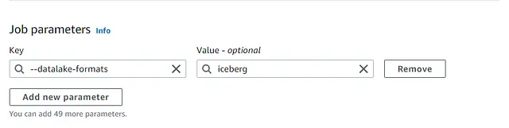

# With Iceberg

## Getting Started

###  Define the important libraries

```python
import sys
from awsglue.transforms import *
from awsglue.utils import getResolvedOptions
from pyspark.context import SparkContext
from pyspark.sql import SparkSession
from pyspark.sql.functions import *
from awsglue.context import GlueContext
from awsglue.job import Job

args = getResolvedOptions(sys.argv, ["JOB_NAME"])
catalog_nm = "glue_catalog"

# The Glue Database Name which has the source table
in_database="<glue-database-input>"

# The input Glue Table which we will be using as a source for the Iceberg data
in_table_name="covid_19_data"

# The Glue Database Name which will be used to create an output Iceberg table
database_op='database_ib'

# The Glue Table Name which will be used as a destination for Iceberg table
table_op='covid_dataset_iceberg'

# The S3 path which will be used to store the Iceberg files as output
s3_output_path='s3://<your-destination-bucket-name>/iceberg-output/'

table = str(catalog_nm)+ '.`' + str(database_op) + '`.' + str(table_op)

print("\nINPUT Database : " + str(in_database))
print("\nINPUT Table : " + str(in_table_name))
print("\nOUTPUT IceBerg Database : " + str(database_op))
print("\nOUTPUT IceBerg Table : " + str(table))
print("\nOUTPUT IceBerg S3 Path : " + str(s3_output_path))
```

In line with the script we need to define a important job parameter in the glue
which will indicate the Glue job executer to leverage the Iceberg table format
as output for the data. For this you need to define a parameter named as

```yaml
--datalake-formats : iceberg
```



### Define Spark and Glue context

```python
def create_spark_iceberg(catalog_nm: str = "glue_catalog"):
    """
    Function to initialize a session with iceberg by default
    :param catalog_nm:
    :return spark:
    """
    from pyspark.sql import SparkSession
    # You can set this as a variable if required
    warehouse_path = s3_output_path

    spark = (
        SparkSession.builder
            .config(f"spark.sql.catalog.{catalog_nm}", "org.apache.iceberg.spark.SparkCatalog")
            .config(f"spark.sql.catalog.{catalog_nm}.warehouse", warehouse_path)
            .config(f"spark.sql.catalog.{catalog_nm}.catalog-impl", "org.apache.iceberg.aws.glue.GlueCatalog")
            .config(f"spark.sql.catalog.{catalog_nm}.io-impl", "org.apache.iceberg.aws.s3.S3FileIO")
            .config(f"spark.sql.extensions", "org.apache.iceberg.spark.extensions.IcebergSparkSessionExtensions")
            .getOrCreate()
    )
    return spark

ibspark = create_spark_iceberg(catalog_nm)
ibsc = ibspark.sparkContext
ibglueContext = GlueContext(ibsc)
ibjob = Job(ibglueContext)
ibjob.init(args["JOB_NAME"], args)
```

### Read the source Glue table and write into a destination Glue

```python
#Read the Glue inout table from thr Catalog using a Glue DynamicFrame
InputDynamicFrameTable = (
    ibglueContext.create_dynamic_frame
        .from_catalog(database=in_database, table_name=in_table_name)
)

#Convert the Glue DynamicFrame into a Spark DataFrame
InputDynamicFrameTable_DF = InputDynamicFrameTable.toDF()

#Register the Spark DataFrame as TempView
InputDynamicFrameTable_DF.createOrReplaceTempView("InputDataFrameTable")
ibspark.sql("select * from InputDataFrameTable LIMIT 10").show()

#Filter the source table with country as 'Australia'
colname_df = ibspark.sql("SELECT * FROM InputDataFrameTable WHERE country='Australia'")
colname_df.createOrReplaceTempView("OutputDataFrameTable")

#Write the filtered Data into an ICEBERG table format in Glue destination table
ib_Write_SQL = f"""
    CREATE OR REPLACE TABLE {catalog_nm}.{database_op}.{table_op}
    USING iceberg
    TBLPROPERTIES ("format-version"="2", "write_compression"="gzip")
    AS SELECT * FROM OutputDataFrameTable;
    """

#Run the Spark SQL query
ibspark.sql(ib_Write_SQL)
```

## References

- https://rajaswalavalkar.medium.com/deploy-apache-iceberg-data-lake-on-amazon-s3-using-aws-glue-spark-job-e14feb38e048
