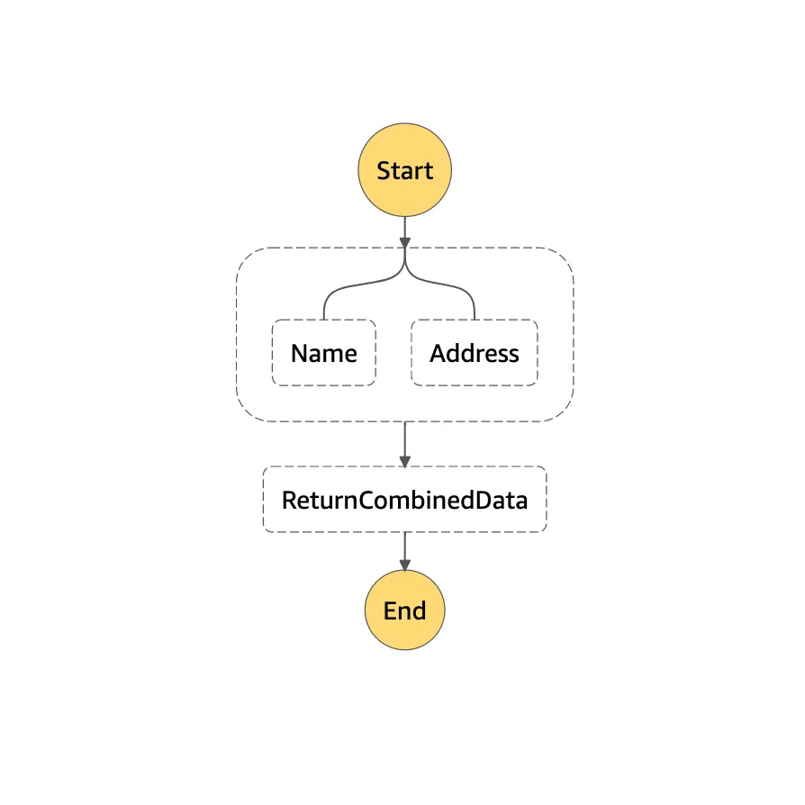

# Combine Data from Parallel State

!!! note

    The elements of the output array correspond to the branches in the same order
    that they appear in the "Branches" array

Below is an example of a State Machine that looks up user information, and in the
parallel state provides the Name and Address in parallel.

{ loading=lazy }

```json title="State Machine"
{
  "Comment": "Parallel Example.",
  "StartAt": "LookupCustomerInfo",
  "States": {
    "LookupCustomerInfo": {
      "Type": "Parallel",
      "Next": "ReturnCombinedData",
      "Branches": [
        {
          "StartAt": "Name",
          "States": {
            "Name": {
              "Type": "Pass",
              "Comment": "This can be any state that returns data, since it's a Pass, the values are static",
              "Result": {
                "fname": "Jack",
                "lname": "Johnson"
              },
              "ResultPath": "$.Name",
              "End": true
            }
          }
        },
        {
          "StartAt": "Address",
          "States": {
            "Address": {
              "Type": "Pass",
              "Comment": "This can be any state that returns data, since it's a Pass, the values are static",
              "Result": {
                "Number": "123",
                "Street": "Fake St",
                "Zip": "90210"
              },
              "ResultPath": "$.Address",
              "End": true
            }
          }
       }
      ]
    },
    "ReturnCombinedData": {
      "Type": "Pass",
      "Parameters": {
        "comment": "Combining the result",
        "UserDetails": {
          "Name.$": "$[0].Name",
          "Address.$": "$[1].Address",
          "StaticMessage": "This is a static message"
        }
      },
      "End": true
    }
  }
}
```

From the previous state machine we would get the following data from the Parallel
state:

```json
[
  {
    "Name": {
      "fname": "Jack",
      "lname": "Johnson"
    }
  },
  {
    "Address": {
      "Number": "123",
      "Street": "Fake St",
      "Zip": "90210"
    }
  }
],
```

In the state that comes after the parallel state, which I used a Pass state in this
example, I used the Parameters field to combine the user information out from the
array and into an object. In the Parameters field, setting the key value pair
requires the following format:

```json
"Name.$": "$[0].Name"
```

Since this is an array, you would require to select the appropriate location within
the array that has the data you need. Since we are setting the name, the data that
has the name is in the first position `"$[0]"` since the name operation was done on
the first branch of the array. For the address, it is in position `"$[1]"` of the
array. In the above state machine, the final successful output would look like the
following:

```json
{
  "comment": "Combining the result",
  "UserDetails": {
    "StaticMessage": "This is a static message",
    "Address": {
      "Number": "123",
      "Street": "Fake St",
      "Zip": "90210"
    },
    "Name": {
      "fname": "Jack",
      "lname": "Johnson"
    }
  }
}
```

??? example "Use ResultSelector"

    ```json title="State Machine"
    {
      "StartAt": "ParallelBranch",
      "States": {
        "ParallelBranch": {
          "Type": "Parallel",
          "ResultPath": "$",
          "InputPath": "$",
          "OutputPath": "$",
          "ResultSelector": {
            "UsersResult.$": "$[1].UsersUpload",
            "CustomersResult.$": "$[0].customersDataUpload"
          },
          "Branches": [
            {
              "StartAt": "customersDataUpload",
              "States": {
                "customersDataUpload": {
                  "Type": "Pass",
                  "ResultPath": "$.customersDataUpload.Output",
                  "Result": {
                    "CompletionStatus": "success",
                    "CompletionDetails": null
                  },
                  "Next": "Wait2"
                },
                "Wait2": {
                  "Comment": "A Wait state delays the state machine from continuing for a specified time.",
                  "Type": "Wait",
                  "Seconds": 2,
                  "End": true
                }
              }
            },
            {
              "StartAt": "UsersUpload",
              "States": {
                "UsersUpload": {
                  "Type": "Pass",
                  "Result": {
                    "CompletionStatus": "success",
                    "CompletionDetails": null
                  },
                  "ResultPath": "$.UsersUpload.Output",
                  "Next": "Wait1"
                },
                "Wait1": {
                  "Comment": "A Wait state delays the state machine from continuing for a specified time.",
                  "Type": "Wait",
                  "Seconds": 1,
                  "End": true
                }
              }
            }
          ],
          "End": true
        }
      },
      "TimeoutSeconds": 129600,
      "Version": "1.0"
    }
    ```

    And the output will be like:

    ```json
    {
      "UsersResult": {
        "Output": {
          "CompletionStatus": "success",
          "CompletionDetails": null
        }
      },
      "CustomersResult": {
        "Output": {
          "CompletionStatus": "success",
          "CompletionDetails": null
        }
      }
    }
    ```

## References

- [AWS Step Functions — Combine Data from Parallel State](https://nadetastic.medium.com/aws-step-functions-combine-data-from-parallel-state-f3bbaff217d9)
- [Parallel States Merge the output in Step Function](https://stackoverflow.com/questions/54105792/parallel-states-merge-the-output-in-step-function)
