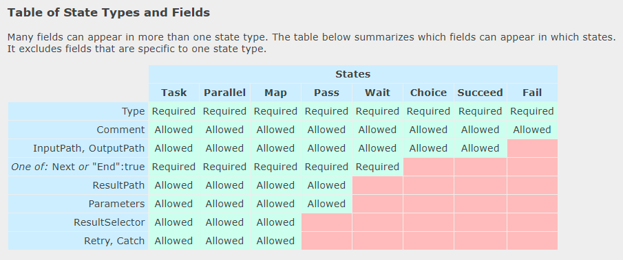

# _State Machine Language_

!!! warning

    This topic copy information from [Amazon States Language](https://states-language.net/spec.html#structure-of-a-state-machine)[^1].
    I think this knowledge is powerfull to reuse this concept for create any state
    declarative object in the Data Pipeline workflow.

!!! quote

    A **State Machine** is represented by a JSON Object.

```json title="Example: Hello World"
{
  "Comment": "A simple minimal example of the States language",
  "StartAt": "Hello World",
  "States": {
    "Hello World": {
      "Type": "Task",
      "Resource": "arn:aws:lambda:us-east-1:123456789012:function:HelloWorld",
      "End": true
    }
  }
}
```

**Top-level fields**:

- A State Machine MUST have an object field named "States", whose fields represent
  the states.
- A State Machine MUST have a string field named "StartAt", whose value MUST exactly
  match one of names of the "States" fields. The interpreter starts running the
  machine at the named state.
- A State Machine MAY have a string field named "Comment", provided for human-readable
  description of the machine.
- A State Machine MAY have a string field named "Version", which gives the version
  of the States language used in the machine. This document describes version 1.0,
  and if omitted, the default value of "Version" is the string "1.0".
- A State Machine MAY have an integer field named "TimeoutSeconds". If provided,
  it provides the maximum number of seconds the machine is allowed to run. If the
  machine runs longer than the specified time, then the interpreter fails the
  machine with a States.Timeout [Error Name](#error-representation).

## Concepts

### States

States are represented as fields of the top-level "States" object. The state
name, whose length MUST BE less than or equal to 80 Unicode characters, is
the field name; state names MUST be unique within the scope of the whole state
machine. States describe tasks (units of work), or specify flow control
(e.g. Choice).

Here is an example state that executes a Lambda function:

```json
"HelloWorld": {
  "Type": "Task",
  "Resource": "arn:aws:lambda:us-east-1:123456789012:function:HelloWorld",
  "Next": "NextState",
  "Comment": "Executes the HelloWorld Lambda function"
}
```

!!! note

    - All states MUST have a "Type" field. This document refers to the values
      of this field as a state's type, and to a state such as the one in the
      example above as a Task State.

    - Any state MAY have a "Comment" field, to hold a human-readable comment or
      description.

    - Most state types require additional fields as specified in this document.

    - Any state except for Choice, Succeed, and Fail MAY have a field named "End"
      whose value MUST be a boolean. The term "Terminal State" means a state with
      with `{ "End": true }`, or a state with `{ "Type": "Succeed" }`, or a state with
      `{ "Type": "Fail" }`.

### Transitions

Transitions link states together, defining the control flow for the state machine.
After executing a non-terminal state, the interpreter follows a transition to the
next state. For most state types, transitions are unconditional and specified
through the state's `"Next"` field.

All non-terminal states MUST have a `"Next"` field, except for the Choice State.
The value of the `"Next"` field MUST exactly and case-sensitively match the name
of the another state.

States can have multiple incoming transitions from other states.

### Timestamps

The Choice and Wait States deal with JSON field values which represent timestamps.
These are strings which MUST conform to the [RFC3339](https://www.ietf.org/rfc/rfc3339.txt)
profile of ISO 8601, with the further restrictions that an uppercase `"T"` character
MUST be used to separate date and time, and an uppercase `"Z"` character MUST be present
in the absence of a numeric time zone offset, for example `"2016-03-14T01:59:00Z"`.

### Data

The interpreter passes data between states to perform calculations or to dynamically
control the state machine's flow. All such data MUST be expressed in JSON.

When a state machine is started, the caller can provide an initial JSON text as
input, which is passed to the machine's start state as input. If no input is provided,
the default is an empty JSON object, `{}`. As each state is executed, it receives
a JSON text as input and can produce arbitrary output, which MUST be a JSON text.
When two states are linked by a transition, the output from the first state is
passed as input to the second state. The output from the machine's terminal state
is treated as its output.

### The Context Object

The interpreter can provide information to an executing state machine about the
execution and other implementation details. This is delivered in the form of a
JSON object called the "Context Object". This version of the States Language
specification does not specify any contents of the Context Object.

### Paths

A Path is a string, beginning with "$", used to identify components with a JSON
text. The syntax is that of JsonPath.

When a Path begins with "$$", two dollar signs, this signals that it is intended
to identify content within the Context Object. The first dollar sign is stripped,
and the remaining text, which begins with a dollar sign, is interpreted as the
JSONPath applying to the Context Object.

### Reference Paths

A Reference Path is a Path with syntax limited in such a way that it can only identify
a single node in a JSON structure: The operators "@", ",", ":", and "?" are not
supported - all Reference Paths MUST be unambiguous references to a single value,
array, or object (subtree).

For example, if state input data contained the values:

```json
{
  "foo": 123,
  "bar": ["a", "b", "c"],
  "car": {
      "cdr": true
  }
}
```

Then the following Reference Paths would return:

```text
$.foo => 123
$.bar => ["a", "b", "c"]
$.car.cdr => true
```

Paths and Reference Paths are used by certain states, as specified later in this
document, to control the flow of a state machine or to configure a state's settings
or options.

Here are some examples of acceptable Reference Path syntax:

```text
$.store.book
$.store\.book
$.\stor\e.boo\k
$.store.book.title
$.foo.\.bar
$.foo\@bar.baz\[\[.\?pretty
$.&Ж中.\uD800\uDF46
$.ledgers.branch[0].pending.count
$.ledgers.branch[0]
$.ledgers[0][22][315].foo
$['store']['book']
$['store'][0]['book']
```

### Payload Template

A state machine interpreter dispatches data as input to tasks to do useful work,
and receives output back from them. It is frequently desired to reshape input data
to meet the format expectations of tasks, and similarly to reshape the output coming
back. A JSON object structure called a Payload Template is provided for this purpose.

In the Task, Map, Parallel, and Pass States, the Payload Template is the value of
a field named "Parameters". In the Task, Map, and Parallel States, there is another
Payload Template which is the value of a field named "ResultSelector".

A Payload Template MUST be a JSON object; it has no required fields. The interpreter
processes the Payload Template as described in this section; the result of that
processing is called the payload.

To illustrate by example, the Task State has a field named "Parameters" whose value
is a Payload Template. Consider the following Task State:

```json
"X": {
  "Type": "Task",
  "Resource": "arn:aws:states:us-east-1:123456789012:task:X",
  "Next": "Y",
  "Parameters": {
    "first": 88,
    "second": 99
  }
}
```

In this case, the payload is the object with "first" and "second" fields whose
values are respectively 88 and 99. No processing needs to be performed and the
payload is identical to the Payload Template.

Values from the Payload Template's input and the Context Object can be inserted
into the payload with a combination of a field-naming convention, Paths and Intrinsic
Functions.

If any field within the Payload Template (however deeply nested) has a name ending
with the characters ".$", its value is transformed according to rules below and
the field is renamed to strip the ".$" suffix.

If the field value begins with only one "$", the value MUST be a Path. In this case,
the Path is applied to the Payload Template's input and is the new field value.

If the field value begins with "$$", the first dollar sign is stripped and the
remainder MUST be a Path. In this case, the Path is applied to the Context Object
and is the new field value.

If the field value does not begin with "$", it MUST be an Intrinsic Function
(see below). The interpreter invokes the Intrinsic Function and the result is the
new field value.

If the path is legal but cannot be applied successfully, the interpreter fails the
machine execution with an Error Name of "States.ParameterPathFailure". If the
Intrinsic Function fails during evaluation, the interpreter fails the machine
execution with an Error Name of "States.IntrinsicFailure".

A JSON object MUST NOT have duplicate field names after fields ending with the
characters ".$" are renamed to strip the ".$" suffix.

```json
"X": {
  "Type": "Task",
  "Resource": "arn:aws:states:us-east-1:123456789012:task:X",
  "Next": "Y",
  "Parameters": {
    "flagged": true,
    "parts": {
      "first.$": "$.vals[0]",
      "last3.$": "$.vals[-3:]"
    },
    "weekday.$": "$$.DayOfWeek",
    "formattedOutput.$": "States.Format('Today is {}', $$.DayOfWeek)"
  }
}
```

Suppose that the input to the P is as follows:

```json
{
  "flagged": 7,
  "vals": [0, 10, 20, 30, 40, 50]
}
```

Further, suppose that the Context Object is as follows:

```json
{
  "DayOfWeek": "TUESDAY"
}
```

In this case, the effective input to the code identified in the "Resource" field
would be as follows:

```json
{
  "flagged": true,
  "parts": {
    "first": 0,
    "last3": [30, 40, 50]
  },
  "weekday": "TUESDAY",
  "formattedOutput": "Today is TUESDAY"
}
```

### Intrinsic Functions

The States Language provides a small number of "Intrinsic Functions", constructs
which look like functions in programming languages and can be used to help Payload
Templates process the data going to and from Task Resources. See [Appendix B](#appendix-b-list-of-intrinsic-functions)
for a full list of Intrinsic Functions

Here is an example of an Intrinsic Function named "States.Format" being used to
prepare data:

```json
"X": {
  "Type": "Task",
  "Resource": "arn:aws:states:us-east-1:123456789012:task:X",
  "Next": "Y",
  "Parameters": {
    "greeting.$": "States.Format('Welcome to {} {}\\'s playlist.', $.firstName, $.lastName)"
  }
}
```

!!! note

    - An Intrinsic Function MUST be a string.
    - The Intrinsic Function MUST begin with an Intrinsic Function name. An Intrinsic Function name MUST contain only the characters A through Z, a through z, 0 through 9, ".", and "_".
    - All Intrinsic Functions defined by this specification have names that begin with "States.". Other implementations may define their own Intrinsic Functions whose names MUST NOT begin with "States.".
    - The Intrinsic Function name MUST be followed immediately by a list of zero or more arguments, enclosed by "(" and ")", and separated by commas.
    - Intrinsic Function arguments may be strings enclosed by apostrophe (`'`) characters, numbers, `null`, Paths, or nested Intrinsic Functions.
    - The value of a string, number or `null` argument is the argument itself. The value of an argument which is a Path is the result of applying it to the input of the Payload Template. The value of an argument which is an Intrinsic Function is the result of the function invocation."

      Note that in the example above, the first argument of `States.Format` could have been a Path that yielded the formatting template string.

    - The following characters are reserved for all Intrinsic Functions and MUST be escaped: ' { } \

      If any of the reserved characters needs to appear as part of the value without serving as a reserved character, it MUST be escaped with a backslash.

      If the character "\ needs to appear as part of the value without serving as an escape character, it MUST be escaped with a backslash.

      The literal string `\'` represents `'`.
      The literal string `\{` represents `{`.
      The literal string `\}` represents `}`.
      The literal string `\\` represents `\`.

      In JSON, all backslashes contained in a string literal value must be escaped
      with another backslash, therefore, the above will equate to:

      The escaped string `\\'` represents `'`.
      The escaped string `\\{` represents `{`.
      The escaped string `\\}` represents `}`.
      The escaped string `\\\\` represents `\`.

      If an open escape backslash `\` is found in the Intrinsic Function, the
      interpreter will throw a runtime error.

### Input and Output Processing

As described above, data is passed between states as JSON texts. However, a state
may want to process only a subset of its input data, and may want that data structured
differently from the way it appears in the input. Similarly, it may want to control
the format and content of the data that it passes on as output.

Fields named "InputPath", "Parameters", "ResultSelector", "ResultPath", and "OutputPath"
exist to support this.

Any state except for the Fail and Succeed States MAY have "InputPath" and "OutputPath".

States which potentially generate results MAY have "Parameters", "ResultSelector"
and "ResultPath": Task State, Parallel State, and Map State.

Pass State MAY have "Parameters" and "ResultPath" to control its output value.

#### Using InputPath, Parameters, ResultSelector, ResultPath and OutputPath

In this discussion, "raw input" means the JSON text that is the input to a state.
"Result" means the JSON text that a state generates, for example from external code
invoked by a Task State, the combined result of the branches in a Parallel or
Map State, or the Value of the "Result" field in a Pass State. "Effective input"
means the input after the application of InputPath and Parameters, "effective result"
means the result after processing it with ResultSelector and "effective output" means
the final state output after processing the result with ResultSelector, ResultPath
and OutputPath.

- The value of "InputPath" MUST be a Path, which is applied to a State's raw input
  to select some or all of it; that selection is used by the state, for example
  in passing to Resources in Task States and Choices selectors in Choice States.
- The value of "Parameters" MUST be a Payload Template which is a JSON object,
  whose input is the result of applying the InputPath to the raw input. If the
  "Parameters" field is provided, its payload, after the extraction and embedding,
  becomes the effective input.
- The value of "ResultSelector" MUST be a Payload Template, whose input is the
  result, and whose payload replaces and becomes the effective result.
- The value of "ResultPath" MUST be a Reference Path, which specifies the raw input's
  combination with or replacement by the state's result.
- The value of "ResultPath" MUST NOT begin with "$$"; i.e. it may not be used to
  insert content into the Context Object.
- The value of "OutputPath" MUST be a Path, which is applied to the state's output
  after the application of ResultPath, producing the effective output which serves
  as the raw input for the next state.

Note that JsonPath can yield multiple values when applied to an input JSON text.
For example, given the text:

```json
{ "a": [1, 2, 3, 4] }
```

Then if the JsonPath `$.a[0,1]` is applied, the result will be two JSON texts,
`1` and `2`. When this happens, to produce the effective input, the interpreter
gathers the texts into an array, so in this example the state would see the
input:

```json
[ 1, 2 ]
```

The same rule applies to OutputPath processing; if the OutputPath result contains
multiple values, the effective output is a JSON array containing all of them.

The "ResultPath" field's value is a Reference Path that specifies where to place
the result, relative to the raw input. If the raw input has a field at the location
addressed by the ResultPath value then in the output that field is discarded and
overwritten by the state's result. Otherwise, a new field is created in the state
output, with intervening fields constructed as necessary. For example, given the
raw input:

```json
{
  "master": {
    "detail": [1, 2, 3]
  }
}
```

If the state's result is the number `6`, and the "ResultPath" is `$.master.detail`,
then in the output the `detail` field would be overwritten:

```json
{
  "master": {
    "detail": 6
  }
}
```

If instead a "ResultPath" of `$.master.result.sum` was used then the result would
be combined with the raw input, producing a chain of new fields containing `result`
and `sum`:

```json
{
  "master": {
    "detail": [1, 2, 3],
    "result": {
      "sum": 6
    }
  }
}
```

If the value of InputPath is `null`, that means that the raw input is discarded,
and the effective input for the state is an empty JSON object, `{}`. Note that
having a value of `null` is different from the "InputPath" field being absent.

If the value of ResultPath is `null`, that means that the state's result is discarded
and its raw input becomes its result.

If the value of OutputPath is `null`, that means the input and result are discarded,
and the effective output from the state is an empty JSON object, `{}`.

#### Defaults

Each of InputPath, Parameters, ResultSelector, ResultPath, and OutputPath are
optional. The default value of InputPath is "$", so by default the effective input
is just the raw input. The default value of ResultPath is "$", so by default a
state's result overwrites and replaces the input. The default value of OutputPath
is "$", so by default a state's effective output is the result of processing
ResultPath.

Parameters and ResultSelector have no default value. If absent, they have no effect
on their input.

Therefore, if none of InputPath, Parameters, ResultSelector, ResultPath, or OutputPath
are supplied, a state consumes the raw input as provided and passes its result
to the next state.

#### Input/Output Processing Examples

Consider the example given above, of a Lambda task that sums a pair of numbers.
As presented, its input is: `{ "val1": 3, "val2": 4 }` and its output is: `7`.

Suppose the input is little more complex:

```json
{
  "title": "Numbers to add",
  "numbers": { "val1": 3, "val2": 4 }
}
```

Then suppose we modify the state definition by adding:

```json
"InputPath": "$.numbers",
"ResultPath": "$.sum"
```

And finally,suppose we simplify Line 4 of the Lambda function to read as
follows: `return JSON.stringify(total)`. This is probably a better form of the
function, which should really only care about doing math and not care how its
result is labeled.

In this case, the output would be:

```json
{
  "title": "Numbers to add",
  "numbers": { "val1": 3, "val2": 4 },
  "sum": 7
}
```

The interpreter might need to construct multiple levels of JSON object to achieve
the desired effect. Suppose the input to some Task State is:

```json
{ "a": 1 }
```

Suppose the output from the Task is "Hi!", and the value of the "ResultPath" field
is "$.b.greeting". Then the output from the state would be:

```json
{
  "a": 1,
  "b": {
    "greeting": "Hi!"
  }
}
```

#### Runtime Errors

Suppose a state's input is the string `"foo"`, and its "ResultPath" field has the
value "$.x". Then ResultPath cannot apply and the interpreter fails the machine
with an Error Name of "States.ResultPathMatchFailure".

### Errors

Any state can encounter runtime errors. Errors can arise because of state machine
definition issues (e.g. the "ResultPath" problem discussed immediately above),
task failures (e.g. an exception thrown by a Lambda function) or because of
transient issues, such as network partition events.

When a state reports an error, the default course of action for the interpreter
is to fail the whole state machine.

#### Error representation

Errors are identified by case-sensitive strings, called Error Names. The States
language defines a set of built-in strings naming well-known errors, all of which
begin with the prefix "States."; see [Appendix A](#appendix-a-predefined-error-codes).

States MAY report errors with other names, which MUST NOT begin with the prefix
"States.".

#### Retrying after error

Task States, Parallel States, and Map States MAY have a field named "Retry", whose
value MUST be an array of objects, called Retriers.

Each Retrier MUST contain a field named "ErrorEquals" whose value MUST be a non-empty
array of Strings, which match [Error Names](#error-representation).

When a state reports an error, the interpreter scans through the Retriers and,
when the Error Name appears in the value of a Retrier's "ErrorEquals" field,
implements the retry policy described in that Retrier.

An individual Retrier represents a certain number of retries, usually at increasing
time intervals.

A Retrier MAY contain a field named "IntervalSeconds", whose value MUST be a
positive integer, representing the number of seconds before the first retry attempt
(default value: 1); a field named "MaxAttempts" whose value MUST be a non-negative
integer, representing the maximum number of retry attempts (default: 3); a field
named "MaxDelaySeconds" whose value MUST be positive integer, representing the
maximum interval in seconds to wait before the next retry attempt; a field named
"JitterStrategy", whose value MUST be a string, representing the jitter strategy
to use in the retry interval calculation; and a field named "BackoffRate", a number
which is the multiplier that increases the retry interval on each attempt (default: 2.0).
The value of BackoffRate MUST be greater than or equal to 1.0.

Note that a "MaxAttempts" field whose value is 0 is legal, specifying that some
error or errors should never be retried.

The States Language does not constrain the value of the "JitterStrategy" field.
The interpreter will use the specified value to select the jitter strategy to use
when calculating the retry interval.

Here is an example of a Retrier which will make 2 retry attempts after waits of
`3` and `6` seconds:

```json
"Retry" : [
  {
    "ErrorEquals": [ "States.Timeout" ],
    "IntervalSeconds": 3,
    "MaxAttempts": 2,
    "BackoffRate": 2.0
  }
]
```

Here is the same example, but with a maximum limit of 4 seconds on the retry interval.
In this case the Retrier will make the second attempt after 4 seconds, rather
than 6 seconds:

```json
"Retry" : [
  {
    "ErrorEquals": [ "States.Timeout" ],
    "IntervalSeconds": 3,
    "MaxAttempts": 2,
    "BackoffRate": 2.0,
    "MaxDelaySeconds": 4
  }
]
```

Here is an example of a Retrier which uses an interpreter-defined JitterStrategy
called "SAMPLE". Instead of waiting for 2 seconds before the first retry attempt
or 4 seconds before the second retry attempt, the interpreter will modify these
values according to the jitter strategy:

```json
"Retry" : [
  {
    "ErrorEquals": [ "States.Timeout" ],
    "IntervalSeconds": 2,
    "MaxAttempts": 2,
    "BackoffRate": 2.0,
    "JitterStrategy": "SAMPLE"
  }
]
```

The reserved name "States.ALL" in a Retrier's "ErrorEquals" field is a wildcard
and matches any Error Name. Such a value MUST appear alone in the "ErrorEquals"
array and MUST appear in the last Retrier in the "Retry" array.

Here is an example of a Retrier which will retry any error except for "States.Timeout",
using the default retry parameters.

```json
"Retry": [
  {
    "ErrorEquals": [ "States.Timeout" ],
    "MaxAttempts": 0
  },
  {
    "ErrorEquals": [ "States.ALL" ]
  }
]
```

If the error recurs more times than allowed for by the "MaxAttempts" field, retries
cease and normal error handling resumes.

#### Complex retry scenarios

A Retrier's parameters apply across all visits to that Retrier in the context of
a single state execution. This is best illustrated by example; consider the following
Task State:

```json
"X": {
  "Type": "Task",
  "Resource": "arn:aws:states:us-east-1:123456789012:task:X",
  "Next": "Y",
  "Retry": [
    {
      "ErrorEquals": [ "ErrorA", "ErrorB" ],
      "IntervalSeconds": 1,
      "BackoffRate": 2,
      "MaxAttempts": 2
    },
    {
      "ErrorEquals": [ "ErrorC" ],
      "IntervalSeconds": 5
    }
  ],
  "Catch": [
    {
      "ErrorEquals": [ "States.ALL" ],
      "Next": "Z"
    }
  ]
}
```

Suppose that this task fails four successive times, throwing Error Names "ErrorA",
"ErrorB", "ErrorC", and "ErrorB". The first two errors match the first retrier
and cause waits of one and two seconds. The third error matches the second retrier
and causes a wait of five seconds. The fourth error would match the first retrier
but its "MaxAttempts" ceiling of two retries has already been reached, so that
Retrier fails, and execution is redirected to the "Z" state via the "Catch"
field.

Note that once the interpreter transitions to another state in any way, all the
Retrier parameters reset.

#### Fallback states

Task States, Parallel States, and Map States MAY have a field named "Catch", whose
value MUST be an array of objects, called Catchers.

Each Catcher MUST contain a field named "ErrorEquals", specified exactly as with
the Retrier "ErrorEquals" field, and a field named "Next" whose value MUST be a
string exactly matching a State Name.

When a state reports an error and either there is no Retrier, or retries have
failed to resolve the error, the interpreter scans through the Catchers in array
order, and when the [Error Name](#error-representation) appears in the value of
a Catcher's "ErrorEquals" field, transitions the machine to the state named in
the value of the "Next" field.

The reserved name "States.ALL" appearing in a Retrier's "ErrorEquals" field is a
wildcard and matches any Error Name. Such a value MUST appear alone in the "ErrorEquals"
array and MUST appear in the last Catcher in the "Catch" array.

#### Error output

When a state reports an error and it matches a Catcher, causing a transfer to another
state, the state's result (and thus the input to the state identified in the
Catcher's "Next" field) is a JSON object, called the Error Output. The Error Output
MUST have a string-valued field named "Error", containing the Error Name. It SHOULD
have a string-valued field named "Cause", containing human-readable text about
the error.

A Catcher MAY have an "ResultPath" field, which works exactly like [a state's top-level "ResultPath"](#input-and-output-processing),
and may be used to inject the Error Output into the state's original input to create
the input for the Catcher's "Next" state. The default value, if the "ResultPath"
field is not provided, is "$", meaning that the output consists entirely of the
Error Output.

Here is an example of a Catcher that will transition to the state named "RecoveryState"
when a Lambda function throws an unhandled Java Exception, and otherwise to the
"EndMachine" state, which is presumably Terminal.

Also in this example, if the first Catcher matches the Error Name, the input to
"RecoveryState" will be the original state input, with the Error Output as the
value of the top-level "error-info" field. For any other error, the input to
"EndMachine" will just be the Error Output.

```json
"Catch": [
  {
    "ErrorEquals": [ "java.lang.Exception" ],
    "ResultPath": "$.error-info",
    "Next": "RecoveryState"
  },
  {
    "ErrorEquals": [ "States.ALL" ],
    "Next": "EndMachine"
  }
]
```

Each Catcher can specific multiple errors to handle.

When a state has both "Retry" and "Catch" fields, the interpreter uses any appropriate
Retriers first and only applies the matching Catcher transition if the retry
policy fails to resolve the error.

## State Types

As a reminder, the state type is given by the value of the "Type" field, which
**MUST** appear in every State object.

{ loading=lazy }

=== "Pass State"

    The Pass State (identified by `"Type":"Pass"`) by default passes its input to
    its output, performing no work.

    A Pass State MAY have a field named "Result". If present, its value is treated
    as the output of a virtual task, and placed as prescribed by the "ResultPath"
    field, if any, to be passed on to the next state. If "Result" is not provided,
    the output is the input. Thus if neither "Result" nor "ResultPath" are provided,
    the Pass State copies its input through to its output.

    Here is an example of a Pass State that injects some fixed data into the state
    machine, probably for testing purposes.

    ```json
    "No-op": {
      "Type": "Pass",
      "Result": {
        "x-datum": 0.381018,
        "y-datum": 622.2269926397355
      },
      "ResultPath": "$.coords",
      "Next": "End"
    }
    ```

    === "Input"

        ```json
        {
          "georefOf": "Home"
        }
        ```

    === "Output"

        ```json
        {
          "georefOf": "Home",
          "coords": {
            "x-datum": 0.381018,
            "y-datum": 622.2269926397355
          }
        }
        ```

=== "Task State"

    The Task State (identified by `"Type":"Task"`) causes the interpreter to execute
    the work identified by the state's "Resource" field.

    Here is an example:

    ```json
    "TaskState": {
      "Comment": "Task State example",
      "Type": "Task",
      "Resource": "arn:aws:states:us-east-1:123456789012:task:HelloWorld",
      "Next": "NextState",
      "TimeoutSeconds": 300,
      "HeartbeatSeconds": 60
    }
    ```

    A Task State MUST include a "Resource" field, whose value MUST be a URI that
    uniquely identifies the specific task to execute. The States language does not constrain the URI scheme nor any other part of the URI.

    A Task State MAY include a "Parameters" field, whose value MUST be a Payload Template. A Task State MAY include a "ResultSelector" field, whose value MUST be a Payload Template.

    Tasks can optionally specify timeouts. Timeouts (the "TimeoutSeconds" and "HeartbeatSeconds" fields) are specified in seconds and MUST be positive integers.

    Both the total and heartbeat timeouts can be provided indirectly. A Task State may have "TimeoutSecondsPath" and "HeartbeatSecondsPath" fields which MUST be Reference Paths which, when resolved, MUST select fields whose values are positive integers. A Task State MUST NOT include both "TimeoutSeconds" and "TimeoutSecondsPath" or both "HeartbeatSeconds" and "HeartbeatSecondsPath".

    If provided, the "HeartbeatSeconds" interval MUST be smaller than the "TimeoutSeconds" value.

    If not provided, the default value of "TimeoutSeconds" is 60.

    If the state runs longer than the specified timeout, or if more time than the specified heartbeat elapses between heartbeats from the task, then the interpreter fails the state with a States.Timeout Error Name.

    !!! note

        A Task State MAY include a "Credentials" field, whose value MUST be a JSON
        object whose value is defined by the interpreter. The States language does
        not constrain the value of the "Credentials" field. The interpreter will
        use the specified credentials to execute the work identified by the state's
        "Resource" field.

=== "Choice State"

    A Choice State (identified by `"Type":"Choice"`) adds branching logic to a state
    machine.

    A Choice State MUST have a "Choices" field whose value is a non-empty array.
    Each element of the array MUST be a JSON object and is called a Choice Rule.
    A Choice Rule may be evaluated to return a boolean value. A Choice Rule at
    the top level, i.e. which is a member of the "Choices" array, MUST have a "Next"
    field, whose value MUST match a state name.

    The interpreter attempts pattern-matches against the top-level Choice Rules
    in array order and transitions to the state specified in the "Next" field on
    the first Choice Rule where there is an exact match between the input value
    and a member of the comparison-operator array.

    Here is an example of a Choice State.

    ```json
    "DispatchEvent": {
      "Type" : "Choice",
      "Choices": [
        {
          "Not": {
            "Variable": "$.type",
            "StringEquals": "Private"
          },
          "Next": "Public"
        },
        {
          "And": [
            {
              "Variable": "$.value",
              "IsPresent": true
            },
            {
              "Variable": "$.value",
              "IsNumeric": true
            },
            {
              "Variable": "$.value",
              "NumericGreaterThanEquals": 20
            },
            {
              "Variable": "$.value",
              "NumericLessThan": 30
            }
          ],
          "Next": "ValueInTwenties"
        },
        {
          "Variable": "$.rating",
          "NumericGreaterThanPath": "$.auditThreshold",
          "Next": "StartAudit"
        }
      ],
      "Default": "RecordEvent"
    }
    ```

    In this example, suppose the machine is started with an input value of:

    ```json
    {
      "type": "Private",
      "value": 22
    }
    ```

    Then the interpreter will transition to the "ValueInTwenties" state, based on
    the "value" field.

    A Choice Rule MUST be either a Boolean Expression or a Data-test Expression.

    === "Boolean Expression"

        A Boolean Expression is a JSON object which contains a field named "And",
        "Or", or "Not". If the field name is "And" or "Or", the value MUST be an
        non-empty object array of Choice Rules, which MUST NOT contain "Next" fields;
        the interpreter processes the array elements in order, performing the boolean
        evaluations in the expected fashion, ceasing array processing when the boolean
        value has been unambiguously determined.

        The value of a Boolean Expression containing a "Not" field MUST be a single
        Choice Rule, that MUST NOT contain a "Next" field; it returns the inverse
        of the boolean to which the Choice Rule evaluates.

    === "Data-test Expression"

        A Data-test Expression Choice Rule is an assertion about a field and its
        value which yields a boolean depending on the data. A Data-test Expression
        MUST contain a field named "Variable" whose value MUST be a Path.

        Each choice rule MUST contain exactly one field containing a comparison
        operator. The following comparison operators are supported:

        ??? Lists

            - StringEquals, StringEqualsPath
            - StringLessThan, StringLessThanPath
            - StringGreaterThan, StringGreaterThanPath
            - StringLessThanEquals, StringLessThanEqualsPath
            - StringGreaterThanEquals, StringGreaterThanEqualsPath
            - StringMatches

                Note: The value MUST be a String which MAY contain one or more "*"
                characters. The expression yields true if the data value selected
                by the Variable Path matches the value, where "*" in the value
                matches zero or more characters. Thus, `foo*.log` matches `foo23.log`,
                `*.log` matches `zebra.log`, and `foo*.*` matches `foobar.zebra`.
                No characters other than "*" have any special meaning during
                matching.

                If the character "*" needs to appear as part of the value without
                serving as a wildcard, it MUST be escaped with a backslash.

                If the character "\ needs to appear as part of the value without
                serving as an escape character, it MUST be escaped with a backslash.

                The literal string `\*` represents `*`.
                The literal string `\\` represents `\`.

                In JSON, all backslashes contained in a string literal value must
                be escaped with another backslash, therefore, the above will equate
                to:

                The escaped string `\\*` represents `*`.
                The escaped string `\\\\` represents `\`.

                If an open escape backslash \ is found in the StringMatches string,
                the interpreter will throw a runtime error.

            - NumericEquals, NumericEqualsPath
            - NumericLessThan, NumericLessThanPath
            - NumericGreaterThan, NumericGreaterThanPath
            - NumericLessThanEquals, NumericLessThanEqualsPath
            - NumericGreaterThanEquals, NumericGreaterThanEqualsPath
            - BooleanEquals, BooleanEqualsPath
            - TimestampEquals, TimestampEqualsPath
            - TimestampLessThan, TimestampLessThanPath
            - TimestampGreaterThan, TimestampGreaterThanPath
            - TimestampLessThanEquals, TimestampLessThanEqualsPath
            - TimestampGreaterThanEquals, TimestampGreaterThanEqualsPath
            - IsNull

                Note: This means the value is the built-in JSON literal `null`.

            - IsPresent

                Note: In this case, if the Variable-field Path fails to match anything
                in the input no exception is thrown and the Choice Rule just returns
                false.

            - IsNumeric
            - IsString
            - IsBoolean
            - IsTimestamp

            For those operators that end with "Path", the value MUST be a Path, to be
            applied to the state's effective input to yield a value to be compared with
            the value yielded by the Variable path.

            For each operator which compares values, if the values are not both of the
            appropriate type (String, number, boolean, or Timestamp) the comparison
            will return false. Note that a field which is thought of as a timestamp
            could be matched by a string-typed comparator.

            The various String comparators compare strings character-by-character with
            no special treatments such as case-folding, white-space collapsing, or
            Unicode form normalization.

            Note that for interoperability, numeric comparisons should not be assumed
            to work with values outside the magnitude or precision representable using the
            IEEE 754-2008 "binary64" data type. In particular, integers outside of
            the range [-(2^53)+1, (2^53)-1] might fail to compare in the expected way.

    A Choice State MAY have a "Default" field, whose value MUST be a string whose
    value MUST match a State name; that state will execute if none of the Choice
    Rules match. The interpreter will raise a runtime States.NoChoiceMatched error
    if a Choice State fails to match a Choice Rule and no "Default" transition was
    specified.

    A Choice State MUST NOT be an End state.

=== "Wait State"

    A Wait State (identified by `"Type":"Wait"`) causes the interpreter to delay
    the machine from continuing for a specified time. The time can be specified
    as a wait duration, specified in seconds, or an absolute expiry time, specified
    as an ISO-8601 extended offset date-time format string.

    For Examples:

    === "Wait with second"

        ```json
        "wait_ten_seconds" : {
          "Type" : "Wait",
          "Seconds" : 10,
          "Next": "NextState"
        }
        ```

    === "Wait until an absolute time"

        ```json
        "wait_until" : {
          "Type": "Wait",
          "Timestamp": "2016-03-14T01:59:00Z",
          "Next": "NextState"
        }
        ```

    === "Wait using a Reference Path"

        Reworked to look up the timestamp time using a Reference Path to the data,
        which might look like `{ "expirydate": "2016-03-14T01:59:00Z" }`:

        ```json
        "wait_until" : {
          "Type": "Wait",
          "TimestampPath": "$.expirydate",
          "Next": "NextState"
        }
        ```

    A Wait State MUST contain exactly one of "Seconds", "SecondsPath", "Timestamp",
    or "TimestampPath".

=== "Succeed State"

    The Succeed State (identified by `"Type":"Succeed"`) either terminates a state
    machine successfully, ends a branch of a Parallel State, or ends an iteration
    of a Map State. The output of a Succeed State is the same as its input, possibly
    modified by "InputPath" and/or "OutputPath".

    The Succeed State is a useful target for Choice-State branches that don't do
    anything except terminate the machine.

    Here is an example:

    ```json
    "SuccessState": {
      "Type": "Succeed"
    }
    ```

    Because Succeed States are terminal states, they have no "Next" field.

=== "Fail State"

    The Fail State (identified by `"Type":"Fail"`) terminates the machine and marks it as a failure.

    Here is an example:

    ```json
    "FailState": {
      "Type": "Fail",
      "Error": "ErrorA",
      "Cause": "Kaiju attack"
    }
    ```

    A Fail State MAY have a field named "Error", whose value MUST be a string whose
    value provides an error name that can be used for error handling (Retry/Catch),
    operational, or diagnostic purposes. A Fail State MAY have a field named "Cause",
    whose value MUST be a string whose value provides a human-readable message.

    Both the "Error" and "Cause" can be provided indirectly. A Fail state MAY have
    "ErrorPath" and "CausePath" fields whose values MUST be Reference Paths or Intrinsic
    Functions which, when resolved, MUST be string values. A Fail state MUST NOT
    include both "Error" and "ErrorPath" or both "Cause" and "CausePath".

    Here is an example that sets the Error and Cause values dynamically from the
    state input rather than using static values:

    ```json
    "FailState": {
      "Type": "Fail",
      "Comment": "my error comment",
      "ErrorPath": "$.Error",
      "CausePath": "$.Cause"
    }
    ```

    Because Fail States are terminal states, they have no "Next" field.

=== "Parallel State"

    The Parallel State (identified by `"Type":"Parallel"`) causes parallel execution
    of "branches".

    Here is an example:

    ```json
    "LookupCustomerInfo": {
      "Type": "Parallel",
      "Branches": [
        {
          "StartAt": "LookupAddress",
          "States": {
            "LookupAddress": {
              "Type": "Task",
              "Resource":
                "arn:aws:lambda:us-east-1:123456789012:function:AddressFinder",
              "End": true
            }
          }
        },
        {
          "StartAt": "LookupPhone",
          "States": {
            "LookupPhone": {
              "Type": "Task",
              "Resource":
                "arn:aws:lambda:us-east-1:123456789012:function:PhoneFinder",
              "End": true
            }
          }
        }
      ],
      "Next": "NextState"
    }
    ```

    A Parallel State causes the interpreter to execute each branch starting with
    the state named in its "StartAt" field, as concurrently as possible, and wait
    until each branch terminates (reaches a terminal state) before processing the
    Parallel State's "Next" field. In the above example, this means the interpreter
    waits for "LookupAddress" and "LookupPhoneNumber" to both finish before transitioning
    to "NextState".

    A Parallel State MUST contain a field named "Branches" which is an array whose
    elements MUST be objects. Each object MUST contain fields named "States" and
    "StartAt" whose meanings are exactly like those in the top level of a State Machine.

    A state in a Parallel State branch "States" field MUST NOT have a "Next" field
    that targets a field outside of that "States" field. A state MUST NOT have a
    "Next" field which matches a state name inside a Parallel State branch's "States"
    field unless it is also inside the same "States" field.

    Put another way, states in a branch's "States" field can transition only to
    each other, and no state outside of that "States" field can transition into
    it.

    If any branch fails, due to an unhandled error or by transitioning to a Fail
    State, the entire Parallel State is considered to have failed and all the
    branches are terminated. If the error is not handled by the Parallel State,
    the interpreter should terminate the machine execution with an error.

    Unlike a Fail State, a Succeed State within a Parallel merely terminates its
    own branch. A Succeed State passes its input through as its output, possibly
    modified by "InputPath" and "OutputPath".

    The Parallel State passes its input (potentially as filtered by the "InputPath"
    field) as the input to each branch's "StartAt" state. It generates a result
    which is an array with one element for each branch containing the output from
    that branch. The elements of the output array correspond to the branches in
    the same order that they appear in the "Branches" array. There is no requirement
    that all elements be of the same type.

    The output array can be inserted into the input data using the state's "ResultPath"
    field in the usual way.

    ??? example "Example of ResultPath"

        ```json
        "FunWithMath": {
          "Type": "Parallel",
          "Branches": [
            {
              "StartAt": "Add",
              "States": {
                "Add": {
                  "Type": "Task",
                  "Resource": "arn:aws:states:::task:Add",
                  "End": true
                }
              }
            },
            {
              "StartAt": "Subtract",
              "States": {
                "Subtract": {
                  "Type": "Task",
                  "Resource": "arn:aws:states:::task:Subtract",
                  "End": true
                }
              }
            }
          ],
          "Next": "NextState"
        }
        ```

        If the "FunWithMath" state was given the JSON array `[3, 2]` as input, then both
        the "Add" and "Subtract" states would receive that array as input. The output
        of "Add" would be `5`, that of "Subtract" would be `1`, and the output of the
        Parallel State would be a JSON array:

        ```json
        [ 5, 1 ]
        ```

=== "Map State"

    The Map State (identified by `"Type": "Map"`) causes the interpreter to process
    all the elements of an array, potentially in parallel, with the processing of
    each element independent of the others. This document uses the term "iteration"
    to describe each such nested execution.

    The Parallel State applies multiple different state-machine branches to the same input, while the Map State applies a single state machine to multiple input elements.

    There are several fields which may be used to control the execution. To
    summarize:

    - The "ItemProcessor" (or "Iterator" which is now deprecated) field's value is an object that defines a state machine which will process each item or batch of items of the array.
    - The "ItemsPath" field's value is a Reference Path identifying where in the effective input the array field is found.
    - The "ItemReader" field's value is an object that specifies where to read the items instead of from the effective input.
    - The "ItemSelector" (or "Parameters" which is now deprecated in Map) field's value is an object that overrides each single element of the item array.
    - The "ItemBatcher" field's value is an object that specifies how to batch the items for the ItemProcessor.
    - The "ResultWriter" field's value is an object that specifies where to write the results instead of to the Map state's result.
    - The "MaxConcurrency" field's value is an integer that provides an upper bound on how many invocations of the Iterator may run in parallel.
    - The "ToleratedFailurePercentage" field's value is an integer that provides an upper bound on the percentage of items that may fail.
    - The "ToleratedFailureCount" field's value is an integer that provides an upper bound on how many items may fail.

    Consider the following example input data:

    ```json
    {
      "ship-date": "2016-03-14T01:59:00Z",
      "detail": {
        "delivery-partner": "UQS",
        "shipped": [
          { "prod": "R31", "dest-code": 9511, "quantity": 1344 },
          { "prod": "S39", "dest-code": 9511, "quantity": 40 },
          { "prod": "R31", "dest-code": 9833, "quantity": 12 },
          { "prod": "R40", "dest-code": 9860, "quantity": 887 },
          { "prod": "R40", "dest-code": 9511, "quantity": 1220 }
        ]
      }
    }
    ```

    Suppose it is desired to apply a single Lambda function, "ship-val", to each
    of the elements of the "shipped" array. Here is an example of an appropriate
    Map State.

    ```json
    "Validate-All": {
      "Type": "Map",
      "InputPath": "$.detail",
      "ItemsPath": "$.shipped",
      "MaxConcurrency": 0,
      "ItemProcessor": {
        "StartAt": "Validate",
        "States": {
          "Validate": {
            "Type": "Task",
            "Resource": "arn:aws:lambda:us-east-1:123456789012:function:ship-val",
            "End": true
          }
        }
      },
      "ResultPath": "$.detail.shipped",
      "End": true
    }
    ```

    In the example above, the "ship-val" Lambda function will be executed once
    for each element of the "shipped" field. The input to one iteration will be:

    ```json
    {
      "prod": "R31",
      "dest-code": 9511,
      "quantity": 1344
    }
    ```

    Suppose that the "ship-val" function also needs access to the shipment's courier,
    which would be the same in each iteration. The "ItemSelector" field may be used
    to construct the raw input for each iteration:

    ```json
    "Validate-All": {
      "Type": "Map",
      "InputPath": "$.detail",
      "ItemsPath": "$.shipped",
      "MaxConcurrency": 0,
      "ItemSelector": {
        "parcel.$": "$$.Map.Item.Value",
        "courier.$": "$.delivery-partner"
      },
      "ItemProcessor": {
        "StartAt": "Validate",
        "States": {
          "Validate": {
            "Type": "Task",
            "Resource": "arn:aws:lambda:us-east-1:123456789012:function:ship-val",
            "End": true
          }
        }
      },
      "ResultPath": "$.detail.shipped",
      "End": true
    }
    ```

    The "ship-val" Lambda function will be executed once for each element of the
    array selected by "ItemsPath". In the example above, the raw input to one
    iteration, as specified by "ItemSelector", will be:

    ```json
    {
      "parcel": {
        "prod": "R31",
        "dest-code": 9511,
        "quantity": 1344
       },
       "courier": "UQS"
    }
    ```

    In the examples above, the ResultPath results in the output being the same as
    the input, with the "detail.shipped" field being overwritten by an array in
    which each element is the output of the "ship-val" Lambda function as applied
    to the corresponding input element.

    ??? note

        **Map State input/output processing**

        :   The "InputPath" field operates as usual, selecting part of the raw input - in
            the example, the value of the "detail" field - to serve as the effective input.

        **Reading Items**

        :   A Map State MAY have an "ItemReader" field, whose value MUST be a JSON
            object and is called the ItemReader Configuration. The ItemReader Configuration
            causes the interpreter to read items from the resource identified by
            the ItemReader Configuration's "Resource" field.

            The ItemReader Configuration MUST have a "Resource" field, whose value
            MUST be a URI that uniquely identifies the specific task to execute.
            The States language does not constrain the URI scheme nor any other
            part of the URI. The ItemReader Configuration MAY have a "Parameters"
            field, whose value MUST be a Payload Template. The ItemReader Configuration
            MAY have a "ReaderConfig" field whose value is a JSON object which
            MAY have a "MaxItems" field which MUST be a positive integer.
            The interpreter MAY define additional "ReaderConfig" fields.

            The ItemReader Configuration causes the interpreter to read items from
            the task identified by the ItemReader's "Resource" field. The
            interpreter will limit the number of items to the maximum number of
            items specified by the "ReaderConfig"'s "MaxItems" field. The "MaxItems"
            can be provided indirectly. A "ReaderConfig" field MAY have "MaxItemsPath"
            field which MUST be a Reference Path which, when resolved, MUST
            select a field whose value is a positive integer. A "ReaderConfig"
            field MUST NOT include both "MaxItems" and "MaxItemsPath".

            The default result for "ItemReader" is "$", which is to say the whole
            effective input.

        Selecting Items

        :   A Map State MAY have an "ItemsPath" field, whose value MUST be a Reference
            Path. The Reference Path is applied to the ItemReader result and MUST
            identify a field whose value is a JSON array.

            The default value of "ItemsPath" is "$", which is to say the whole
            ItemReader result. So, if a Map State has neither an "InputPath" nor
            an "ItemReader" nor an "ItemsPath" field, it is assuming that the raw
            input to the state will be a JSON array.

            A Map State MAY have an "ItemSelector" field, whose value MUST be a
            Payload Template. The interpreter uses the "ItemSelector" field to
            override each single element of the item array. The result of the
            "ItemSelector" field is called the selected item. The "ItemSelector"
            field performs the same function as the "Parameters" field, which is
            now deprecated in the Map State.

            The default of "ItemSelector" is a single element of the array field
            identified by the "ItemsPath" value.

        **Batching Items**

        :   A Map State MAY have an "ItemBatcher" field, whose value MUST be a
            JSON object and is called the ItemBatcher Configuration. The ItemBatcher
            Configuration causes the interpreter to batch selected items into
            sub-arrays before passing them to each invocation. The interpreter
            will limit each sub-array to the maximum number of items specified
            by the "MaxItemsPerBatch" field, and to the maximum size in bytes
            specified by the "MaxInputBytesPerBatch" field.

            The ItemBatcher Configuration MAY have a "BatchInput" field, whose
            value MUST be a Payload Template. An ItemBatcher Configuration MAY
            have a "MaxItemsPerBatch" field, whose value MUST be a positive integer.
            An ItemBatcher Configuration MAY have a "MaxInputBytesPerBatch" field,
            whose value MUST be a positive integer.

            The default of "ItemBatcher" is the selected item. Put another way,
            the interpreter will not batch items if no "ItemBatcher" field is
            provided.

            Both the "MaxItemsPerBatch" and "MaxInputBytesPerBatch" can be provided
            indirectly. A Map State may have "MaxItemsPerBatchPath" and
            "MaxInputBytesPerBatchPath" fields which MUST be Reference Paths which,
            when resolved, MUST select fields whose values are positive integers.
            A Map State MUST NOT include both "MaxItemsPerBatch" and "MaxItemsPerBatchPath"
            or both "MaxInputBytesPerBatch" and "MaxInputBytesPerBatchPath".

            An ItemBatcher Configuration MUST contain at least one of "MaxItemsPerBatch",
            "MaxItemsPerBatchPath", "MaxInputBytesPerBatch", or "MaxInputBytesPerBatchPath".

        Processing Items

        :   The input to each invocation, by default, is a single element of the
              array field identified by the "ItemsPath" value, but may be overridden
              using the "ItemSelector" and/or "ItemBatcher" fields. If present, the
              interpreter uses the "ItemSelector" field to override each single element
              of the array field identified by the "ItemsPath" value to produce an
              array of selected items. If present, the interpreter then uses the
              "ItemBatcher" field to specify how to batch the selected items array
              to produce an array of batched selected items.

            For each item, within the Map State's "ItemSelector" (or deprecated
            "Parameters") field, the Context Object will have an object field named
            "Map" which contains an object field named "Item" which in turn contains
            an integer field named "Index" whose value is the (zero-based) array
            index being processed and a field named "Value", whose value is the array
            element being processed.

        Writing Results

        :   A Map State MAY have a "ResultWriter" field, whose value MUST be a
            JSON object and is called the ResultWriter Configuration. The ResultWriter
            Configuration causes the interpreter to write results to the resource
            identified by the ResultWriter's "Resource" field.

            The ResultWriter Configuration MUST have a "Resource" field, whose
            value MUST be a URI that uniquely identifies the specific task to execute.
            The States language does not constrain the URI scheme nor any other part
            of the URI. The ResultWriter Configuration MAY have a "Parameters" field,
            whose value MUST be a Payload Template.

            If a "ResultWriter" field is provided, a Map State's result is a JSON
            object containing fields defined by the interpreter. If a "ResultWriter"
            field is not specified, the result is a JSON array, whose value is
            either an array containing one element for each element of the ItemsPath
            input array, in the same order (if an "ItemBatcher" field is not
            specified), or an array containing one element for each batched
            sub-array of the ItemsPath input array, in the same order (if an
            "ItemBatcher" field is specified).

        Map State concurrency

        :   A Map State MAY have a non-negative integer "MaxConcurrency" field.
            Its default value is zero, which places no limit on invocation
            parallelism and requests the interpreter to execute the iterations
            as concurrently as possible.

            If "MaxConcurrency" has a non-zero value, the interpreter will not
            allow the number of concurrent iterations to exceed that value.

            A MaxConcurrency value of 1 is special, having the effect that interpreter
            will invoke the ItemProcessor once for each array element in
            the order of their appearance in the input, and will not start
            an iteration until the previous iteration has completed execution.

            The "MaxConcurrency" can be provided indirectly. A Map State may have
            "MaxConcurrencyPath" field which MUST be a Reference Path which,
            when resolved, MUST select a field whose value is a non-negative
            integer. A Map State MUST NOT include both "MaxConcurrency" and
            "MaxConcurrencyPath".

        Map State ItemProcessor definition

        :   A Map State MUST contain an object field named "ItemProcessor" (or
            deprecated "Iterator") which MUST contain fields named "States"
            and "StartAt", whose meanings are exactly like those in the top
            level of a State Machine. The "ItemProcessor" field performs the
            same function as the "Iterator" field, which is now deprecated
            in the Map State.

            The "ItemProcessor" field MAY contain a field named "ProcessorConfig",
            whose value MUST be a JSON object whose value is defined by the
            interpreter. The interpreter will execute the ItemProcessor
            according to the ProcessorConfig.

            A state in the "States" field of an "ItemProcessor" field MUST NOT
            have a "Next" field that targets a field outside of that "States"
            field. A state MUST NOT have a "Next" field which matches a state
            name inside an "ItemProcessor" field's "States" field unless it is
            also inside the same "States" field.

            Put another way, states in an ItemProcessor's "States" field can
            transition only to each other, and no state outside of that "States"
            field can transition into it.

            If any iteration fails, due to an unhandled error or by transitioning
            to a Fail state, the entire Map State is considered to have failed
            and all the iterations are terminated. If the error is not handled
            by the Map State, the interpreter should terminate the machine
            execution with an error.

            Unlike a Fail State, a Succeed State within a Map merely terminates
            its own iteration. A Succeed State passes its input through as
            its output, possibly modified by "InputPath" and "OutputPath".

        Map State Failure Tolerance

        :   A Map State MAY have a "ToleratedFailurePercentage" field whose value
            MUST be a number between zero and 100. Its default value is zero,
            which means the Map State will fail if any (i.e. more than 0%) of
            its items fail. A "ToleratedFailurePercentage" value of 100 means
            the interpreter will continue starting iterations even if all items
            fail.

            A Map State MAY have a non-negative integer "ToleratedFailureCount"
            field. Its default value is zero, which means the Map State will fail
            if at least 1 of its items fail. If a "ToleratedFailurePercentage"
            field and a "ToleratedFailureCount" field are both specified, the
            Map State will fail if either threshold is breached.

            Both the "ToleratedFailureCount" and "ToleratedFailurePercentage" can
            be provided indirectly. A Map State may have "ToleratedFailureCountPath"
            and "ToleratedFailurePercentagePath" fields which MUST be Reference
            Paths which, when resolved, MUST select fields whose values are non-negative
            integers. A Map State MUST NOT include both "ToleratedFailureCount"
            and "ToleratedFailureCountPath" or both "ToleratedFailurePercentage"
            and "ToleratedFailurePercentagePath".

## Appendices

### Appendix A: Predefined Error Codes


| Code                                   | Description                                                                                                                                 |
|:---------------------------------------|:--------------------------------------------------------------------------------------------------------------------------------------------|
| States.ALL                             | A wildcard which matches any Error Name.                                                                                                    |
| States.HeartbeatTimeout                | A Task State failed to heartbeat for a time longer than the "HeartbeatSeconds" value.                                                       |
| States.Timeout                         | A Task State either ran longer than the "TimeoutSeconds" value, or failed to heartbeat for a time longer than the "HeartbeatSeconds" value. |
| States.TaskFailed                      | A Task State failed during the execution.                                                                                                   |
| States.Permissions                     | A Task State failed because it had insufficient privileges to execute the specified code.                                                   |
| States.ResultPathMatchFailure          | A state's "ResultPath" field cannot be applied to the input the state received.                                                             |
| States.ParameterPathFailure            | Within a state's "Parameters" field, the attempt to replace a field whose name ends in ".$" using a Path failed.                            |
| States.BranchFailed                    | A branch of a Parallel State failed.                                                                                                        |
| States.NoChoiceMatched                 | A Choice State failed to find a match for the condition field extracted from its input.                                                     |
| States.IntrinsicFailure                | Within a Payload Template, the attempt to invoke an Intrinsic Function failed.                                                              |
| States.ExceedToleratedFailureThreshold | A Map state failed because the number of failed items exceeded the configured tolerated failure threshold.                                  |
| States.ItemReaderFailed                | A Map state failed to read all items as specified by the "ItemReader" field.                                                                |
| States.ResultWriterFailed              | A Map state failed to write all results as specified by the "ResultWriter" field.                                                           |

### Appendix B: List of Intrinsic Functions

**States.Format**

:   This Intrinsic Function takes one or more arguments. The Value of the first
    MUST be a string, which MAY include zero or more instances of the character
    sequence `{}`. There MUST be as many remaining arguments in the Intrinsic Function
    as there are occurrences of `{}`. The interpreter returns the first-argument
    string with each `{}` replaced by the Value of the positionally-corresponding
    argument in the Intrinsic Function.

    If necessary, the `{` and `}` characters can be escaped respectively as `\\{`
    and `\\}`.

    If the argument is a Path, applying it to the input MUST yield a value that
    is a string, a boolean, a number, or `null`. In each case, the Value is the
    natural string representation; string values are not accompanied by enclosing
    `"` characters. The Value MUST NOT be a JSON array or object.

    For example, given the following Payload Template:

    ```json
    {
      "Parameters": {
        "foo.$": "States.Format('Your name is {}, we are in the year {}', $.name, 2020)"
      }
    }
    ```

    === "Input"

        Suppose the input to the Payload Template is as follows:

        ```json
        {
          "name": "Foo",
          "zebra": "stripe"
        }
        ```

    === "Output"

        After processing the Payload Template, the new payload becomes:

        ```json
        {
          "foo": "Your name is Foo, we are in the year 2020"
        }
        ```

**States.StringToJson**

:   This Intrinsic Function takes a single argument whose Value MUST be a string.
    The interpreter applies a JSON parser to the Value and returns its parsed JSON
    form.

    For example, given the following Payload Template:

    ```json
    {
      "Parameters": {
        "foo.$": "States.StringToJson($.someString)"
      }
    }
    ```

    === "Input"

        Suppose the input to the Payload Template is as follows:

        ```json
        {
          "someString": "{\"number\": 20}",
          "zebra": "stripe"
        }
        ```

    === "Output"

        After processing the Payload Template, the new payload becomes:

        ```json
        {
          "foo": {
            "number": 20
          }
        }
        ```

**States.JsonToString**

:   This Intrinsic Function takes a single argument which MUST be a Path. The
    interpreter returns a string which is a JSON text representing the data
    identified by the Path.

    For example, given the following Payload Template:

    ```json
    {
      "Parameters": {
        "foo.$": "States.JsonToString($.someJson)"
      }
    }
    ```

    === "Input"

        Suppose the input to the Payload Template is as follows:

        ```json
        {
          "someJson": {
            "name": "Foo",
            "year": 2020
          },
          "zebra": "stripe"
        }
        ```

    === "Output"

        After processing the Payload Template, the new payload becomes:

        ```json
        {
          "foo": "{\"name\":\"Foo\",\"year\":2020}"
        }
        ```

**States.Array**

:   This Intrinsic Function takes zero or more arguments. The interpreter returns
    a JSON array containing the Values of the arguments, in the order provided.

    For example, given the following Payload Template:

    ```json
    {
      "Parameters": {
        "foo.$": "States.Array('Foo', 2020, $.someJson, null)"
      }
    }
    ```

    === "Input"

        Suppose the input to the Payload Template is as follows:

        ```json
        {
          "someJson": {
            "random": "abcdefg"
          },
          "zebra": "stripe"
        }
        ```

    === "Output"

        After processing the Payload Template, the new payload becomes:

        ```json
        {
          "foo": [
            "Foo",
            2020,
            {
              "random": "abcdefg"
            },
            null
          ]
        }
        ```

**States.ArrayPartition**

:   Use the `States.ArrayPartition` intrinsic function to partition a large array.
    You can also use this intrinsic to slice the data and then send the payload in
    smaller chunks.

    This intrinsic function takes two arguments. The first argument is an array,
    while the second argument defines the chunk size. The interpreter chunks the input
    array into multiple arrays of the size specified by chunk size. The length of
    the last array chunk may be less than the length of the previous array chunks if
    the number of remaining items in the array is smaller than the chunk size.

    **Input validation**

    - You must specify an array as the input value for the function's first argument.
    - You must specify a non-zero, positive integer for the second argument representing
      the chunk size value.
    - The input array can't exceed Step Functions' payload size limit of 256 KB.

    For example, given the following input array:

    ```json
    {"inputArray": [1,2,3,4,5,6,7,8,9] }
    ```

    You could use the States.ArrayPartition function to divide the array into chunks
    of four values:

    ```json
    "inputArray.$": "States.ArrayPartition($.inputArray,4)"
    ```

    Which would return the following array chunks:

    ```json
    {"inputArray": [ [1,2,3,4], [5,6,7,8], [9]] }
    ```

    In the previous example, the States.ArrayPartition function outputs three arrays.
    The first two arrays each contain four values, as defined by the chunk size.
    A third array contains the remaining value and is smaller than the defined
    chunk size.

**States.ArrayContains**

:   Use the `States.ArrayContains` intrinsic function to determine if a specific
    value is present in an array. For example, you can use this function to detect
    if there was an error in a `Map` state iteration.

    This intrinsic function takes two arguments. The first argument is an array,
    while the second argument is the value to be searched for within the array.

    **Input validation**:

    - You must specify an array as the input value for function's first argument.
    - You must specify a valid JSON object as the second argument.
    - The input array can't exceed Step Functions' payload size limit of 256 KB.

    For example, given the following input array:

    ```json
    { "inputArray": [1,2,3,4,5,6,7,8,9], "lookingFor": 5 }
    ```

    You could use the States.ArrayContains function to find the lookingFor value
    within the inputArray:

    ```json
    "contains.$": "States.ArrayContains($.inputArray, $.lookingFor)"
    ```

    Because the value stored in `lookingFor` is included in the inputArray,
    `States.ArrayContains` returns the following result:

    ```json
    {"contains": true }
    ```

**States.ArrayRange**

:   Use the `States.ArrayRange` intrinsic function to create a new array containing
    a specific range of elements. The new array can contain up to 1000 elements.

    This function takes three arguments. The first argument is the first element
    of the new array, the second argument is the final element of the new array,
    and the third argument is the increment value between the elements in the new
    array.

    **Input validation**:

    - You must specify integer values for all of the arguments.
    - You must specify a non-zero value for the third argument.
    - The newly generated array can't contain more than 1000 items.

    For example, the following use of the `States.ArrayRange` function will create
    an array with a first value of 1, a final value of 9, and values in between
    the first and final values increase by two for each item:

    ```json
    "array.$": "States.ArrayRange(1, 9, 2)"
    ```

    Which would return the following array:

    ```json
    {"array": [1,3,5,7,9] }
    ```

**States.ArrayGetItem**

:   This intrinsic function returns a specified index's value. This function takes
    two arguments. The first argument is an array of values and the second argument
    is the array index of the value to return.

    For example, use the following `inputArray` and `index` values:

    ```json
    { "inputArray": [1,2,3,4,5,6,7,8,9], "index": 5 }
    ```

    From these values, you can use the `States.ArrayGetItem` function to return the
    value in the `index` position 5 within the array:

    ```json
    "item.$": "States.ArrayGetItem($.inputArray, $.index)"
    ```

    In this example, `States.ArrayGetItem` would return the following result:

    ```json
    { "item": 6 }
    ```

**States.ArrayLength**

:   The `States.ArrayLength` intrinsic function returns the length of an array. It
    has one argument, the array to return the length of.

    For example, given the following input array:

    ```json
    { "inputArray": [1,2,3,4,5,6,7,8,9] }
    ```

    You can use `States.ArrayLength` to return the length of `inputArray`:

    ```json
    "length.$": "States.ArrayLength($.inputArray)"
    ```

    In this example, `States.ArrayLength` would return the following JSON object
    that represents the array length:

    ```json
    { "length": 9 }
    ```

**States.ArrayUnique**

:   The `States.ArrayUnique` intrinsic function removes duplicate values from an
    array and returns an array containing only unique elements. This function
    takes an array, which can be unsorted, as its sole argument.

    For example, the following `inputArray` contains a series of duplicate
    values:

    ```json
    {"inputArray": [1,2,3,3,3,3,3,3,4] }
    ```

    You could use the `States.ArrayUnique` function as and specify the array you
    want to remove duplicate values from:

    ```json
    "array.$": "States.ArrayUnique($.inputArray)"
    ```

    The `States.ArrayUnique` function would return the following array containing
    only unique elements, removing all duplicate values:

    ```json
    {"array": [1,2,3,4] }
    ```

**States.Base64Encode**

:   Use the `States.Base64Encode` intrinsic function to encode data based on MIME
    Base64 encoding scheme. You can use this function to pass data to other AWS
    services without using an AWS Lambda function.

    This function takes a data string of up to 10,000 characters to encode as its
    only argument.

    For example, consider the following `input` string:

    ```json
    {"input": "Data to encode" }
    ```

    You can use the `States.Base64Encode` function to encode the `input` string as a
    MIME Base64 string:

    ```json
    "base64.$": "States.Base64Encode($.input)"
    ```

    The `States.Base64Encode` function returns the following encoded data in
    response:

    ```json
    {"base64": "RGF0YSB0byBlbmNvZGU=" }
    ```

**States.Base64Decode**

:   Use the `States.Base64Decode` intrinsic function to decode data based on MIME
    Base64 decoding scheme. You can use this function to pass data to other AWS
    services without using a Lambda function.

    This function takes a Base64 encoded data string of up to 10,000 characters
    to decode as its only argument.

    For example, given the following input:

    ```json
    {"base64": "RGF0YSB0byBlbmNvZGU=" }
    ```

    You can use the `States.Base64Decode` function to decode the base64 string to a
    human-readable string:

    ```json
    "data.$": "States.Base64Decode($.base64)"
    ```

    The `States.Base64Decode` function would return the following decoded data in
    response:

    ```json
    {"data": "Decoded data" }
    ```

**States.Hash**

:   Use the `States.Hash` intrinsic function to calculate the hash value of a given
    input. You can use this function to pass data to other AWS services without
    using a Lambda function.

    This function takes two arguments. The first argument is the data you want
    to calculate the hash value of. The second argument is the hashing algorithm
    to use to perform the hash calculation. The data you provide must be an object
    string containing 10,000 characters or less.

    The hashing algorithm you specify can be any of the following algorithms:

    - MD5
    - SHA-1
    - SHA-256
    - SHA-384
    - SHA-512

    For example, you can use this function to calculate the hash value of the `Data`
    string using the specified `Algorithm`:

    ```json
    { "Data": "input data", "Algorithm": "SHA-1" }
    ```

    You can use the `States.Hash` function to calculate the hash value:

    ```json
    "output.$": "States.Hash($.Data, $.Algorithm)"
    ```

    The `States.Hash` function returns the following hash value in response:

    ```json
    {"output": "aaff4a450a104cd177d28d18d7485e8cae074b7" }
    ```

**States.JsonMerge**

:   Use the `States.JsonMerge` intrinsic function to merge two JSON objects into a
    single object. This function takes three arguments. The first two arguments
    are the JSON objects that you want to merge.The third argument is a boolean
    value of `false`. This boolean value determines if the deep merging mode is
    enabled.

    Currently, Step Functions only supports the shallow merging mode; therefore,
    you must specify the boolean value as `false`. In the shallow mode, if the same
    key exists in both JSON objects, the latter object's key overrides the same
    key in the first object. Additionally, objects nested within a JSON object
    aren't merged when you use shallow merging.

    For example, you can use the `States.JsonMerge` function to merge the following
    JSON arrays that share the key `a`.

    ```json
    { "json1": { "a": {"a1": 1, "a2": 2}, "b": 2, }, "json2": { "a": {"a3": 1, "a4": 2}, "c": 3 } }
    ```

    You can specify the json1 and json2 arrays as inputs in the `States.JasonMerge`
    function to merge them together:

    ```json
    "output.$": "States.JsonMerge($.json1, $.json2, false)"
    ```

    The `States.JsonMerge` returns the following merged JSON object as result.
    In the merged JSON object `output`, the `json2` object's key a replaces the `json1`
    object's key `a`. Also, the nested object in `json1` object's key `a` is discarded
    because shallow mode doesn't support merging nested objects.

    ```json
    { "output": { "a": {"a3": 1, "a4": 2}, "b": 2, "c": 3 } }
    ```

**States.MathRandom**

:   Use the `States.MathRandom` intrinsic function to return a random number between
    the specified start and end number. For example, you can use this function
    to distribute a specific task between two or more resources.

    This function takes three arguments. The first argument is the start number,
    the second argument is the end number, and the last argument controls the seed
    value. The seed value argument is optional.

    If you use this function with the same seed value, it returns an identical number.

    !!! warning

        Because the `States.MathRandom` function doesn't return cryptographically
        secure random numbers, we recommend that you don't use it for security
        sensitive applications.

    **Input validation**:

    - You must specify integer values for the start number and end number arguments.

    For example, to generate a random number from between one and 999, you can use
    the following input values:

    ```json
    { "start": 1, "end": 999 }
    ```

    To generate the random number, provide the `start` and `end` values to the
    `States.MathRandom` function:

    ```json
    "random.$": "States.MathRandom($.start, $.end)"
    ```

    The `States.MathRandom` function returns the following random number as a
    response:

    ```json
    {"random": 456 }
    ```

**States.MathAdd**

:   Use the `States.MathAdd` intrinsic function to return the sum of two numbers.
    For example, you can use this function to increment values inside a loop without
    invoking a Lambda function.

    **Input validation**:

    - You must specify integer values for all the arguments.

    For example, you can use the following values to subtract one from 111:

    ```json
    { "value1": 111, "step": -1 }
    ```

    Then, use the `States.MathAdd` function defining `value1` as the starting value,
    and `step` as the value to increment `value1` by:

    ```json
    "value1.$": "States.MathAdd($.value1, $.step)"
    ```

    The `States.MathAdd` function would return the following number in response:

    ```json
    {"value1": 110 }
    ```

**States.StringSplit**

:   Use the `States.StringSplit` intrinsic function to split a string into an array
    of values. This function takes two arguments.The first argument is a string
    and the second argument is the delimiting character that the function will
    use to divide the string.

    For example, you can use `States.StringSplit` to divide the following `inputString`,
    which contains a series of comma separated values:

    ```json
    { "inputString": "1,2,3,4,5", "splitter": "," }
    ```

    Use the `States.StringSplit` function and define `inputString` as the first
    argument, and the delimiting character `splitter` as the second argument:

    ```json
    "array.$": "States.StringSplit($.inputString, $.splitter)"
    ```

    The States.StringSplit function returns the following string array as
    result:

    ```json
    {"array": ["1","2","3","4","5"] }
    ```

**States.UUID**

:   Use the `States.UUID` intrinsic function to return a version 4 universally
    unique identifier (v4 UUID) generated using random numbers. For example, you
    can use this function to call other AWS services or resources that need a
    UUID parameter or insert items in a DynamoDB table.

    The `States.UUID` function is called with no arguments specified:

    ```json
    "uuid.$": "States.UUID()"
    ```

    The function returns a randomly generated UUID, as in the following example:

    ```json
    {"uuid": "ca4c1140-dcc1-40cd-ad05-7b4aa23df4a8" }
    ```

[^1]:

    Copyright © 2016 Amazon.com Inc. or Affiliates.

    Permission is hereby granted, free of charge, to any person obtaining a copy
    of this specification and associated documentation files (the "specification"),
    to use, copy, publish, and/or distribute, the Specification) subject to the
    following conditions:

    The above copyright notice and this permission notice shall be included in all
    copies of the Specification.

    You may not modify, merge, sublicense, and/or sell copies of the Specification.

    THE SPECIFICATION IS PROVIDED "AS IS", WITHOUT WARRANTY OF ANY KIND, EXPRESS
    OR IMPLIED, INCLUDING BUT NOT LIMITED TO THE WARRANTIES OF MERCHANTABILITY,
    FITNESS FOR A PARTICULAR PURPOSE AND NONINFRINGEMENT. IN NO EVENT SHALL THE
    AUTHORS OR COPYRIGHT HOLDERS BE LIABLE FOR ANY CLAIM, DAMAGES OR OTHER LIABILITY,
    WHETHER IN AN ACTION OF CONTRACT, TORT OR OTHERWISE, ARISING FROM, OUT OF OR
    IN CONNECTION WITH THE SPECIFICATION OR THE USE OR OTHER DEALINGS IN THE
    SPECIFICATION.

    Any sample code included in the Specification, unless otherwise specified,
    is licensed under the Apache License, Version 2.0.
