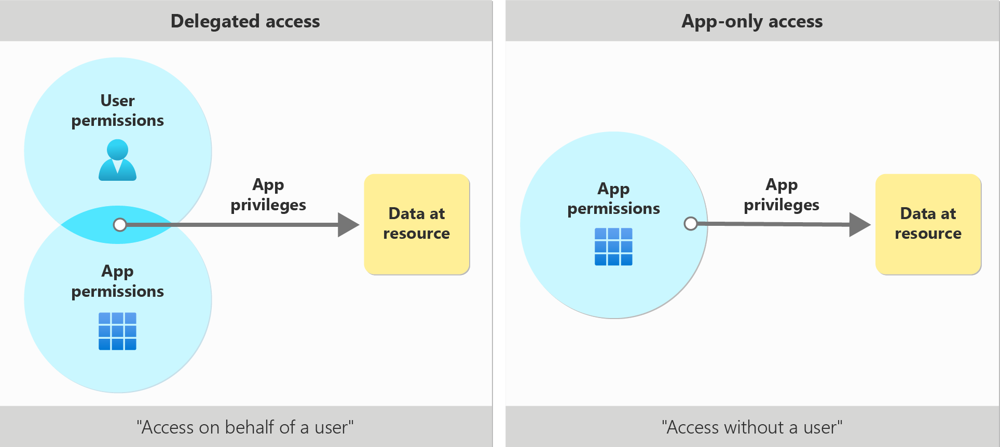

# OAuth

<figure markdown="span">
  { loading=lazy width="700" }
  <figcaption>Access Scenarios</figcaption>
</figure>

## :material-arrow-down-right: Getting Started

### 1) Create Service Principle

- Go to **App Registration** :octicons-arrow-right-24: Click **New registration**
- On **Authentication** :octicons-arrow-right-24: Click **Add a platform** :octicons-arrow-right-24:
  Pass `http://localhost` to this field
- On **Certificates & secrets** :octicons-arrow-right-24: Click **Client secrets**
  :octicons-arrow-right-24: Copy **Client ID** and **Client Secret ID** from this creation process

### 2) Client Authenticate

- Get Authorization Code

    ```console
    GET {tenant-id}/oauth2/v2.0/authorize HTTP/1.1
    Host: login.microsoftonline.com
    Content-Type: application/x-www-form-urlencoded

    client_id={client-id}&
    redirect_uri={redirect-uri}&
    response_type=code&
    response_mode=query&
    scope=offline_access {scopes}&
    access_type=offline
    ```

- Request Access and Refresh tokens

    ```console
    POST {tenant-id}/oauth2/v2.0/token HTTP/1.1
    Host: login.microsoftonline.com
    Content-Type: application/x-www-form-urlencoded

    code={authorization-code}&
    client_id={client-id}&
    client_secret={client-secret}&
    redirect_uri={redirect-uri}&
    scope=offline_access {scopes}&
    grant_type=authorization_code
    ```

- Re-generate Access Token

    ```console
    POST {tenant-id}/oauth2/v2.0/token HTTP/1.1
    Host: login.microsoftonline.com
    Content-Type: application/x-www-form-urlencoded

    refresh_token={refresh-token}&
    client_id={client-id}&
    client_secret={client-secret}&
    scope=offline_access {scopes}&
    grant_type=refresh_token
    ```

## References

- [:material-microsoft: Microsoft -- Get access and refresh tokens](https://learn.microsoft.com/en-us/advertising/guides/authentication-oauth-get-tokens)
- [:material-microsoft: Microsoft -- identity platform and OAuth 2.0 authorization code flow](https://learn.microsoft.com/en-us/entra/identity-platform/v2-oauth2-auth-code-flow#refreshing-the-access-tokens)
- [:material-microsoft: Microsoft Graph -- Permissions Reference](https://learn.microsoft.com/en-us/graph/permissions-reference)
