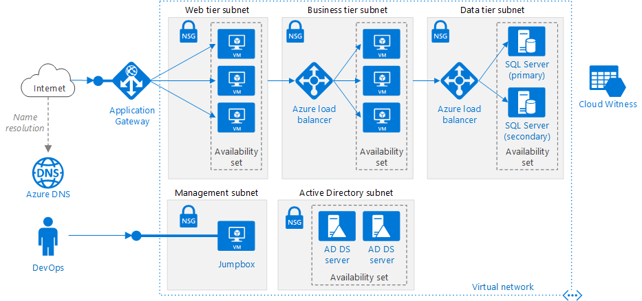
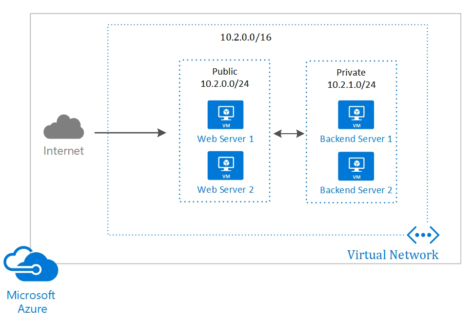
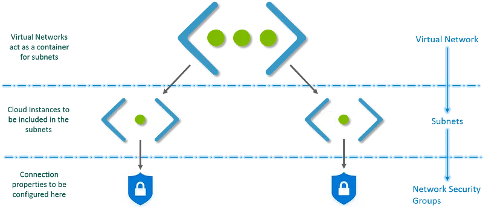

# VNet

**Azure Virtual Network (VNet)** is a representation of your own network in the
cloud. It is a logical isolation of the Azure cloud dedicated to your subscription.

## :material-arrow-down-right: Getting Started

### Components

#### Subnets

Each Virtual Network can be divided into sub parts, these sub parts are called
Subnets.

A subnet can further be divided into:

- Private Subnet — A network in which there is no internet access.
- Public Subnet — A network in which there is internet access.

#### Network Security Groups

A network security group is a set of rules or policies for incoming and outgoing
requests.
A network security group is generally attached at the subnet level.
The advantage of applying network security groups to Subnets is that we can control
the data flow. This is important in terms of network security.
With an NSG, we can define the IP range for the source of incoming requests.

But first, let me show you how the final architecture for a Virtual Network
looks like:

### Create

- On **Azure Portal** > Go to **Virtual Network** > Click **Create**

This is how Virtual Network works:

- First you create a virtual network.
- Then, in this virtual network you create subnets.
- You associate each subnet with the respective Virtual Machines or Cloud Instances.
- Attach the relevant Network Security Group to each subnet.
- Configure the properties in the NSGs and you are set!

## Read Mores

- [:simple-medium: Azure Virtual Network For Beginners — Securing Your Applications Using VPC](https://medium.com/edureka/azure-virtual-network-15ef505ba459)
- [:simple-medium: Beginner’s Guide to Azure Virtual Networks](https://medium.com/@AlexanderObregon/beginners-guide-to-azure-virtual-networks-bc965af76544)
