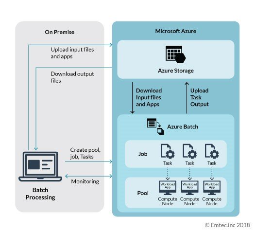
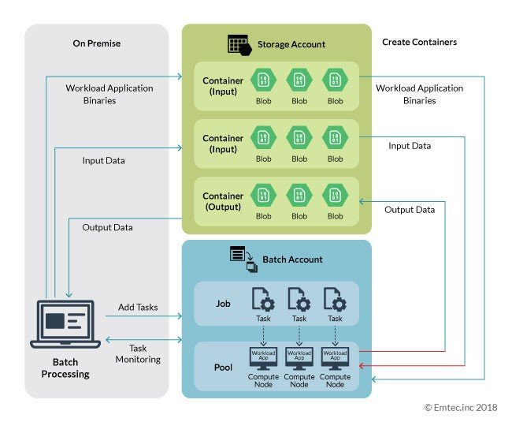
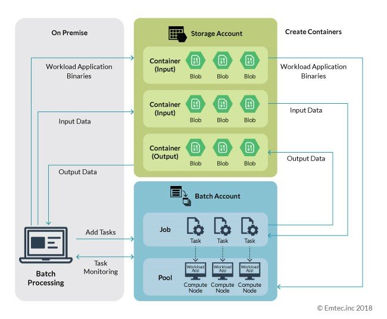

# Azure Batch

**Azure Batch** is a robust service that provides parallel batch processing to
execute intensive workloads of varying size.
It creates a pool of compute nodes (virtual machines) to tackle heavy loads.
With **Azure Batch**, batch processing has become more streamlined and viable to
complete data-intensive workloads at any scale.
To initiate automated creation and management of Azure Batch pool, job, and task,
the developer needs to create a batch application which can carry out on-premise
execution using batch API.
The batch application can be easily developed as an Azure CLI script, `.Net` application,
or `Python` application. The batch application is not limited to any technology
as Azure batch service provides REST API which is well documented.

The following diagram depicts an Azure Batch Processing design based on a
parallel workload:



- https://github.com/baptisteohanes/Demo_AzureBatch/blob/master/python_tutorial_client.py

The following steps explain the Azure Batch workflow scenario:

- The relevant data which needs to be processed by the task is uploaded to Azure storage.
  From Azure storage, the files are downloaded to the compute nodes to run the tasks.
- The setup is then completed to configure the pool of compute nodes. As the
  workload application is present in the compute node, the data needs to reach
  the compute node for application to process it.
  After processing the data, it is sent back to the storage.
- The job is set up and configured to manage a collection of tasks/work items.
- The task is then set up, configured, and assigned a job. The task defines the
  computational work to be done which may consist of retrieving the files stored
  in the Microsoft Azure Cloud storage.

## Typical Workload Applications / Use Cases

**Cloud-aware application**

:   Consider this use case based on a sample project in GitHub (Ref1)*.
    In this instance, the application is aware of the existence of Cloud and
    can interact with it.

    { loading=lazy }

    The block diagram above is an extension of the detailed diagram represented
    in the Azure batch processing section above.
    The overall execution process is the same, except one special attribute that
    the workload application is aware of the Cloud. It is capable to execute
    read and write operations on Cloud storage.


**Legacy application**

:   This includes standalone applications that do not include Cloud as part of
    the overall architecture or applications which organizations implemented
    before Cloud became mainstream.

    { loading=lazy }

    Let’s review an example of an application which is not aware of the cloud.
    Consider this sample project (Ref 2)where an application takes MP4 files from
    the filesystem and converts them into an AVI format using a FFmpeg tool
    (which is not Cloud aware) and then saves them to the filesystem.

The data processing remains same as mentioned in Azure batch processing with
the only difference being the tasks act as the intermediate between I/O container
and workload application present in the compute node.
Azure Batch has the capability to push the file from Cloud storage to the node
before starting the task, and after completion of the task, push it back to
Cloud storage.

## Create Batch Pool

```json
{
  "properties": {
    "vmSize": "STANDARD_D2a_V4",
    "deploymentConfiguration": {
      "virtualMachineConfiguration": {
        "imageReference": {
          "publisher": "canonical",
          "offer": "0001-com-ubuntu-server-jammy",
          "sku": "22_04-lts",
          "version": "latest"
        },
        "nodeAgentSKUId": "batch.node.ubuntu 22.04"
      }
    },
    "scaleSettings": {
      "autoScale": {
        "evaluationInterval": "PT5M",
        "formula": "samples = $PendingTasks.GetSamplePercent(TimeInterval_Minute * 5);\r\ncappedPoolSize = 1;\r\nAvgActiveTask = samples< 70 ? max(0,$ActiveTasks.GetSample(1)) : avg($ActiveTasks.GetSample(1 * TimeInterval_Minute, 2 * TimeInterval_Minute));\r\nAvgRunningTask = samples< 70 ? max(0,$RunningTasks.GetSample(1)) : avg($RunningTasks.GetSample(1 * TimeInterval_Minute, 10 * TimeInterval_Minute));\r\n$TargetDedicatedNodes = 0;\r\nActiveTask = AvgActiveTask > 0 ? 1 : 0;\r\nRunningTask = AvgRunningTask > 0 ? 1 : 0;\r\n$TargetLowPriorityNodes = min(cappedPoolSize,max(ActiveTask,RunningTask));\r\n// Set node deallocation mode - keep nodes active only until tasks finish\r\n$NodeDeallocationOption = taskcompletion;"
      }
    },
    "startTask": {
      "commandLine": "/bin/bash -c \"echo 'Set Python 3.10' && sudo update-alternatives --set python3 /usr/bin/python3.10 || echo 'Skipped: Set Python 3.10' && echo '########## Add PPA Repository ##########' && sudo apt update && sudo add-apt-repository ppa:deadsnakes/ppa || echo 'Skipped: Add Repository' && echo '########## Install Python V3.8 ##########' && sudo apt -y install python3.8 || echo 'Skipped: Install Python 3.8' && sudo apt -y install python3.8-dev && sudo update-alternatives --install /usr/bin/python3 python3 /usr/bin/python3.8 2 && sudo update-alternatives --install /usr/bin/python3 python3 /usr/bin/python3.10 1 && sudo update-alternatives --set python3 /usr/bin/python3.8 && python3 --version && sudo apt -y install python3-pip && sudo apt -y install python3.8-distutils && python3 -m pip install --upgrade pip && echo '########## Setting Others Configuration ##########' && sudo curl https://packages.microsoft.com/keys/microsoft.asc | apt-key add - && sudo curl https://packages.microsoft.com/config/ubuntu/22.04/prod.list > /etc/apt/sources.list.d/mssql-release.list && sudo ACCEPT_EULA=Y apt install -y msodbcsql17 && sudo ACCEPT_EULA=Y apt install -y mssql-tools && echo 'export PATH=\\\"$PATH:/opt/mssql-tools/bin\\\"' >> ~/.bashrc && source ~/.bashrc && sudo apt -y install unixodbc-dev && echo '########## Start Install Python Library ##########' && pip3 install azure-core==1.17.0 && pip3 install azure-storage-blob==12.8.1 && pip3 install networkx==2.5 && pip3 install numpy==1.19.5 && pip3 install pandas==1.1.3 && pip3 install pyarrow==1.0.1 && pip3 install pyodbc==4.0.35 && pip3 install pythainlp==2.3.0 && pip3 install rapidfuzz==1.3.3 && pip3 install scikit-learn==0.24.1 && pip3 install scipy==1.6.0 && pip3 install torch==1.7.1 && pip3 install tqdm==4.58.0 && pip3 install azure-keyvault-secrets==4.3.0 && pip3 install azure-identity==1.6.1 && pip3 install cffi==1.14.6 && pip install azure-storage-file-datalake==12.4.0 && pip install duckdb==0.2.9 && pip install Office365-REST-Python-Client==2.3.8 && pip install openpyxl==3.0.9 && pip install xlsxwriter && pip install xlrd==1.2.0 && pip install pytz==2021.1\"",
      "userIdentity": {
        "autoUser": {
          "scope": "Pool",
          "elevationLevel": "Admin"
        }
      },
      "maxTaskRetryCount": 1,
      "waitForSuccess": true
    },
    "taskSlotsPerNode": 2,
    "taskSchedulingPolicy": {
      "nodeFillType": "pack"
    }
  },
  "identity": {
    "type": "UserAssigned",
    "userAssignedIdentities": {
      "/subscriptions/{tenant-id}/resourceGroups/{resource-group-name}/providers/Microsoft.ManagedIdentity/userAssignedIdentities/{managed-id-name}": {}
    }
  }
}
```

## Python

- https://github.com/uglide/azure-content/blob/master/articles/batch/batch-python-tutorial.md


## References

- [Running heavy workloads using Azure Batch Processing](https://www.bridgenext.com/blog/running-heavy-workloads-using-azure-batch-processing/)
- [Azure Batch cloud scale containers for HPC](https://www.youtube.com/watch?v=r5jxlwJQEPc)
