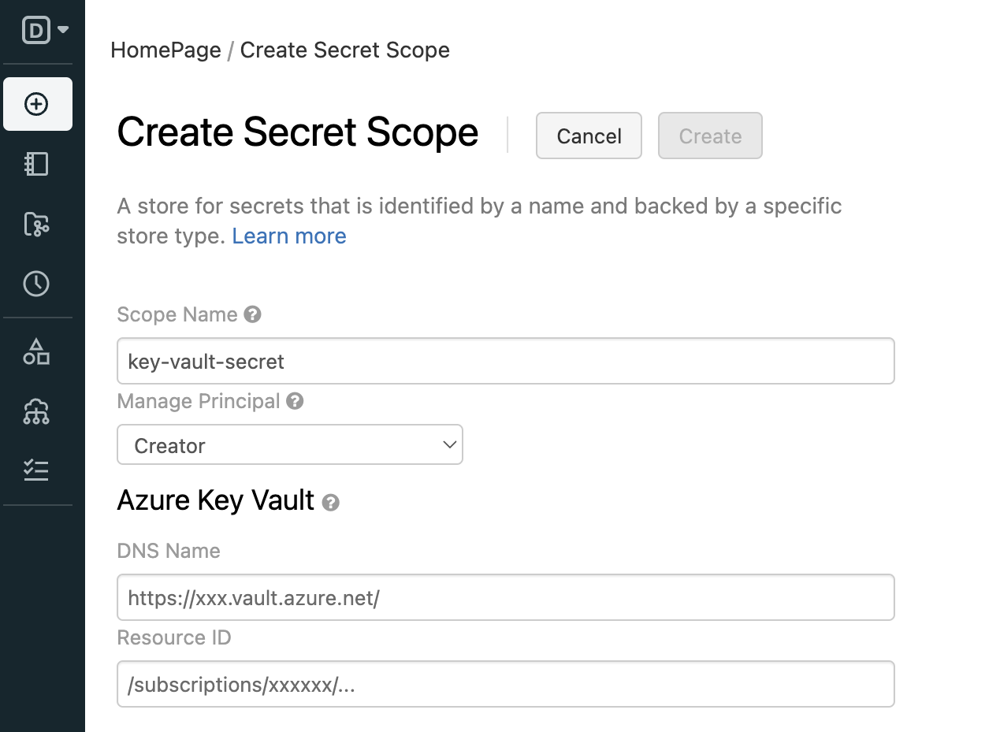

# Secrets

**Azure Databricks** allow you to map **Azure Key Vault** with secrete module.

## :material-arrow-down-right: Getting Started

### Prerequisite

- Go to `https://<databricks-instance>.azuredatabricks.net#secrets/createScope`
- Create Scope with `All workspace users` manage principle

<figure markdown="span">
  { loading=lazy width="500" }
  <figcaption>Azure Databricks Secrets Scope</figcaption>
</figure>

### List of Secrets

**List of all secrets scopes**:

```python
display(dbutils.secrets.listScopes())
```

**List of secrets with a scope name**:

```python
display(dbutils.secrets.list(scope='<scope-name>'))
```

## Read Mores

- [:material-microsoft: Microsoft - Secret scopes](https://learn.microsoft.com/en-us/azure/databricks/security/secrets/secret-scopes)
