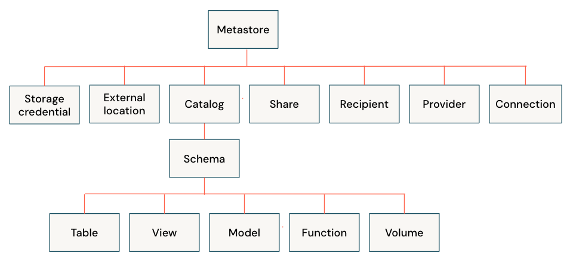

# Privileges

Initially, users have no access to data in a metastore. Azure Databricks account
admins, workspace admins, and metastore admins have default privileges for managing
Unity Catalog.

All securable objects in Unity Catalog have an owner. Object owners have all
privileges on that object, including the ability to grant privileges to other
principals.

!!! note

    Privileges can be granted by either a metastore admin, the owner of an object,
    or the owner of the catalog or schema that contains the object. Account admins
    can also grant privileges directly on a metastore.

## Manage Privileges

## :material-playlist-plus: Read Mores

- [:material-microsoft: Manage privileges in Unity Catalog](https://learn.microsoft.com/en-us/azure/databricks/data-governance/unity-catalog/manage-privileges/#grant)
- [:material-microsoft: Unity Catalog privileges and securable objects](https://learn.microsoft.com/en-us/azure/databricks/data-governance/unity-catalog/manage-privileges/privileges)
