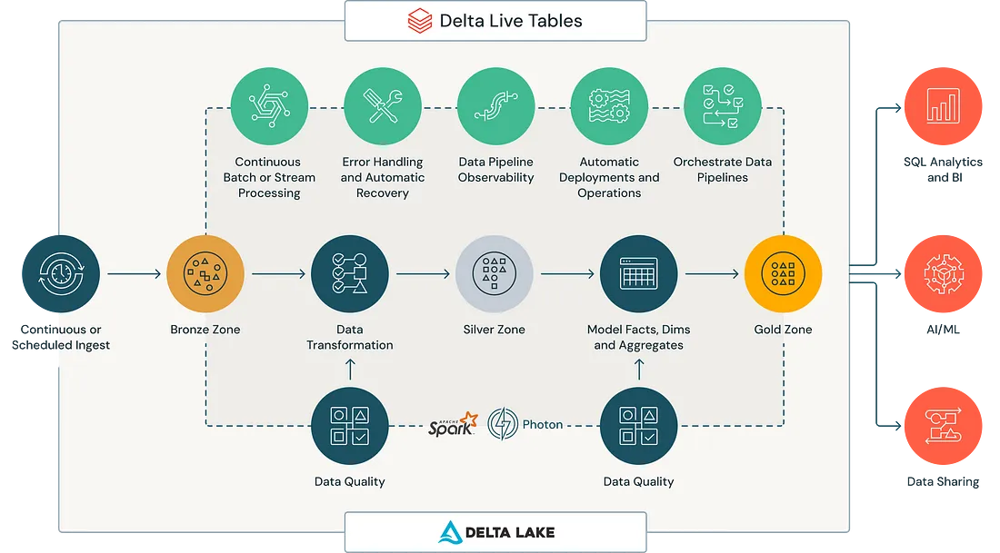

# Delta Live Table

The data engineering domain has evolved recently to contain many data transformation
frameworks. In the past years, frameworks like **DBT** and **Dataform**
have gained momentum and proven their benefit across analytics environments.
I had the chance to work with those frameworks and build data architectures that
used them as a core for running data transformations and ensuring code quality.

{ loading=lazy }

## Getting Started

### Project File Structure

```text
workflows/
├── datasource/
│  └── <env>_deployment.yml

datasource/
│
├── raw/
│ ├── docs/
│ │ └── docs.yml
│ │
│ ├── configs/
│ │ └── tables.yml
│ │
│ ├── tests/
│ │ └── tests.yml
│ │
│ └── scripts/
│ ├── raw_customers.sql
│ └── raw_orders.sql
│
├── silver/
│ └── scripts/
│ ├── silver_customers.sql
│ └── silver_orders.sql
└── ...
│
└── gold/
└── ...
├── datasource_transformation_notebook.py
```

## References

- [Production Ready Project File Structure for Databricks Delta Live Tables](https://blog.det.life/production-ready-project-file-structure-for-databricks-delta-live-tables-788cbe8a0290)
