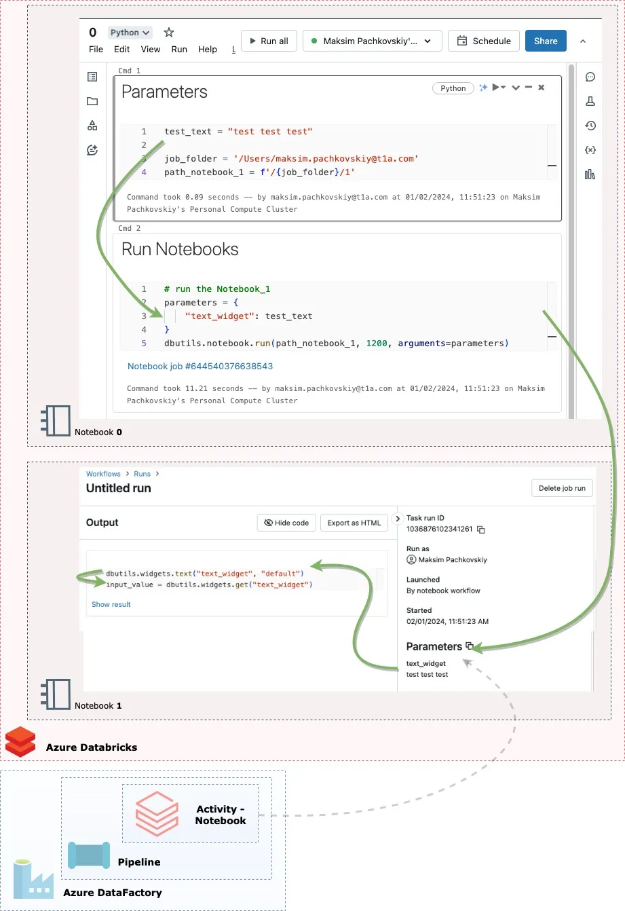

# Widgets and Parameters

## Widgets

```python
dbutils.widgets.text("text_widget", "default")
```

## Transferring Parameters

```python
test_text = "test test test"
job_folder = '/Users/username@email.com'
path_notebook_1 = f'/{job_folder}/1'


parameters = {
    "text_widget": test_text
}
dbutils.notebook.run(path_notebook_1, 1200, arguments=parameters)
```

{ loading=lazy }

## References

- [All about Parameters and Widgets in Databricks Workflows](https://blog.devgenius.io/all-about-parameters-in-databricks-workflows-28ae13ebb212)
