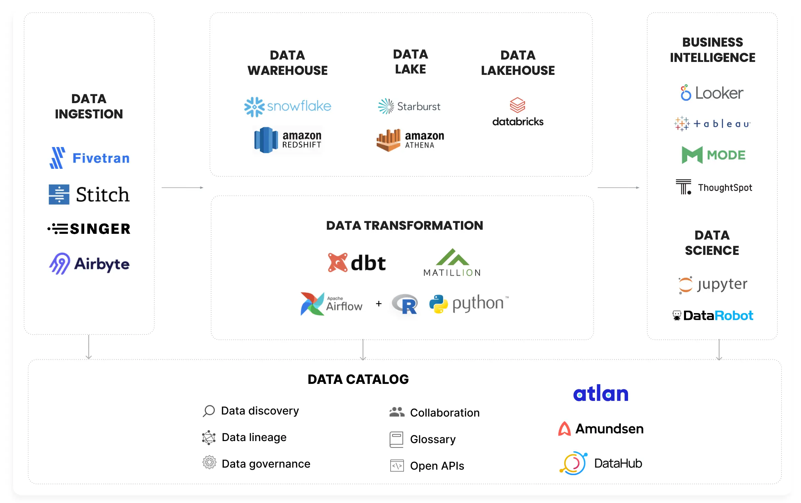
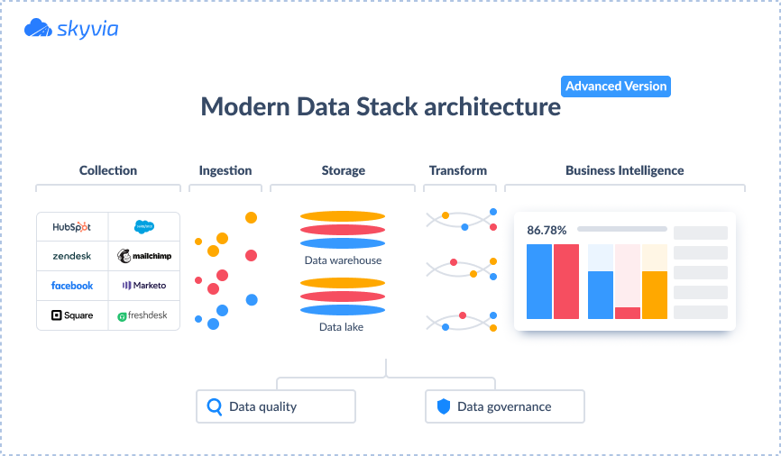

# Services

!!! warning

    I will filter **Data Engineering Services** on this session that do not relate
    and unnecessary for the most **Data Architect** and **Modern Data Strack**.

:material-page-last: Service and Cloud Provider that use on **Modern Data Stack (MDS)**.
You can see the below diagram show a ==Modern Data Stack Ecosystem== that include
the **Cloud Services** more than the [**Open-Source Stacks**](../tools/index.md).

<figure markdown="span">
  { loading=lazy width="700" }
  <figcaption><a href="https://atlan.com/modern-data-stack-101/">Modern Data Stack Ecosystem</a></figcaption>
</figure>

:material-page-last: As such, the definition of a **Modern Data Stack** cannot
be clearly stated since every business tries to adapt modern technologies to
their requirements.

However, there are definite features of the modern data stack that identify it:

- It’s **Cloud-Based**, requires very little maintenance, is easy to install,
  and can scale quickly with little effort.
- It can be used by **Small and Medium-Sized Data Teams**, as it has a lot of
  out-of-the-box functionality and doesn't rely on the number of data professionals.
- It offers a **Lot of Integration Opportunities** for creating a comprehensive
  data ecosystem.

Overall, the **Modern Data Stack** centerpiece is about democratizing data usage:
^^Making data more accessible, covering different dimensions of business, improving
analytics capabilities, and simplifying the infrastructure^^.

<figure markdown="span">
  { loading=lazy width="650" }
  <figcaption><a href="https://blog.skyvia.com/modern-data-stack/">Modern Data Stack Architecture</a></figcaption>
</figure>

:material-page-last: If the advantages of Modern Data Stack do not seem convincing
enough, let's have a look at how it differs from the **Traditional Data Stack**.

| **Traditional Data Stack**             | **Modern Data Stack**                                     |
|----------------------------------------|-----------------------------------------------------------|
| Has coupled structure                  | Has modular structure                                     |
| Complex setup requiring large IT teams | Less time on technical configuration                      |
| Requires serious technical background  | Suitable for users without extensive technical background |
| Contains traditional RDBMS             | Works with RDBMS as well as big data, unstructured data   |

The Modern Data Stack provides businesses with a bias for action.
Creating a Modern Data Stack enables organizations to devote more time to analyzing
their data and less time engineering their data processing pipelines.

## :material-select-compare: Providers Comparison

- ==[:material-cloud-outline: Compare Cloud Service Providers](https://comparecloud.in/)==

### Data Processing

- [:simple-medium: Databricks vs Snowflake: A Complete 2024 Comparison](https://medium.com/sync-computing/databricks-vs-snowflake-a-complete-2024-comparison-462eac35b639)

### IaC & Infra

- [:simple-medium: Pulumi vs Terraform: The Definitive Guide to Choosing Your IaC Tool](https://medium.com/4th-coffee/pulumi-v-s-terraform-the-definitive-guide-to-choosing-your-iac-tool-5a602f754439)
- [:simple-medium: Pulumi vs. Terraform: Choosing your IaC Tool](https://medium.com/datamindedbe/pulumi-vs-terraform-choosing-your-iac-tool-6d17b5222545)

## :material-finance: FinOps

- [Proven in Production: A Cost-Effective Modern Data Architecture for Small and Medium Enterprises](https://blog.det.life/proven-in-production-a-cost-effective-modern-data-architecture-for-small-and-medium-enterprises-bfb3502a89c8)
