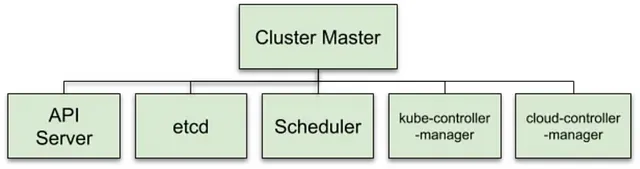
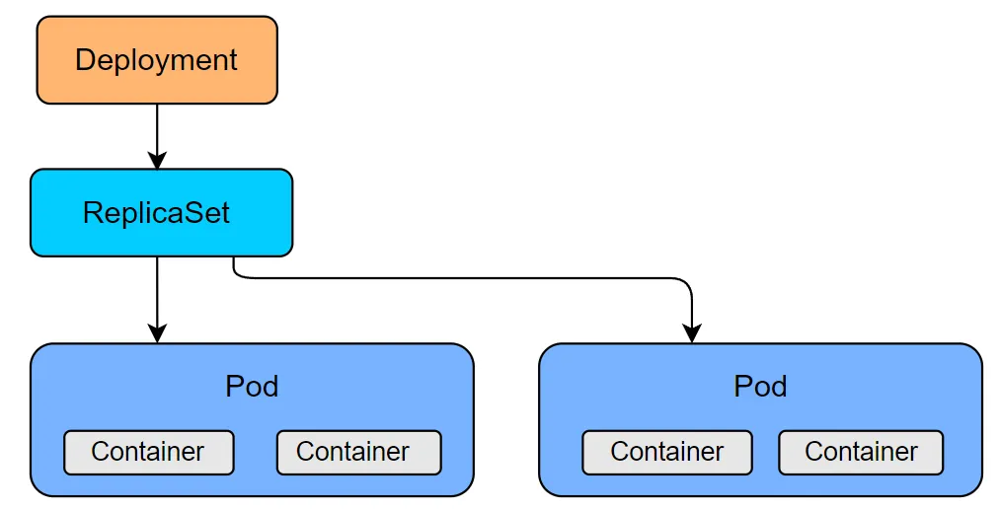
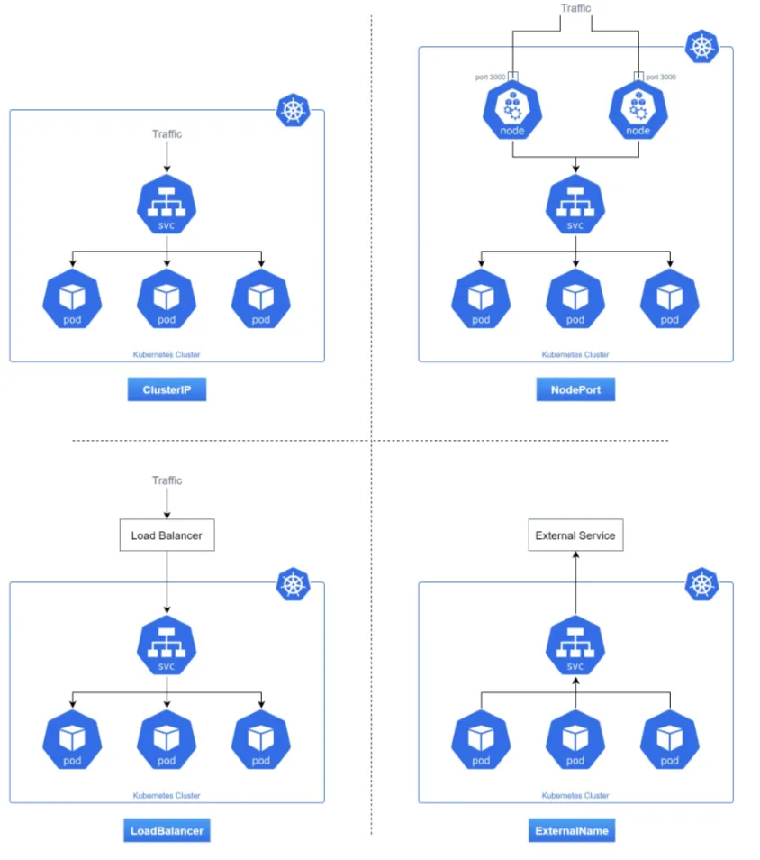
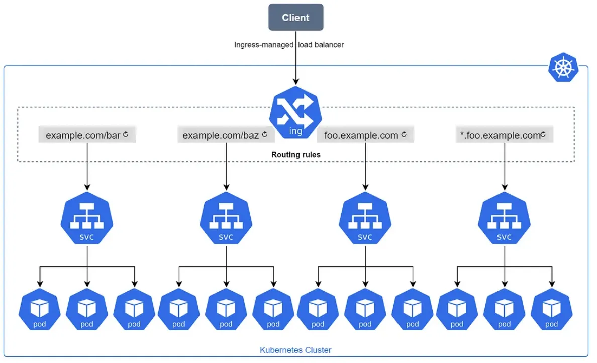
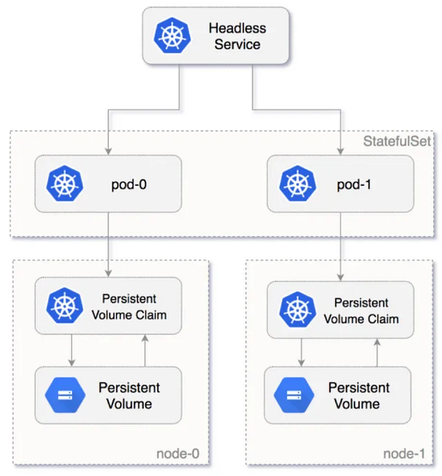
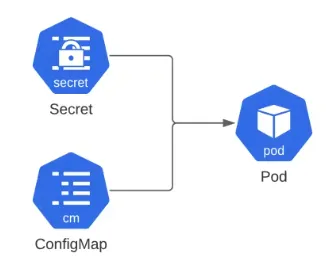
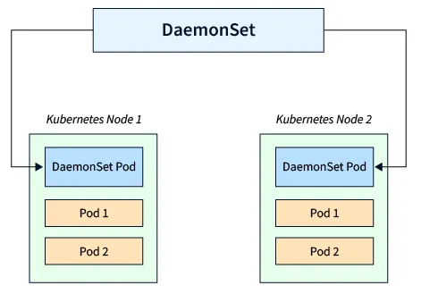
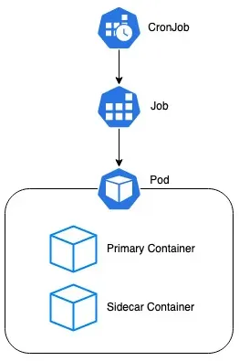
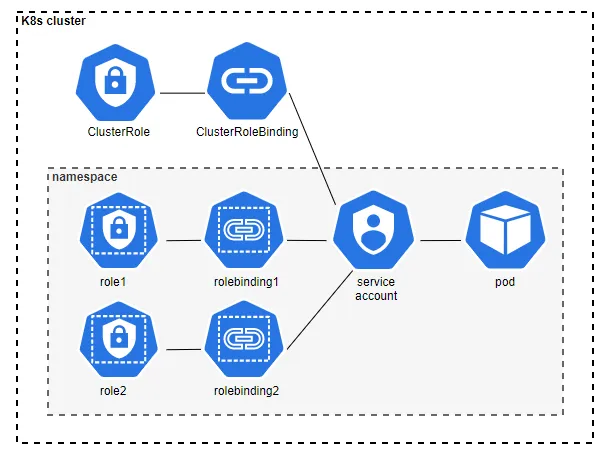

# Kubernetes

Kubernetes (K8s)

## Installation

=== "MacOS"

    ```console
    $ brew install kubectl
    $ brew install helm
    $ brew install k9s
    ```

## Core Concepts of Kubernetes

{ loading=lazy }

- **Control Plane** — The ‘brain’ of the cluster, responsible for managing the nodes and applications that are running on them. It consists of several components, such as API server, etcd, scheduler, and controller manager.
- **API Server** — It exposes a RESTful API that allows users to interact with the cluster.
- **etcd** — Database that stores the configuration data for the cluster.
- **Scheduler** — Responsible for placing applications onto nodes, depending on the availability and requirements of the resources.
- **Controller Manager** — monitoring the state of the cluster.

## Data Plane components of Kubernetes

- **Containers**: Kubernetes is built around containerization. A container packages an application with all its dependencies and runtime environment. This ensures consistency across various development, testing, and production environments.

- **Pods**: The smallest deployable units in Kubernetes. A pod can contain one or more containers that share storage, network, and specifications on how to run the containers. Pods are ephemeral and disposable.

- **Deployments**: This is a higher-level concept that manages declarative updates for Pods and ReplicaSets. Deployments use a template for a pod and control parameters to scale the number of pods, rolling update strategies, and desired state. used for managing the rollout and scaling of applications.

  { loading=lazy }

- **Services**: Exposing an application running on a POD to the network (other PODS).
  A Kubernetes Service is an abstraction layer that defines a logical set of Pods
  and a policy by which to access them. This is often used to provide network access
  to a set of pods.

  { loading=lazy }

- **Ingress** — Ingresses provide external access to services within the cluster.
  They manage external HTTP and HTTPS routing, allowing us to define rules for
  handling incoming traffic.

  { loading=lazy }

- **Statefulsets** — A StatefulSet is a set of pods with a unique, persistent hostname
  and ID. StatefulSets are designed to run stateful applications in Kubernetes
  with dedicated persistent storage. When pods run as part of a StatefulSet,
  Kubernetes keeps state data in the persistent storage volumes of the StatefulSet,
  even if the pods shut down. StatefulSets provide predictable order and state for
  stateful workloads such as databases. They are scaled up or down sequentially
  in a predictable order. This is very important for databases. StatefulSets have
  a unique DNS name based on this order. This is important for workloads such as
  Apache Kafka which distribute the data amongst their brokers; hence, one broker
  is not the same as another.

  { loading=lazy }

- **Config map** — Config Maps store configuration data separately from application code, allowing for easier configuration changes without modifying the container image.

- **Secret** — Secrets store sensitive information such as passwords, API keys, and tokens. They are base64-encoded and can be mounted into pods or used as environment variables.

  { loading=lazy }

- **Daemonsets** — DaemonSets ensure that a copy of a pod runs on every node in the cluster. This is particularly useful for system-level tasks such as log collection, monitoring, or node-specific functionality.

  { loading=lazy }

- **Job** — Jobs manage the execution of short-lived tasks to completion. They are useful for batch processing, data migration, or any task that needs to run to completion but doesn’t require continuous execution.
- **Cron Jobs** — Cron Jobs enables the scheduling of recurring tasks in a Kubernetes cluster, similar to the cron jobs in traditional Unix/Linux systems. They are valuable for automating periodic processes.

  { loading=lazy }

- **Namespace** — Namespaces provide a way to divide cluster resources into virtual
  clusters, enabling multi-tenancy and resource isolation. They help organize and
  manage objects within a cluster.

- **Role** — Roles define a set of permissions within a namespace. They are used in conjunction with role bindings to grant access to resources within the cluster.
- **Role Binding** — A role binding grants the permissions defined in a role to a user or set of users. It holds a list of subjects (users, groups, or service accounts), and a reference to the role being granted
- **Service Account** — A service account provides an identity for processes that run in a Pod, and maps to a ServiceAccount object. When you authenticate to the API server, you identify yourself as a particular user.

  { loading=lazy }

- **Nodes**: These are worker machines in Kubernetes, which can be either physical or virtual. Each node runs pods and is managed by the master node. Nodes have the necessary services to run pods and are managed by the control plane.
- **Label, Annotation & Selectors** — Labels are key-value pairs attached to objects (such as pods, nodes, services, and more) to help organize and categorize them. Labels can be used with selectors to filter and select specific resources. Annotations in Kubernetes are a mechanism for adding arbitrary metadata to objects (such as pods, services, nodes, and more) that are not used for identification or selection purposes.

- **Affinity** — Affinities are used to express Pod scheduling constraints that can match the characteristics of candidate Nodes and the Pods that are already running on those Nodes. A Pod that has an “affinity” to a given Node is more likely to be scheduled to it; conversely, an “anti-affinity” makes it less probable it’ll be scheduled. Affinity can be either an attracting affinity or a repelling anti-affinity.
- **Taints & toleration** — Taints and tolerations work together to ensure that pods are not scheduled onto inappropriate nodes. One or more taints are applied to a node; this marks that the node should not accept any pods that do not tolerate the taints.
- **Cert Manager** — cert-manager adds certificates and certificate issuers as resource types in Kubernetes clusters and simplifies the process of obtaining, renewing, and using those certificates.
- **Kubectl** — Kubectl is the command-line interface (CLI) for interacting with Kubernetes clusters. It allows users to perform various operations on Kubernetes resources, such as deploying applications, inspecting and managing cluster resources, and troubleshooting issues. Kubectl communicates with the Kubernetes API server to execute these commands and obtain information about the cluster’s state.

  ??? note "Kubectl commands"

        ```shell
        kubectl version --client
        kubectl cluster-info
        kubectl config view
        kubectl config current-context
        kubectl config use-context <cluster name>
        kubectl get nodes
        kubectl label node <node-name> node-role.kubernetes.io/worker=worker
        kubectl drain <node-name>
        kubectl cordon <node-name>
        kubectl uncordon <node-name>
        kubectl apply -f <K8s-manifest.yaml>
        kubectl delete -f <K8s-manifest.yaml>

        # Pod
        kubectl get pods -n <namespace> -o wide
        kubectl get pods -n <namespace> -w
        kubectl describe pod <pod-name> -n <namespace>
        kubectl logs -f pod <pod-name> -n <namespace>
        kubectl logs --since=1h <pod-name> -n <namespace>
        kubectl logs --tail=200 <pod-name> -n <namespace>
        kubectl exec -it <pod-name> -c <container_name> -n <namespace> -- bash
        kubectl get events --field-selector involvedObject.name=<pod-name> --field-selector involvedObject.kind=Pod
        kubectl port-forward <pod-name> -n <namespace> <local-port>:<pod-port>

        # Deployment
        kubectl get deployments -n <namespace>
        kubectl edit deployments <deployment_name> -n <namespace>
        kubectl set image deployment/nginx-deployment nginx=nginx:2.0
        kubectl scale deployment <deployment-name> -n <namespace> --replicas=<desired-replica-count>
        kubectl rollout restart deployment/<deployment-name>
        kubectl rollout status deployment <deployment-name> -n <namespace>
        kubectl delete deployment <deployment_name> -n <namespace>

        # Services
        kubectl get services -n <namespace>
        kubectl describe service <service-name> -n <namespace>
        kubectl expose deployment <deployment-name> -n <namespace> --type=NodePort --port=<port>

        # Config Map & Secret
        kubectl create configmap <configmap-name> --from-file=<path-to-file> -n <namespace>
        kubectl create secret generic <secret-name> --from-file=file_name -n <namespace>

        # Role & Role binding
        kubectl create role pod-reader --verb=get --verb=list --verb=watch --resource=pods
        kubectl create rolebinding bob-admin-binding --clusterrole=pod-reader --user=bob --namespace=<namespace>

        # Job / CronJob
        kubectl create cronjob my-cron --image=busybox --schedule="*/5 * * * *" -- echo hello -n <namespace>

        # Patch
        kubectl patch svc my-apache -n apache-http-server -p '{"spec":{"externalIPs":["172.20.82.86"]}}'

        # Copy from local to pod
        kubectl cp -n <namespace> <local_file_path> <pod_name>:/path/on/container/file_name

        # Auth Check
        kubectl --as=system:serviceaccount:NAMESPACE:SERVICE_ACCOUNT auth can-i get secret/SECRET_NAME
        ```

- **Helm** — is a package manager used to manage and deploy Kubernetes applications. Helm was developed to make complex application deployments and configurations in Kubernetes environments more manageable and reusable. Examples are apache-airflow/airflow and datahub/datahub.

  ??? note "Helm commands"

        ```shell
        # Helm Chart
        helm create mychart
        helm install myrelease ./mychart
        helm uninstall myrelease
        helm upgrade myrelease ./mychart
        helm upgrade myrelease ./mychart --set key1=value1,key2=value2
        helm rollback myrelease 1
        helm repo list
        helm repo add apache-airflow https://airflow.apache.org
        helm repo update
        helm install airflow apache-airflow/airflow --namespace airflow --create-namespace -f values.yaml
        kubectl port-forward svc/airflow-webserver 8080:8080 --namespace airflow

        # Examples from DE charts
        helm repo add kafka https://charts.bitnami.com/bitnami
        helm install kafka bitnami/kafka
        helm repo add pinot https://raw.githubusercontent.com/apache/pinot/master/kubernetes/helm
        helm install pinot pinot/pinot
        helm repo add superset https://apache.github.io/superset
        helm install superset superset/superset -f superset-values.yaml
        ```

- **Operators** — Kubernetes’ operator pattern concept lets you extend the cluster’s behavior without modifying the code of Kubernetes itself by linking controllers to one or more custom resources. Operators are clients of the Kubernetes API that act as controllers for a Custom Resource. Examples are sparkoperator, and druid-operator.

## Common Kubernetes Errors

- CrashLoopBackOff — pod repeatedly crashes and is restarted by the kubelet, faulty container image, resource constraints, or problems with the application itself.
- ImagePullBackOff — kubelet is unable to pull the container image from the specified registry, incorrect image names or tags, network problems, or authentication issues.
- OutOfMemory — pod consumes more memory than its resource limits allow.
- OutOfMemoryKilled — The pod consumes more memory than its limits allow, and the kubelet kills the container to prevent the pod from consuming even more memory.
- OutOfCPU — The pod consumes more CPU resources than its limits allow.
- ImagePullError —The kubelet is unable to pull the container image from the specified registry due to a non-HTTP error, network connectivity problems, or registry availability issues.
- EvictionWarning — The pod is at risk of being evicted from a node due to resource constraints.
- FailedScheduling — The scheduler is unable to find a node that meets the resource and placement requirements of a pod.
- DiskPressure — The node runs out of available disk space.
- NodeUnreachable — The pod is unable to communicate with its assigned node.
- RunContainerError — The issue is usually due to misconfiguration such as: Mounting a not-existent volume such as ConfigMap or Secrets. Mounting a read-only volume as read-write.
- Pod in pending state — The cluster doesn’t have enough resources such as CPU and memory to run the Pod. The current Namespace has a ResourceQuota object and creating the Pod will make the Namespace go over the quota. The Pod is bound to a Pending PersistentVolumeClaim.


## Practices

- [Most common mistakes to avoid when using Kubernetes: Anti-Patterns](https://medium.com/@seifeddinerajhi/most-common-mistakes-to-avoid-when-using-kubernetes-anti-patterns-%EF%B8%8F-f4d37586528d)

## References

- [LearnK8s - Troubleshooting Deployments](https://learnk8s.io/troubleshooting-deployments)
- [Intro to K8s for Data Engineers](https://blog.devgenius.io/intro-to-k8s-for-data-engineers-e2a233e44ce4)
- https://blog.cloudnatician.com/%E0%B8%AD%E0%B8%98%E0%B8%B4%E0%B8%9A%E0%B8%B2%E0%B8%A2-kubernetes-%E0%B8%9E%E0%B8%B7%E0%B9%89%E0%B8%99%E0%B8%90%E0%B8%B2%E0%B8%99-%E0%B9%83%E0%B8%99-5-%E0%B8%99%E0%B8%B2%E0%B8%97%E0%B8%B5-823cb6190c65
- [Kubernetes for Data Engineering](https://blog.stackademic.com/kubernetes-for-data-engineering-an-end-to-end-guide-26c741a8c013)
