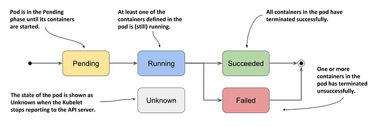

# State & Phase

## Pod phases

Pods have a predetermined life cycle. We can use the Kubernetes API to check its
status. Pod statuses are crucial in understanding the health and state of a pod
at any given time. There are five primary phases or statuses that a pod can
be in.

### Pending

The Pod has been accepted by the Kubernetes cluster, but one or more of the containers has not been set up and made ready to run. This includes time a Pod spends waiting to be scheduled as well as the time spent downloading container images over the network.

- Insufficient resources: When the cluster does not have enough resources to accommodate the pod’s resource requests, the pod cannot be scheduled.
- Image issues: If there is a wrong image name specified in the pod spec, or issues are pulling the image from the repository, the pod will not start.
- Node selector and node labels mismatches: Node selectors are used to target specific nodes for pod placement. If the labels on the nodes do not match the selectors defined in the pod specification, the pod will remain unscheduled.
- Taints and Tolerations: If a node is “tainted”, it’s marked to repel certain Pods. A Pod with a matching “toleration” can be scheduled on such a node. If no node with a suitable toleration for the Pod’s taints exists, the Pod will stay in Pending status.
- Unschedulable nodes: Nodes may be marked as unschedulable for various reasons, such as maintenance, which prevents pods from being scheduled on them.
- Rolling update surge
- Inter pod affinity & anti affinity
- PVC linked issues

### Running

The Pod has been bound to a node, and all the containers have been created. At least one container is still running, or is in the process of starting or restarting.

### Succeeded

All containers in the Pod have terminated in success, and will not be restarted.

### Failed

All containers in the Pod have terminated, and at least one container has terminated in failure. That is, the container either exited with non-zero status or was terminated by the system.

### Unknown

For some reason the state of the Pod could not be obtained, typically due to an error in communicating with the host of the Pod.

## References

- [K8s for Data Engineers — Pod & Container States/Phase](https://blog.devgenius.io/k8s-for-data-engineers-pod-container-states-phase-530edaeb22a7)
