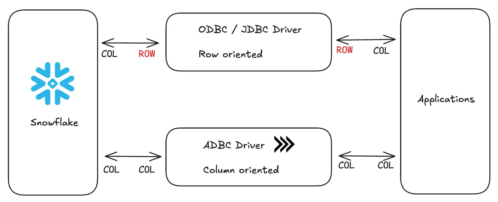

# ADBC

!!! note "What is Apache Arrow and ADBC?"

    **Apache Arrow** is a columnar memory format designed for fast analytics and
    data transfer between systems. While Arrow itself is the format specification,
    **ADBC (Arrow Database Connectivity)** is the database connectivity layer
    that enables standardized access to databases using Arrow.



In ODBC land, we hit the Snowflake API with an ODBC driver, Snowflake converts
the requested data from columnar format to row format (~100ms), serialize to
ODBC format (500ms), network transfer (1–2 seconds), deserialize from ODBC (~500ms),
and convert the data back from row format into columnar format for DuckDB.

In the great land of ADBC, we hit the Snowflake API with an ADBC driver, the
data stays in columnar format, network transfer (1–2 seconds), and we read
the data into DuckDB as is.

The challenge in using JDBC or ODBC is due to the rise in columnar databases
(Redshift, BigQuery, Snowflake, Databricks, etc.) and columnar formats
(Parquet, Avro, ORC, etc.). Using ODBC with columnar databases forces
a time-consuming conversion between rows and columns, a process known
as serialization/deserialization.

## Getting Started

```shell
pip install adbc_driver_snowflake pyarrow duckdb
```

```python
SNOWFLAKE_CONFIG = {
    'adbc.snowflake.sql.account': os.getenv('SNOWFLAKE_ACCOUNT'),
    'adbc.snowflake.sql.warehouse': os.getenv('SNOWFLAKE_WAREHOUSE'),
    'adbc.snowflake.sql.role': os.getenv('SNOWFLAKE_ROLE'),
    'adbc.snowflake.sql.database': os.getenv('SNOWFLAKE_DATABASE'),
    'username': os.getenv('SNOWFLAKE_USER'),
    'password': os.getenv('SNOWFLAKE_PASSWORD'), # Comment this line if you want to use a password
    # 'adbc.snowflake.sql.client_option.jwt_private_key_pkcs8_value': pem_key, # Uncomment this line if you want to use a password
    # 'adbc.snowflake.sql.auth_type': 'auth_jwt' # Uncomment this line if you want to use a password
}

# Create Snowflake connection
snowflake_conn = adbc_driver_snowflake.dbapi.connect(
    db_kwargs={**SNOWFLAKE_CONFIG}
)
```

```shell
pip install cryptography
```

```python
from cryptography.hazmat.primitives import serialization

def read_private_key(private_key_path: str, private_key_passphrase: str = None) -> str:
    """Read a private key file and return its PEM representation as a string"""
    with open(private_key_path, 'rb') as key_file:
        private_key = serialization.load_pem_private_key(
            key_file.read(),
            password=private_key_passphrase.encode() if private_key_passphrase else None
        )

        # Convert to PEM format with PKCS8
        pem_key = private_key.private_bytes(
            encoding=serialization.Encoding.PEM,
            format=serialization.PrivateFormat.PKCS8,
            encryption_algorithm=serialization.NoEncryption()
        )
        return pem_key.decode('utf-8')
```

```python
pem_key = read_private_key(os.getenv('SNOWFLAKE_PRIVATE_KEY_PATH'), os.getenv('SNOWFLAKE_PRIVATE_KEY_PASSPHRASE'))
```

## Full Code

```python
import adbc_driver_snowflake.dbapi
import duckdb
import dotenv
import os
from read_private_key import read_private_key # Uncomment if you're using a private key

# Load environment variables
dotenv.load_dotenv()

# Configuration for Snowflake connection
pem_key = read_private_key(os.getenv('SNOWFLAKE_PRIVATE_KEY_PATH'), os.getenv('SNOWFLAKE_PRIVATE_KEY_PASSPHRASE'))

SNOWFLAKE_CONFIG = {
    'adbc.snowflake.sql.account': os.getenv('SNOWFLAKE_ACCOUNT'),
    'adbc.snowflake.sql.warehouse': os.getenv('SNOWFLAKE_WAREHOUSE'),
    'adbc.snowflake.sql.role': os.getenv('SNOWFLAKE_ROLE'),
    'adbc.snowflake.sql.database': os.getenv('SNOWFLAKE_DATABASE'),
    'username': os.getenv('SNOWFLAKE_USER'),
    'password': os.getenv('SNOWFLAKE_PASSWORD'), # Comment this line if you want to use a password
    # 'adbc.snowflake.sql.client_option.jwt_private_key_pkcs8_value': pem_key, # Uncomment this line if you want to use a password
    # 'adbc.snowflake.sql.auth_type': 'auth_jwt' # Uncomment this line if you want to use a password
}

# Create Snowflake connection
snowflake_conn = adbc_driver_snowflake.dbapi.connect(
    db_kwargs={**SNOWFLAKE_CONFIG}
)
print("Connection to Snowflake successful.")
snowflake_cursor = snowflake_conn.cursor()

# Query Snowflake
query = """
    SELECT
        *
    FROM SANDBOX_DB.KYLE_SCHEMA.RAW_ORDERS
"""
snowflake_cursor.execute(query)
print("Query executed successfully.")

# Store results as an arrow table
arrow_table = snowflake_cursor.fetch_arrow_table()

# Create DuckDB connection and store locally to path
duckdb_conn = duckdb.connect('demo.db')

# Store arrow table in DuckDB
table_name = 'raw_orders'
query = f"""
    CREATE TABLE IF NOT EXISTS {table_name} AS SELECT * FROM arrow_table
"""
duckdb_conn.execute(query)
print("Table created in DuckDB successfully.")

# Alternatively you can use the from_arrow_table method
# duckdb_conn.from_arrow_table(arrow_table)

# Close connections
snowflake_cursor.close()
snowflake_conn.close()
duckdb_conn.close()

print("All done :)")

# Now we can spin up DuckDB CLI and work with the data locally! Enter the following command in your terminal to connect:
# duckdb demo.db
```

## References

- [Cut Costs by Querying Snowflake Tables in DuckDB with Apache Arrow](https://greybeam.medium.com/query-locally-and-cut-snowflake-costs-with-duckdb-and-arrow-00aa56a3cd58)
