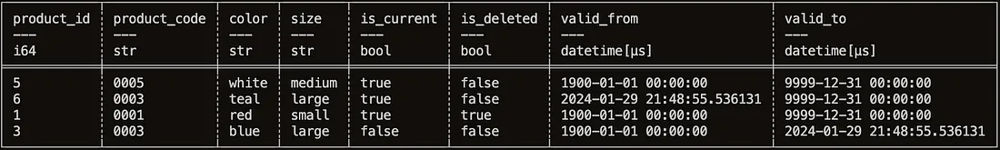

# SCD2 on Delta Lake

## :material-arrow-down-right: Getting Started

Before I can implement a type 2 slowly changing dimension, I first fill the target
table with an initial data load. However, a couple of metadata fields are required
in order to track changes:

-   `is_current`:

    Whether the record has the currently valid information for the specific product code

-   `valid_from`:

    The timestamp from which the record was/is current.

-   `valid_to`:

    The timestamp until which the record was/is current.

-   `is_deleted`:

    Whether the product code no longer exists in the source data.

### Prerequisite

```python
import polars as pl
from datetime import datetime

# Displays all columns
pl.Config().set_tbl_cols(-1)

data = {
    'product_code' : ['0001', '0002', '0003', '0004'],
    'color' : ['red', 'green','blue','yellow'],
    'size': ['small','medium','large','x-large']
}

df = pl.DataFrame(data).with_columns(
    [
        pl.lit(True).alias('is_current'),
        pl.lit(False).alias('is_deleted'),
        pl.lit(datetime(1900,1,1,0,0,0,0)).alias('valid_from'),
        pl.lit(datetime(9999,12,31,0,0,0,0)).alias('valid_to')
    ]
)

df = df.with_row_index(
    name='product_id',
    offset=1,
)

df.write_delta(target='./deltalake/product')

target_df = pl.read_delta(source='./deltalake/product')

print(target_df)
```

---

### Subsequent data loads

When the initial Delta table is loaded, I can begin loading in with the SCD2 pattern.
The goal is to create a set of dataframes which will be upserted into the target
table.

=== "New"

    To identify new record with Polars, it is simply performed with an anti join.

    ```python
    source_data = {
        'product_code' : ['0001', '0002', '0003', '0004','0005'],
        'color' : ['red', 'green','blue','yellow','white'],
        'size': ['small','medium','large','x-large', 'medium']
    }

    source_df = pl.DataFrame(source_data)

    new_records_df = source_df.join(
        other=target_df,
        on='product_code',
        how='anti'
    )

    new_records_df = new_records_df.with_columns(
        [
            pl.lit(True).alias('is_current'),
            pl.lit(False).alias('is_deleted'),
            pl.lit(datetime(1900,1,1,0,0,0,0)).alias('valid_from'),
            pl.lit(datetime(9999,12,31,0,0,0,0)).alias('valid_to')
        ]
    )

    print(new_records_df)
    ```

=== "Deleted"

    If a record is deleted in the source system, it is a good idea to flag it as such
    in the SCD2 table.

    ```python
    source_data = {
        'product_code' : ['0002', '0003', '0004','0005'],
        'color' : ['green','blue','yellow','white'],
        'size': ['medium','large','x-large', 'medium']
    }

    source_df = pl.DataFrame(source_data)

    deleted_records_df = target_df.filter(
        pl.col('is_current') == True,
        pl.col('is_deleted') == False
    ).join(
        other=source_df,
        on='product_code',
        how='anti'
    )

    deleted_records_df = deleted_records_df.with_columns(
        pl.lit(True).alias('is_deleted')
    )

    print(deleted_records_df)
    ```

=== "Updated"

    When it comes to the updated records, it gets a little more complex.
    Records which have changed will be identified, and then two versions of the
    records will be created; one for **closing** the existing record — overwriting
    the `is_current` and `valid_to` columns, and one version for **opening** new record
    with all the new column values from the source data.

    ```python
    source_data = {
        'product_code' : ['0002', '0003', '0004','0005'],
        'color' : ['green','teal','yellow','white'],
        'size': ['medium','large','x-large', 'medium']
    }

    source_df = pl.DataFrame(source_data)

    updated_records_df = target_df.filter(
        pl.col('is_current') == True,
    ).join(
        other=source_df,
        on='product_code',
        how='inner'
    ).filter(
        pl.any_horizontal(
            pl.col('is_deleted') == True,
            pl.col('color') != pl.col('color_right'),
            pl.col('size') != pl.col('size_right')
         )
    )

    print(updated_records_df)
    ```

=== "Closing"

    From the updated records I’ll derive records to be closed. That is; the `valid_to`
    timestamp is updated to current timestamp, and `is_current` flag is set to false.

    ```python
    modification_timestamp = datetime.utcnow()

    closed_records_df = updated_records_df.with_columns(
        pl.lit(False).alias('is_current'),
        pl.lit(modification_timestamp).alias('valid_to')
    )

    closed_records_df = closed_records_df.drop(
        'color_right',
        'size_right'
    )

    print(closed_records_df)
    ```

=== "Opened"

    For the opened records I can similarly derive them from the updated records dataframe.
    This time, I take the values from the **right** dataframe, so the new column values
    overwrite the **left** dataframe columns.

    ```python
    opened_records_df = updated_records_df.with_columns(
        pl.col('size_right').alias('size'),
        pl.col('color_right').alias('color'),
        pl.lit(modification_timestamp).alias('valid_from'),
        pl.lit(False).alias('is_deleted')
    )

    opened_records_df = opened_records_df.drop(
        'product_id',
        'color_right',
        'size_right'
    )

    print(opened_records_df)
    ```

---

**Putting it all together**:

```python
insert_records_df = pl.concat(
    [
        new_records_df,
        opened_records_df
    ],
    how='vertical'
)

# Find the max product_id in the target
product_id_offset = target_df.select(
    pl.col('product_id')
).max().item() + 1

insert_records_df = insert_records_df.with_row_index(
    name='product_id',
    offset=product_id_offset
)

upsert_records_df = pl.concat(
    [
        insert_records_df,
        deleted_records_df,
        closed_records_df
    ],
    how='vertical_relaxed'
)

print(upsert_records_df)
```



---

## :material-source-commit-end: Conclusion

The above dataframe represents all updates and inserts required to upsert into
the Delta table. The only last step we need is to perform the merge-operation.

```python
upsert_records_df.write_delta(
    target='./deltalake/product',
    mode='merge',
    delta_merge_options={
        'predicate': 'source.product_id = target.product_id',
        'source_alias': 'source',
        'target_alias': 'target'
    }
) \
.when_matched_update_all() \
.when_not_matched_insert_all() \
.execute()

updated_delta_table = pl.read_delta(
    source='./deltalake/product'
).sort(
    pl.col('product_id')
)

print(updated_delta_table)
```

In addition, Polars also provide a Lazy API which comes which amongst other benefits
does automatic query plan optimisation and [predicate pushdown](https://docs.pola.rs/user-guide/lazy/optimizations/).

## :material-playlist-plus: Read Mores

- [:simple-medium: Implementing a type 2 slowly changing dimension with Polars and Delta Lake](https://medium.com/@jimmy-jensen/implementing-a-type-2-slowly-changing-dimension-with-polars-and-delta-lake-4a633fb28195)
