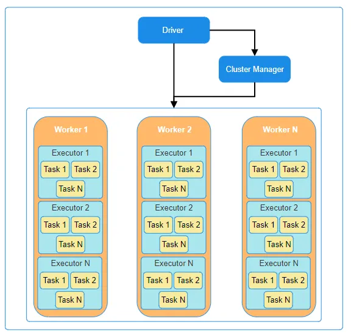
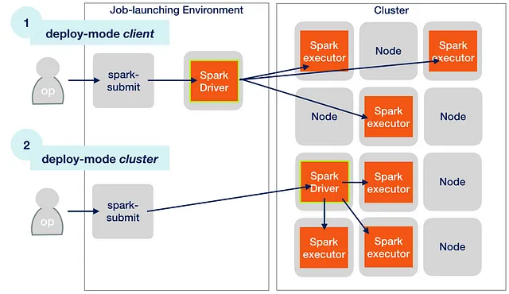
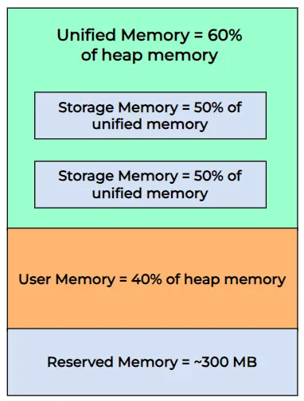
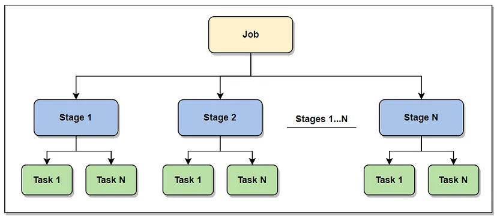
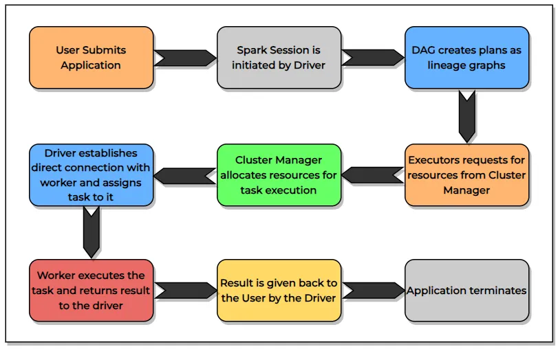
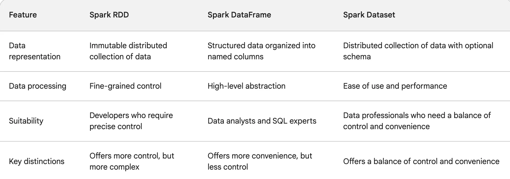

# Apache Spark

!!! quote

    **Apache Spark** is a unified computing engine and a set of libraries for parallel
    data processing on computer cluster.

Read more [The Essential PySpark Cheat Sheet for Success!](https://pub.towardsai.net/simplify-your-data-engineering-journey-the-essential-pyspark-cheat-sheet-for-success-69db0c38b31e)

## :material-arrow-down-right: Getting Started

### Architecture

The Apache Spark framework uses a ==**master-slave architecture**== that consists
of a driver, which runs as a master node, and many executors that run across as
worker nodes in the cluster.
Apache Spark can be used for batch processing and real-time processing as well.

<figure markdown="span">
  { loading=lazy width="650" }
  <figcaption>Spark Cluster Overview</figcaption>
</figure>

<figure markdown="span">
    
    <figcaption>Spark Driver-Worker Architecture</figcaption>
</figure>

In the Introduction, I have already highlighted about driver, worker, and cluster
manager, but now let's discuss their roles when the actual computation happens.
When a code is submitted to the spark cluster for execution, it is first assigned
to the Driver which assigns it to the Cluster Manager.
Now the Cluster Manager checks and maintains the availability and health of the
Workers and confirms the same to the Driver. It is also responsible for allocating
resources to execute the task.

Upon confirmation from the Cluster Manager regarding the resources, the Driver
establishes a direct connection with the Workers, starts assigning the tasks to
them, and gets the response directly as well.
In case of any failure, the Cluster Manager comes into play, it detects node
failures, automatically reschedules the affected tasks on other available nodes,
and re-initializes the node for the next task.

- [A Deep Dive into Apache Spark Architecture](https://medium.com/@shaloomathew/a-deep-dive-into-apache-spark-architecture-fe01723b1aa6)
- [This level of detail in Spark is tackled only by experts — 2](https://medium.com/@think-data/this-level-of-detail-in-spark-is-tackled-only-by-experts-2-975cfb41af50)
- [Partitioning & Bucketing](https://blog.det.life/apache-spark-partitioning-and-bucketing-1790586e8917)
- [How does Adaptive Query Execution fix your Spark performance issues](https://medium.com/@kerrache.massipssa/how-does-adaptive-query-execution-fix-your-spark-performance-issues-029166e772b7)
- [Apache Spark for Dummies: Part 4 — Advanced Spark Features](https://medium.com/@SaiParvathaneni/apache-spark-for-dummies-part-4-advanced-spark-features-d45e3b333c56)

---

### Deploy Modes

In the cluster mode, Spark Submit will reach the YARN RM, requesting it to start
the driver in an AM container.
YARN will start your driver in the AM container on a worker node in the cluster.
Then the driver will again request YARN to begin executor containers.
So, the YARN will start executor containers and hand them over to the driver.
So, in cluster mode, your driver is running in the AM container on a worker node
in cluster. Your executors are also running in the executor containers on some
worker nodes in cluster.

<figure markdown="span">
    
    <figcaption>Execution of Client Deploy Mode and Cluster Deploy Mode</figcaption>
</figure>

In the Client Mode, Spark Submit doesn't go to the YARN resource manager for
starting an AM container. Instead, the spark-submit command will start the
driver JVM directly on the client machine.
So, in this case, the spark driver is a JVM application running on your client
machine. Now the driver will reach out to the YARN resource manager requesting
executor containers. The YARN RM will start executor containers and hand them
over to the driver.
The driver will start executors in those containers to do the job.

!!! note

    Client Machines in the Spark Cluster are also known as Gateway Nodes.

You will almost always submit your application in cluster mode. It is unlikely
that you submit your spark application in client mode.
We have two clear advantages of running your application in cluster mode.

1. The cluster mode allows you to submit the application and log off from the
   client machine, as the driver and executors run on the cluster.
   They have nothing active on your client's machine.
   So, even if you log off from your client machine, the driver and executor
   will continue to run in the cluster.

2. Your application runs faster in cluster mode because your driver is closer
   to the executors. The driver and executor communicate heavily, and you don't
   get impacted by network latency, if they are close.

The designed client mode is for interactive workloads.
For example, Spark Shell runs your code in client mode.
Similarly, Spark notebooks also use the client mode.

---

### On-Heap vs Off-Heap Memory

There are two concepts of storage that are quite important to discuss as they play
a key role in the optimization of an Application.
Every Executor has access to two types of memory:- **On-Heap** and **Off-Heap**
memory.
Each Executor has its own on-heap memory but the off-heap memory is common for
all executors within a worker node.
On-heap memory is managed by Java Virtual Machine (JVM) while off-heap memory is
managed by the Operating System.
The latter is used for caching and storing serialized data.
Another important concept of Garbage Collection(GC) is applicable for On-heap
memory as it is managed by JVM but does not apply to off-heap memory,
therefore giving more control over memory management in case of off-heap memory.

<figure markdown="span">
    
    <figcaption>On-Heap Memory Architecture</figcaption>
</figure>

Let us discuss in detail about the On-Heap Memory architecture.
It is divided into 3 parts:-

1.  Reserved Memory — This is the fixed memory that cannot be used for storage
    or execution and cannot be altered. About 300 MB of heap memory is taken up
    by this. It is mainly used for failure recovery. In case there is some fault
    in the system and it is unable to function, then this memory will be used for
    recovery.

2.  User Memory —User Memory refers to the storage dedicated to retaining user-defined
    data structures, internal metadata within Spark, and any User-Defined Functions
    (UDFs) created by the user.
    There is a memory fraction parameter that can be altered in the spark settings
    by the parameter `spark.memory.fraction` and the formula for the calculation
    of this storage is:-

    ```text
    (Executor Memory - Reserved Memory) * (1 - spark.memory.fraction)
    ```

3.  Unified Memory — This memory is again divided into 2 segments whose fraction
    can be altered by the parameter “spark.memory.memoryFraction” in the spark
    settings.
    By default, it is set to 0.5. These segments are:-

    -   Storage Memory — It is used for storing the cached information, broadcast
        variables, etc, and can be calculated by:-

        ```text
        (Executor Memory — Reserved Memory) * spark.memory.fraction * spark.memory.storageFraction
        ```

    -   Execution Memory — This memory is utilized for storing intermediate states
        of execution processes like joins, aggregations, shuffles, etc.
        This can be calculated by:-

        ```text
        (Executor Memory — Reserved Memory) * spark.memory.fraction * (1.0 - spark.memory.storageFraction)
        ```

The performance optimization of an application depends a lot on both the
above-mentioned fraction values, i.e. `spark.memory.fraction` and
`spark.memory.memoryFraction`.
Tweaking these values based on the percentage of storage and execution requirements
can have a drastic effect on the performance of the application.

### Jobs, Stages and Tasks

<figure markdown="span">
    
    <figcaption>Spark Jobs, Stages and Tasks</figcaption>
</figure>

In this section, we will discuss about the flow of an Application in steps when
it is sent for execution and how it is converted into job, stages and tasks.

- When an Application is submitted, the code is converted into a Job.
- Jobs are divided into stages and the number of stages is determined by the number
  of times data is shuffled. So, as the shuffling increases so does the number of
  stages.
  Join is an example of data shuffling.
- Each stage can have several Tasks. Every task within a stage executes the same
  operation, with each task handling one Partition.
  The number of partitions indicates the number of tasks within each stage.

---

### Spark Session

!!! note

    **Spark Session** is a unified entry point of a spark application from Spark 2.0

<figure markdown="span">
    
    <figcaption>Spark Session Life Cycle</figcaption>
</figure>

Once the user is ready with the Application, it is submitted to Spark for execution.
The application goes to the Driver which initiates the spark session.
After the application is compiled, DAG creates logical plans in the form of
lineage graphs.
Based on the computation required and the presence of worker nodes,
the task executors request resources from the Cluster Manager.
The Cluster Manager then allocates the required resources to perform the task.

Now the Driver establishes a direct connection with the Workers, assigns tasks
to is, and also gets the response directly.
The Driver returns the result to the user and the Application ends.

=== "Spark Session"

    Stop current spark session:

    ```python
    spark.sparkContext.stop()
    ```

    ```python
    from pyspark.sql import SparkSession

    spark = (
        SparkSession
            .builder
            .appName("YourAppName")
            .master("local")
            .config("park.executor.memory", "2g")
            .config("spark.executor.cores", 4)
            .enableHiveSupport()  # Default be True
            .getOrCreate()
    )
    ```

=== "Spark Context"

    Get default config:

    ```python
    spark.sparkContext._conf.getAll()
    ```

    ```python
    from pyspark.context import SparkContext
    from pyspark import SparkConf

    SparkContext.stop(sc)

    sc = (
        SparkContext(
            "local",
            "YourAppName",
            conf=(
                SparkConf()
                    .set("spark.executor.memory", "2g")
                    .set("spark.executor.cores", "4")
            )
        )
        .getOrCreate()
    )
    ```

---

## Spark API

<figure markdown="span">
  { loading=lazy width="650" }
  <figcaption>Structured Spark API Execution plan</figcaption>
</figure>



### Low-level API

**Resilient Distributed Datasets** (RDDs) is collection of elements partitioned that
distributes to each node in cluster and work parallel.

You can convert the Abstract DataFrame to Low-level RDD by:

```python
rdd = spark.read.csv("file.csv", header=True).rdd
```

**RDDs support 2 operations**:

-   **Transformations** — create new rdd but lazy meaning they don't execute until you
    call an action on RDD.

    Some transformations on RDDs are `flatMap()`, `map()`, `reduceByKey()`, `filter()`, `sortByKey()`
    and all these return a new RDD instead of updating the current.

-   **Actions** — return value to driver program after compute dataset finish.

    Some actions on RDDs are `count()`, `collect()`, `first()`, `max()`, `reduce()`
    and more.

### High-level API

**Structured API** is tool for manipulate all sorts of data such as Unstructured, Semi-Structured,
Structured data

Structured API able to use with batch and streaming computation that is Spark SQL,
Dataframes, Datasets API but for streaming, it be Spark Structured Streaming.

---

## Execution

https://blog.stackademic.com/apache-spark-101-understanding-spark-code-execution-cbff49cb85ac

## Practices

- https://medium.com/@uzzaman.ahmed/list/pyspark-sql-basics101-d80bd574842d

## Most Common Use Cases

- https://towardsdatascience.com/fetch-failed-exception-in-apache-spark-decrypting-the-most-common-causes-b8dff21075c
- https://medium.com/art-of-data-engineering/distinct-and-dropduplicates-in-spark-real-project-example-9007954b49af
- https://medium.com/@vishalbarvaliya/coalesce-vs-repartition-58b12a0f0a3d
- https://medium.com/@vishalbarvaliya/apache-sparks-reducebykey-and-reduce-transformations-42b3bd80e32e

## Interview Questions

- https://blog.devgenius.io/spark-interview-questions-ii-120e1621be9a
- https://blog.devgenius.io/spark-interview-questions-x-843a24cb703a
- https://gsanjeewa1111.medium.com/pyspark-facts-b83366842ddf
- [Top 25 PySpark Interview Questions and Answers (2023)](https://blog.varunsingh.in/top-25-pyspark-interview-questions-and-answers-2023-2eb3c67cbaf5)

## Optimization

- https://medium.com/plumbersofdatascience/7-key-strategies-to-optimize-your-spark-applications-948e7df607b
- [PySpark Tips](https://towardsdev.com/pyspark-tip-d4614b013d6f)
- [4 Examples to Take Your PySpark Skills to Next Level](https://towardsdatascience.com/4-examples-to-take-your-pyspark-skills-to-next-level-2a04cbe6e630)

## :material-playlist-plus: Read Mores

- [:simple-medium: Understanding Apache Spark Architecture](https://medium.com/@shobhittulshain/understanding-spark-architecture-6003184a12ec)
