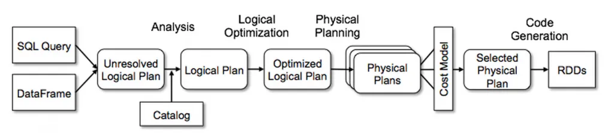

# Apache Spark

!!! quote

    **Apache Spark** is a unified computing engine and a set of libraries for parallel
    data processing on computer cluster

## Architecture


* https://medium.com/@think-data/this-level-of-detail-in-spark-is-tackled-only-by-experts-2-975cfb41af50
* [Partitioning & Bucketing](https://blog.det.life/apache-spark-partitioning-and-bucketing-1790586e8917)
* [How does Adaptive Query Execution fix your Spark performance issues](https://medium.com/@kerrache.massipssa/how-does-adaptive-query-execution-fix-your-spark-performance-issues-029166e772b7)

## Spark Context vs Spark Session

!!! quote

    **Spark Session** is a unified entry point of a spark application from Spark 2.0

=== "Spark Session"

    Stop current spark session:

    ```python
    spark.sparkContext.stop()
    ```

    ```python
    from pyspark.sql import SparkSession

    spark = (
        SparkSession
            .builder
            .appName("YourAppName")
            .master("local")
            .config("park.executor.memory", "2g")
            .config("spark.executor.cores", 4)
            .enableHiveSupport()  # Default be True
            .getOrCreate()
    )
    ```

=== "Spark Context"

    Get default config:

    ```python
    spark.sparkContext._conf.getAll()
    ```

    ```python
    from pyspark.context import SparkContext
    from pyspark import SparkConf

    SparkContext.stop(sc)

    sc = (
        SparkContext(
            "local",
            "YourAppName",
            conf=(
                SparkConf()
                    .set("spark.executor.memory", "2g")
                    .set("spark.executor.cores", "4")
            )
        )
        .getOrCreate()
    )
    ```

## Spark API

Spark has two API types

* Low-level API (Unstructured)
* High-level API (Spark’s Structured API)



### Low-level API

**Resilient Distributed Datasets** (RDDs) is collection of elements partitioned that
distributes to each node in cluster and work parallel.

```python
rdd = spark.read.csv("file.csv", header=True).rdd
```

RDDs support 2 operations:

* **Transformations** — create new rdd but lazy meaning they don't execute until you
  call an action on RDD.

    Some transformations on RDDs are `flatMap()`, `map()`, `reduceByKey()`, `filter()`, `sortByKey()`
    and all these return a new RDD instead of updating the current.

* **Actions** — return value to driver program after compute dataset finish.

    Some actions on RDDs are `count()`,  `collect()`,  `first()`,  `max()`,  `reduce()`  and more.

### High-level API

Structured API is tool for manipulate all sorts of data such as Unstructured, Semi-Structured,
Structured data

Structured API able to use with batch and streaming computation that is Spark SQL,
Dataframes, Datasets API but for streaming, it be Spark Structured Streaming.

## Execution

https://blog.stackademic.com/apache-spark-101-understanding-spark-code-execution-cbff49cb85ac

## Most Common Use Cases

* https://towardsdatascience.com/fetch-failed-exception-in-apache-spark-decrypting-the-most-common-causes-b8dff21075c
* https://medium.com/art-of-data-engineering/distinct-and-dropduplicates-in-spark-real-project-example-9007954b49af
* https://medium.com/@vishalbarvaliya/coalesce-vs-repartition-58b12a0f0a3d
* https://medium.com/@vishalbarvaliya/apache-sparks-reducebykey-and-reduce-transformations-42b3bd80e32e

## Interview Questions

* https://blog.devgenius.io/spark-interview-questions-ii-120e1621be9a
* https://blog.devgenius.io/spark-interview-questions-x-843a24cb703a
* https://gsanjeewa1111.medium.com/pyspark-facts-b83366842ddf
* [Top 25 PySpark Interview Questions and Answers (2023)](https://blog.varunsingh.in/top-25-pyspark-interview-questions-and-answers-2023-2eb3c67cbaf5)

## Optimization

* https://medium.com/plumbersofdatascience/7-key-strategies-to-optimize-your-spark-applications-948e7df607b
* [PySpark Tips](https://towardsdev.com/pyspark-tip-d4614b013d6f)
* [4 Examples to Take Your PySpark Skills to Next Level](https://towardsdatascience.com/4-examples-to-take-your-pyspark-skills-to-next-level-2a04cbe6e630)
