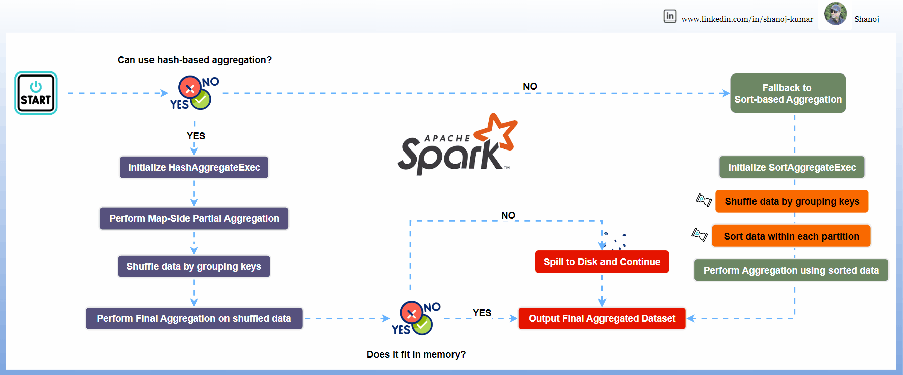

# Aggregate

**Apache Spark** provides two primary methods for performing aggregations: **Sort-based**
and **Hash-based** aggregations.
These methods are optimized for different scenarios and have distinct performance
characteristics.

## References

- [Apache Spark Aggregation Methods: Hash-based Vs. Sort-based](https://blog.stackademic.com/apache-spark-aggregation-methods-hash-based-vs-sort-based-f1f02ec14d80)
