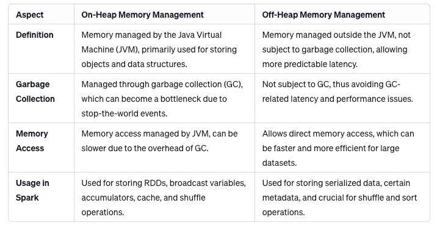

# Spark: Memory

* https://medium.com/@think-data/understanding-the-memory-components-of-spark-e3070f315d17

## On-Heap vs Off-Heap Memory Management

## Tungsten Optimizer: Enhancing Spark’s Memory Management

The Tungsten optimizer represents a significant advancement in Spark’s ability to
efficiently process data. It optimizes both CPU and memory usage in Spark applications,
leveraging on-heap and off-heap memory management techniques. Tungsten employs
advanced strategies like binary in-memory data representation and explicit memory
management.

**Key Benefits**:

* Improved Execution Speed: Tungsten’s memory management strategies enable faster operation execution.
* Efficient Resource Utilization: By balancing the use of on-heap and off-heap memory, Tungsten optimizes resource utilization.
* Reduced Overhead: Minimizes the overhead of garbage collection, enhancing the overall performance of Spark applications.

## Integration with Spark Memory Management

When integrating Tungsten with Spark’s memory management, particularly in off-heap mode,
certain Spark configurations need to be adjusted for optimal performance:

* `spark.memory.offHeap.enabled`:

    This configuration must be set to true to enable the use of off-heap memory.

* `spark.memory.offHeap.size`:

    It specifies the amount of off-heap memory to be allocated (in bytes).
    This setting is crucial as it determines the memory capacity available for
    off-heap storage.

* `spark.executor.memory`:

    While this parameter primarily configures on-heap memory, it's important to
    balance it with off-heap settings to ensure overall memory allocation is sufficient
    for the workload.

* `spark.executor.memoryOverhead`:

    This setting is used to account for additional memory overhead apart from the
    memory used by the executor process. In off-heap mode, this might need to be
    increased to accommodate the extra memory usage.

## Conclusion

Apache Spark's on-heap and off-heap memory management, integral to its performance
in big data processing, are significantly enhanced by the Tungsten optimizer.
This synergy ensures optimal resource utilization, enabling Spark to handle large-scale
and complex data processing tasks effectively. As the demands for data processing
continue to escalate, innovations in Spark’s memory management and optimization
remain crucial in the realm of big data analytics.

## References

* [Apache Spark Memory Management: On-Heap vs Off-Heap in the Context of Tungsten Optimizer](https://medium.com/@skraghunandan11/apache-spark-memory-management-on-heap-vs-off-heap-in-the-context-of-tungsten-optimizer-df6f641a2d93)
