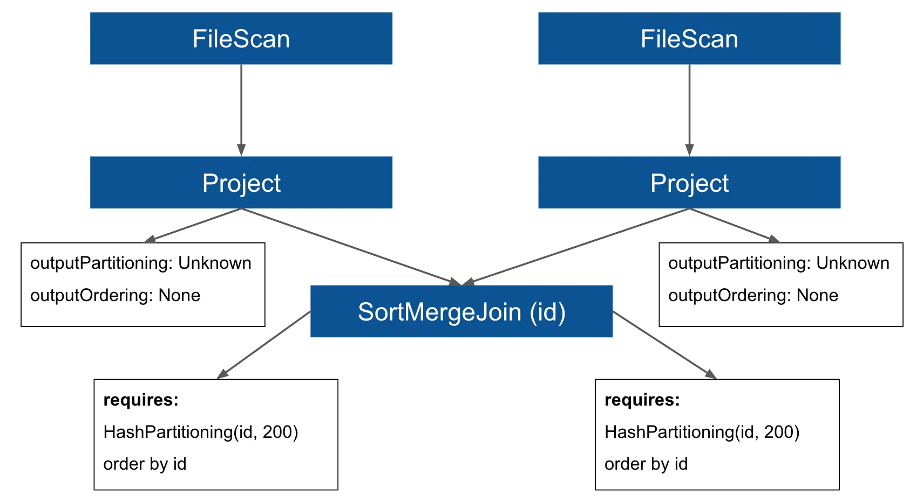
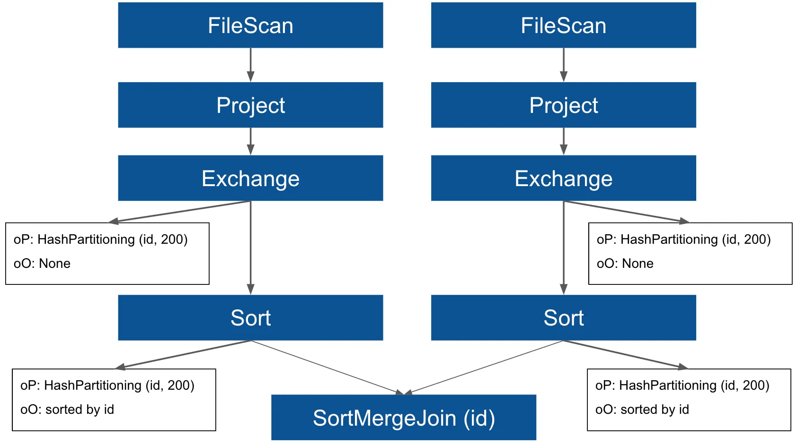
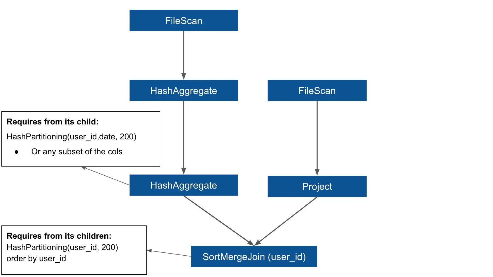
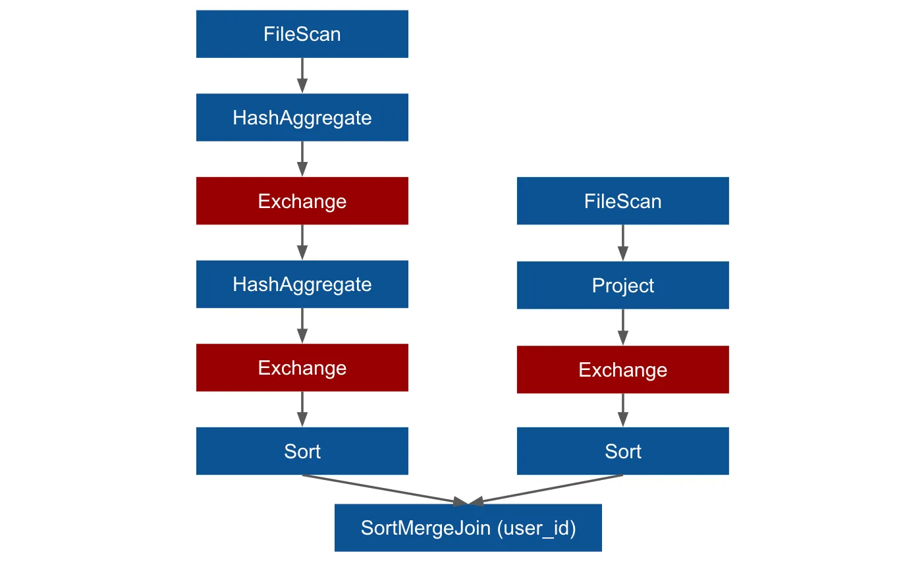
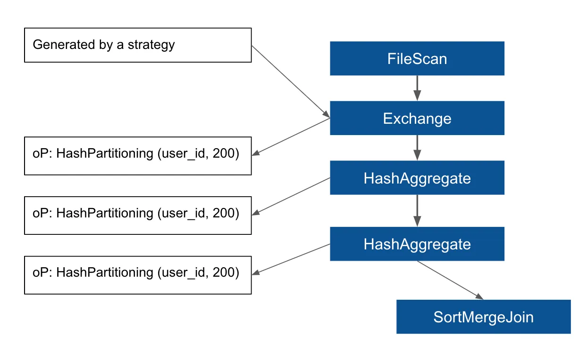
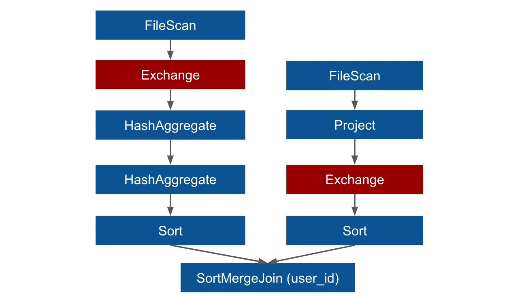
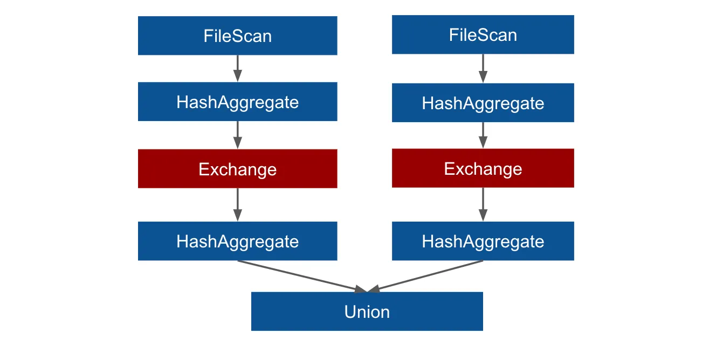
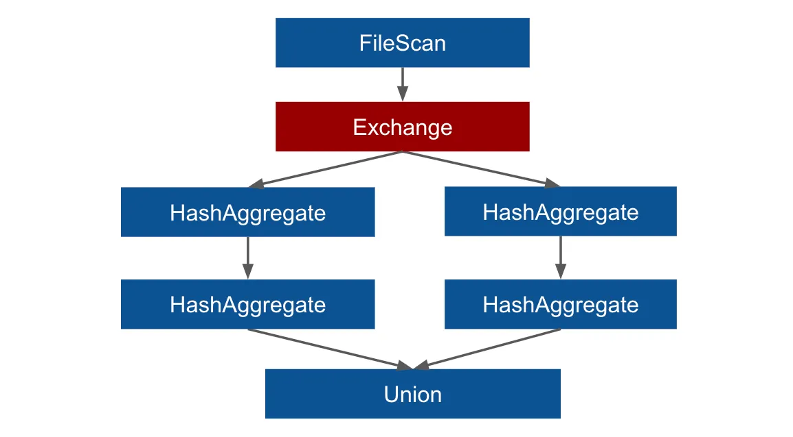

# Spark Repartitioning

In a distributed environment, having proper data distribution becomes a key tool
for boosting performance. In the DataFrame API of Spark SQL, there is a function
`repartition()` that allows controlling the data distribution on the Spark cluster.
The efficient usage of the function is however not straightforward because changing
the distribution is related to a cost for physical data movement on the cluster
nodes (a so-called shuffle).

A general rule of thumb is that using repartition is costly because it will induce
shuffle. In this article, we will go further and see that there are situations
in which adding one shuffle at the right place will remove two other shuffles, so
it will make the overall execution more efficient. We will first cover a bit of
theory to understand how the information about data distribution is internally
utilized in Spark SQL, and then we will go over some practical examples where using
repartition becomes useful.

The theory described in this article is based on the Spark source code, the version
being the current snapshot 3.1 (written in June 2020) and most of it is valid also
in previous versions 2.x. Also, the theory and the internal behavior are language-agnostic,
so it doesn't matter whether we use it with Scala, Java, or Python API.

## Query Planning

The DataFrame API in Spark SQL allows the users to write high-level transformations.
These transformations are lazy, which means that they are not executed eagerly but
instead under the hood they are converted to a query plan. The query plan will be
materialized when the user calls an action which is a function where we ask for
some output, for example when we are saving the result of the transformations to
some storage system. The query plan itself can be of two major types: a logical
plan and a physical plan. And the steps of the query plan processing can be called
accordingly as logical planning and physical planning.

## Logical Plan

The phase of the logical planning is responsible for multiple steps related to a
logical plan where the logical plan itself is just an abstract representation of
the query, it has a form of a tree where each node in the tree is a relational
operator. The logical plan itself does not carry any specific information about
the execution or about algorithms used to compute transformations such as joins
or aggregations. It just represents the information from the query in a way that
is convenient for optimizations.

During logical planning, the query plan is optimized by a Spark optimizer, which
applies a set of rules that transform the plan. These rules are based mostly on
heuristics, for instance, that it is better to first filter the data and then do
other processing and so on.

## Physical Plan

Once the logical plan is optimized, physical planning begins. The purpose of this
phase is to take the logical plan and turn it into a physical plan which can be
then executed. Unlike the logical plan which is very abstract, the physical plan
is much more specific regarding details about the execution, because it contains
a concrete choice of algorithms that will be used during the execution.

The physical planning is also composed of two steps because there are two versions
of the physical plan: `spark plan` and `executed plan`. The `spark plan` is created
using so-called `strategies` where each node in a logical plan is converted into
one or more operators in the `spark plan`. One example of a strategy is `JoinSelection`,
where Spark decides what algorithm will be used to join the data. The string
representation of the `spark plan` can be displayed using the Scala API:

```scala
df.queryExecution.sparkPlan
```

After the `spark plan` is generated, there is a set of additional rules that are
applied to it to create the final version of the physical plan which is the executed
plan. This `executed plan` will then be executed to generate _RDD_ code. To see this
executed plan we can simply call explain on the DataFrame because it is actually
the final version of the physical plan. Alternatively, we can go to the Spark UI
to see its graphical representation.

## EnsureRequirements (ER rule)

One of these additional rules that are used to transform the spark plan into the
executed plan is called EnsureRequirements (in the next we will refer to it as ER rule)
and this rule is going to make sure that the data is distributed correctly as is
required by some transformations (for example joins and aggregations). Each operator
in the physical plan is having two important properties outputPartitioning and
outputOrdering (in the next we will call them oP and oO respectively) which carry
the information about the data distribution, how the data is partitioned and sorted
at the given moment. Besides that, each operator also has two other properties
requiredChildDistribution and requiredChildOrdering by which it puts requirements
on the values of oP and oO of its child nodes. Some operators don’t have any requirements
but some do. Let’s see this on a simple example with SortMergeJoin, which is an
operator that has strong requirements on its child nodes, it requires that the
data must be partitioned and sorted by the joining key so it can be merged correctly.
Let’s consider this simple query in which we join two tables (both of them are
based on a file datasource such as parquet):

```python
# Using Python API:
spark.table("tableA") \
    .join(spark.table("tableB"), "id") \
    .write
    ...
```

The `spark plan` for this query will look like this (and I added there also the
information about the _oP_, _oO_ and the requirements of the `SortMergeJoin`):



From the spark plan we can see that the child nodes of the SortMergeJoin (two
Project operators) have no oP or oO (they are Unknown and None) and this is a general
situation where the data has not been repartitioned in advance and the tables are
not bucketed. When the ER rule is applied on the plan it can see that the requirements
of the SortMergeJoin are not satisfied so it will fill Exchange and Sort operators
to the plan to meet the requirements. The Exchange operator will be responsible
for repartitioning the data to meet the requiredChildDistribution requirement and
the Sort will order the data to meet the requiredChildOrdering, so the final executed
plan will look like this (and this is what you can find also in the SparkUI in the
SQL tab, you won’t find there the spark plan though, because it is not available
there):



## Bucketing

The situation will be different if both tables are bucketed by the joining key.
Bucketing is a technique for storing the data in a pre-shuffled and possibly
pre-sorted state where the information about bucketing is stored in the metastore.
In such a case the FileScan operator will have the oP set according to the information
from the metastore and if there is exactly one file per bucket, the oO will be also
set, and it will all be passed downstream to the Project. If both tables were bucketed
by the joining key to the same number of buckets, the requirements for the oP will
be satisfied and the ER rule will add no Exchange to the plan. The same number of
partitions on both sides of the join is crucial here and if these numbers are different,
Exchange will still have to be used for each branch where the number of partitions
differs from `spark.sql.shuffle.partitions` configuration setting (default value is 200).
So with a correct bucketing in place, the join can be shuffle-free.

The important thing to understand is that Spark needs to be aware of the distribution
to make use of it, so even if your data is pre-shuffled with bucketing, unless you
read the data as a table to pick the information from the metastore, Spark will
not know about it and so it will not set the oP on the `FileScan`.

## Repartition

As mentioned at the beginning, there is a function repartition that can be used
to change the distribution of the data on the Spark cluster. The function takes
as argument columns by which the data should be distributed (optionally the first
argument can be the number of partitions that should be created). What happens under
the hood is that it adds a `RepartitionByExpression` node to the logical plan which
is then converted to Exchange in the spark plan using a strategy, and it sets the
_oP_ to `HashPartitioning` with the key being the column name used as the argument.

Another usage of the repartition function is that it can be called with only one
argument being the number of partitions that should be created (repartition(n)),
which will distribute the data randomly. The use case for this random distribution
is however not discussed in this article.

Let’s now go over some practical examples where adjusting the distribution using
repartition by some specific field will bring some benefits.

## Example I: One-side shuffle-free join

Let’s see what happens if one of the tables in the above join is bucketed and the
other is not. In such a case the requirements are not satisfied because the oP is
different on both sides (on one side it is defined by the bucketing and on the
other side it is Unknown). In this case, the ER rule will add Exchange to both
branches of the join so each side of the join will have to be shuffled! Spark will
simply neglect that one side is already pre-shuffled and will waste this opportunity
to avoid the shuffle. Here we can simply use repartition on the other side of the
join to make sure that oP is set before the ER rule checks it and adds Exchanges:

```python
# Using Python API:
# tableA is not bucketed
# tableB is bucketed by id into 50 buckets
spark.table("tableA") \
    .repartition(50, "id") \
    .join(spark.table("tableB"), "id") \
    .write \
    ...
```

Calling repartition will add one Exchange to the left branch of the plan but the
right branch will stay shuffle-free because requirements will now be satisfied
and ER rule will add no more Exchanges. So we will have only one shuffle instead
of two in the final plan. Alternatively, we could change the number of shuffle
partitions to match the number of buckets in tableB, in such case the repartition
is not needed (it would bring no additional benefit), because the ER rule will
leave the right branch shuffle-free, and it will adjust only the left branch (in
the same way as repartition does):

```python
# match number of buckets in the right branch of the join
# with the number of shuffle partitions:
spark.conf.set("spark.sql.shuffle.partitions", 50)
```

## Example II: Aggregation followed by a join

Another example where repartition becomes useful is related to queries where we
aggregate a table by two keys and then join an additional table by one of these
two keys (neither of these tables is bucketed in this case). Let’s see a simple
example which is based on transactional data of this kind:

```text
{"id": 1, "user_id": 100, "price": 50, "date": "2020-06-01"}
{"id": 2, "user_id": 100, "price": 200, "date": "2020-06-02"}
{"id": 3, "user_id": 101, "price": 120, "date": "2020-06-01"}
```

Each user can have many rows in the dataset because he/she could have made many
transactions. These transactions are stored in tableA. On the other hand, tableB
will contain information about each user (name, address, and so on). The tableB
has no duplicities, each record belongs to a different user. In our query we want
to count the number of transactions for each user and date and then join the user
information:

```python
# Using Python API:
dfA = spark.table("tableA") # transactions (not bucketed)
dfB = spark.table("tableB") # user information (not bucketed)
dfA \
    .groupBy("user_id", "date") \
    .agg(count("*")) \
    .join(dfB, "user_id")
```

The spark plan of this query looks like this



In the spark plan, you can see a pair of HashAggregate operators, the first one
(on the top) is responsible for a partial aggregation and the second one does the
final merge. The requirements of the SortMergeJoin are the same as previously.
The interesting part of this example are the HashAggregates. The first one has no
requirements from its child, however, the second one requires for the oP to be
`HashPartitioning` by `user_id` and date or any subset of these columns and this
is what we will take advantage of shortly. In the general case, these requirements
are not fulfilled so the ER rule will add Exchanges (and Sorts). This will lead
to this executed plan:



As you can see we end up with a plan that has three Exchange operators, so three
shuffles will happen during the execution. Let’s now see how using repartition
can change the situation:

```python
dfA = spark.table("tableA").repartition("user_id")
dfB = spark.table("tableB")
dfA \
    .groupBy("user_id", "date") \
    .agg(count("*")) \
    .join(dfB, "user_id")
```

The spark plan will now look different, it will contain Exchange that is generated
by a strategy that converts RepartitionByExpression node from the logical plan.
This Exchange will be a child of the first HashAggregate operator, and it will set
the oP to HashPartitioning (user_id) which will be passed downstream:



The requirements for oP of all operators in the left branch are now satisfied so
ER rule will add no additional Exchanges (it will still add Sort to satisfy oO).
The essential concept in this example is that we are grouping by two columns and
the requirements of the HashAggregate operator are more flexible so if the data
will be distributed by any of these two fields, the requirements will be met. The
final executed plan will have only one Exchange in the left branch (and one in
the right branch) so using repartition we reduced the number of shuffles by one:



## Discussion

It is `true` that using repartition we have now only one shuffle in the left branch
instead of two, it is however important to understand that these shuffles are not
of the same kind! In the original plan, both of the Exchanges came after HashAggregate
which was responsible for a partial aggregation, so the data were reduced (aggregated
locally on each node) before shuffling. In the new plan, the Exchange comes before
HashAggregate so the full data will be shuffled.

So what is better? One full shuffle or two reduced shuffles? Well, that ultimately
depends on the properties of the data. If there are only a few records per user_id
and date, it means that the aggregation will not reduce the data much, so the total
shuffle will be comparable with the reduced one, and having only one shuffle will
be better. On the other hand, if there are lots of records per user_id and date,
the aggregation will make the data much smaller and so going with the original plan
might be better because these two small shuffles can be faster than one big shuffle.
This can be expressed also in terms of the cardinality of all distinct combinations
of these two fields user_id and date. If this cardinality is comparable with the
total row count it means that the groupBy transformation will not reduce the data
much.

## Example III: Union of two aggregations

Let’s consider one more example where repartition will bring optimization to our
query. The problem is based on the same data as the previous example. Now in our
query we want to make a union of two different aggregations, in the first one we
will count the rows for each user and in the second we will sum the price column:

```python
# Using Python API:
countDF = df.groupBy("user_id") \
    .agg(count("*").alias("metricValue")) \
    .withColumn("metricName", lit("count"))

sumDF = df.groupBy("user_id") \
    .agg(sum("price").alias("metricValue")) \
    .withColumn("metricName", lit("sum"))

countDF.union(sumDF)
```

Here is the final executed plan for this query:



It is a typical plan for a union-like query, one branch for each DataFrame in the
union. We can see that there are two shuffles, one for each aggregation. Besides
that, it also follows from the plan that the dataset will be scanned twice. Here
the repartition function together with a small trick can help us to change the shape
of the plan

```python
df = spark.read.parquet(...).repartition("user_id")

countDF = df.groupBy("user_id") \
    .agg(count("price").alias("metricValue")) \
    .withColumn("metricName", lit("count"))

sumDF = df.groupBy("user_id") \
    .agg(sum("price").alias("metricValue")) \
    .withColumn("metricName", lit("sum"))

countDF.union(sumDF)
```



The repartition function will move the Exchange operator before the HashAggregate,
and it will make the Exchange sub-branches identical so it will be reused by another
rule called ReuseExchange. In the count function, changing the star to the price
column becomes important here because it will make sure that the projection will
be the same in both DataFrames (we need to project the price column also in the
left branch to make it the same as the second branch). It will however produce the
same result as the original query only if there are no null values in the price
column. To understand the logic behind this rule see my other [article](https://towardsdatascience.com/be-in-charge-of-query-execution-in-spark-sql-c83d1e16b9b8)
where I explain the ReuseExchange rule more in detail on a similar example.

Similarly, as before, we reduced here the number of shuffles by one, but again we
have now a total shuffle as opposed to reduced shuffles in the original query. The
additional benefit here is that after this optimization the dataset will be scanned
only once because of the reused computation.

## Distribution information loss

As we already mentioned, it is not only important to have the data distributed in
an optimal way, but it is also important to have Spark know about it. The information
about the oP is propagated through the plan from a node to its parent, however,
there are some operators that will stop propagating the information even if the
actual distribution doesn’t change. One of these operators is `BatchEvalPython`
— an operator that represents a user-defined function in the Python API. So if
you repartition the data, then call a Python UDF and then do a join (or some aggregation),
the ER rule will add a new `Exchange` because the `BatchEvalPython` will not pass
the oP information downstream. We can simply say that after calling a Python UDF,
Spark will forget how the data was distributed.

## Controlling the number of produced files

Let me just mention very briefly yet another use case for the `repartition` function
which is to steer the number of produced files when partitioning and/or bucketing
the data to the storage system. If you are partitioning data to a file system like
this:

```python
(
    df.write
        .partitionBy(key)
        .save(path)
)
```

it can produce lots of small files if the data is distributed randomly in the last
stage of the Spark job. Each task in the final stage can possibly contain values
for all the keys so it will create a file in each storage partition and thus produce
lots of small files. Calling custom `repartition` just before to write allows us
to imitate the distribution required for the file system and thus control the number
of produced files. In some future post we will describe more in detail how this
works and how it can be used efficiently also for bucketing.

## Conclusion

The `repartition` function allows us to change the distribution of the data on the
Spark cluster. This distribution change will induce shuffle (physical data movement)
under the hood, which is quite an expensive operation. In this article, we have
seen some examples in which this additional shuffle can however remove some other
shuffles at the same time and thus make the overall execution more efficient. We
have also seen that it is important to distinguish between two kinds of shuffles
— a total shuffle (which moves all the data) and a reduced shuffle (which moves
the data after partial aggregation). Sometimes deciding what is ultimately more
efficient requires understanding the properties of the actual data.

## References

- https://towardsdatascience.com/should-i-repartition-836f7842298c
- https://medium.com/@tomhcorbin/repartitioning-in-spark-repartition-vs-coalesce-5e2fde5fa471
