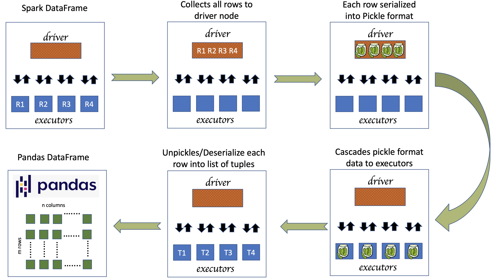

# UDFs

Developers often create custom **User-Defined Functions (UDFs)** in their Spark code
to handle specific transformations. This allows users to develop personalized code
for their unique data processing requirements.

- https://tsaiprabhanj.medium.com/spark-user-defined-functions-udfs-043f1bdcd09b
- https://medium.com/geekculture/mastering-pyspark-udfs-advantages-disadvantages-and-best-practices-e70f15b5f75c

!!! warning

    [Why you should Avoid using UDFs](https://medium.com/@kerrache.massipssa/why-you-should-avoid-using-udf-in-pyspark-c57558af9d0a)

## Getting Started

### Standard UDF

```python
from pyspark.sql.types import IntegerType

def add_one(x):
    return x + 1

add_one_udf = udf(add_one, IntegerType())

# Apply traditional UDF
df_traditional_udf = df.withColumn("new_value", add_one_udf("value"))
```

### Pandas UDF

=== "Series"

    ```python
    from pyspark.sql.functions import pandas_udf
    from pyspark.sql.types import DoubleType

    # UDF to apply state sales tax to the price column
    @pandas_udf(DoubleType())
    def apply_sales_tax(price_series: pd.Series) -> pd.Series:
        sales_tax_rate = 0.07  # 7% sales tax
        return price_series * (1 + sales_tax_rate)

    # Usage in Spark DataFrame
    df = spark.createDataFrame([(1, 19.99), (2, 15.99), (3, 23.99)], ["id", "price"])
    df_with_tax = df.withColumn("price_with_tax", apply_sales_tax(df["price"]))
    ```

=== "Iterator of Series"

    ```python
    @pandas_udf('long')
    def pandas_cumulative_sum(iterator: Iterator[pd.Series]) -> Iterator[pd.Series]:
        # Compute the cumulative sum for each partition (series) in the iterator
        return (series.cumsum() for series in iterator)

    # Create a DataFrame with a sequence of numbers
    df = spark.range(10)

    # Apply the cumulative sum UDF to the DataFrame
    df_with_cumsum = df.withColumn("cumulative_sum", pandas_cumulative_sum("id"))

    df_with_cumsum.show()
    ```

=== "Iterator of Multiple Series"

    ```python
    from pyspark.sql import SparkSession
    from pyspark.sql.functions import pandas_udf
    from pyspark.sql.types import DoubleType
    from typing import Iterator, Tuple
    import pandas as pd


    # Pandas UDF definition
    @pandas_udf("double")
    def calculate_total_sales(
            iterator: Iterator[Tuple[pd.Series, pd.Series]]) -> Iterator[pd.Series]:
        return (quantity * price for quantity, price in iterator)

    # Create a dataframe for testing purpose
    df = spark.createDataFrame([
        (1, 4, 10.0),
        (2, 2, 20.0),
        (3, 1, 30.0),
        (4, 5, 40.0),
    ], ["item_id", "quantity", "price_per_item"])

    # Apply the UDF on total_sales
    df_with_total_sales = df.withColumn("total_sales", calculate_total_sales(df["quantity"], df["price_per_item"]))

    df_with_total_sales.show()
    ```

=== "Scalar"

    ```python
    import pandas as pd
    from pyspark.sql.functions import pandas_udf
    from pyspark.sql import Window

    df = spark.createDataFrame(
        [(1, 1.0), (1, 2.0), (2, 3.0), (2, 5.0), (2, 10.0)], ("id", "v"))

    @pandas_udf("double")
    def pandas_mean(v: pd.Series) -> float:
        return v.sum()

    df.select(pandas_mean(df['v'])).show()
    ```

### Arrow-Optimized UDF

Unveiling a paradigm shift in Apache Spark 3.5 and Databricks Runtime 14.0, the
introduction of Arrow-optimized Python UDFs stands as a game-changer for performance
enhancement.

Arrow-optimized UDFs were introduced in Spark 3.5 to tackle the limitations of
Pandas UDFs and UDFs by

- Better serialization/deserialization : Apache Arrow is used here for data serialization/deserialization as Pandas-udf. However, the limitation of only interacting with pandas API is broken.
- Consistent Type Handling: Apache Arrow provides a consistent and rich set of data types that are well-integrated with both Python and the JVM ecosystem.
- Type Coercion and Conversion: Arrow’s type system helps in better managing type coercion and conversion. In traditional Pandas UDFs, mismatches between the defined types in UDFs and the actual returned data types could lead to errors or unexpected behavior. Arrow’s robust type system reduces such issues by providing clear and well-defined type conversions.
- Enhanced Performance for Complex Types: Arrow’s efficient representation of complex data types (like structs, lists, and maps) can lead to performance improvements especially for operations that involve these types. This is because Arrow can handle these types natively in its columnar format efficiently.

```python
spark.conf.set("spark.sql.execution.pythonUDF.arrow.enabled", "true")
```

```python
@udf(returnType="int", useArrow=True)
def add_one_udf(x):
    return x + 1

# Apply traditional UDF
df_traditional_udf = df.withColumn("new_value", add_one_udf("value"))
```

## Performance

(De)Serialization for Python UDF is carried out as a separate process which takes
additional time for its completion. Allow me to enhance the clarity of the performance
bottleneck by referring to a diagram from one of my previous posts which explains
the under the hood processes involved in converting Spark Dataframe to a Pandas
Dataframe.

{ loading=lazy width="650" }

I hope the above diagram shows the additional process required in (de)serializing
the data using pickle format. Since all the records needs to be moved to driver
for serialization, most of the cases that involves huge data volume doesn't fit
the dataframe within driver memory and might fail. Though this can be fixed through
different options, it needs additional effort.

## References

However, it's important to remember that UDF aren’t optimized by Spark’s Catalyst
optimizer. Therefore, whenever feasible, use Spark native transformations functions
available in `spark.sql.functions`.

- [Fast-Track PySpark UDF execution with Apache Arrow](https://balachandar-paulraj.medium.com/fast-track-pyspark-udf-execution-with-apache-arrow-c4d872664e78)
- [Arrow-optimized Python UDFs in Apache Spark 3.5](https://www.databricks.com/blog/arrow-optimized-python-udfs-apache-sparktm-35)
- [Apache Spark : A comparative overview of UDF, pandas-UDF and arrow-optimized UDF](https://ange-kouame.medium.com/apache-spark-a-comparative-overview-of-udf-pandas-udf-and-arrow-optimized-udf-37c62c8d059f)
