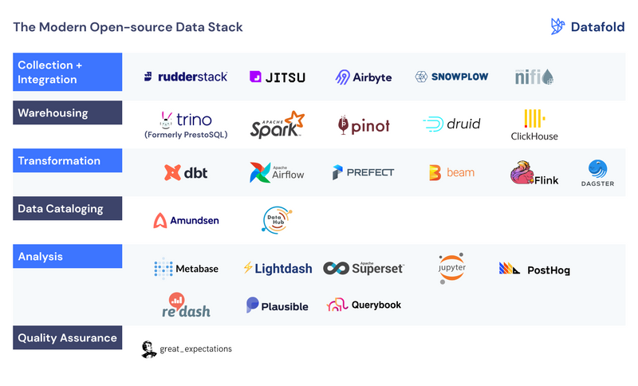
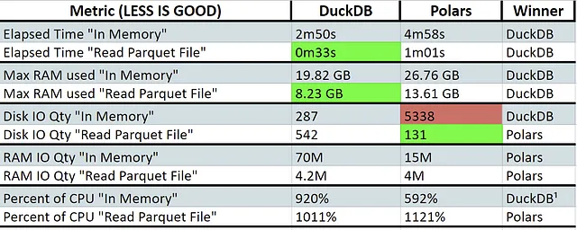

# Tools

!!! warning

    I will filter the DE tools on this session that do not dynamically and flexibility
    for the most data strategies.

:material-format-list-group: **Modern Data Stack (MDS)** is a collection of tools and cloud
data technologies used to collect, process, store, and analyze data.

!!! note

    So, this topic will group any open-soure data tools by the **Modern Data Stack**
    concept. Sometime I will found a tools from [ReStack](https://www.restack.io/)

<figure markdown="span">
  { loading=lazy width="700" }
  <figcaption><a href="https://bitestreams.com/blog/modern-data-stack/">DBT Ecosystem Overview</a></figcaption>
</figure>

:material-page-last: The **MDS** advocates a lot of changes, but if not done right
they can be painful, expensive, and risky. Most often when I talk to data stack
owners in the enterprise, the question is not so much how one tool compares to
another but whether they can live with the status quo or Have a strong enough
desire to change.

:material-key-chain: **The Key Concepts**:

- Easy to Try & Deploy
- Massive Scalability
    - Data
    - Users
    - Use Cases
- Composable Data Stack
- Flexible Pricing

:material-page-last: The **MDS** allows you to build on top of the software of giants instead of adopting
the "^^**not invented here syndrome**^^". Consider whether the business value from your
analytics solution is coming from how well you manage your data pipelines and
data infrastructure, versus how well you build analytics and AI products on
top of your infrastructure.

<figure markdown="span">
  { loading=lazy width="700" }
  <figcaption><a href="https://www.datafold.com/blog/the-modern-data-stack-open-source-edition#instrumentation/">The Modern Open-Source Data Stack</a></figcaption>
</figure>

## :material-select-compare: Comparison

- https://itnext.io/five-apache-projects-you-probably-didnt-know-about-13528e05765f
- https://medium.com/geekculture/airflow-vs-prefect-vs-kestra-which-is-best-for-building-advanced-data-pipelines-40cfbddf9697
- https://medium.com/@mariusz_kujawski/converting-csv-files-to-parquet-with-polars-pandas-dask-and-dackdb-52a77378349d
- https://medium.com/@kywe665/hot-take-apache-hudi-delta-lake-apache-iceberg-are-divergent-7ca6a43d39fc

### File Format

- [Comparing Performance of Big Data File Formats: A Practical Guide](https://towardsdatascience.com/comparing-performance-of-big-data-file-formats-a-practical-guide-ef366561b7d2)
- https://medium.com/@turkelturk/data-file-formats-in-data-engineering-5ba0db8c2c16
- [Compressing Your Data: A Comparison of Popular Algorithms](https://thedatasalesguy.medium.com/compressing-your-data-a-comparison-of-popular-algorithms-7a7dc341af94)

### Ingestion

[Modern Data Stack: Reverse ETL](https://blog.stackademic.com/modern-data-stack-reverse-etl-e77c920887ae)

### Compute

- [Trino vs StarRocks](https://blog.devgenius.io/comparison-of-the-open-source-query-engines-trino-and-starrocks-cf959049f9ab)

### Dataframe API

- [Polars, DuckDB, Pandas, Modin, Ponder, Fugue, Daft](https://rathoreaparna678.medium.com/polars-duckdb-pandas-modin-ponder-fugue-daft-which-one-is-the-best-dataframe-and-sql-tool-e8f7cba550cb)

#### DuckDB vs Polars

{ loading=lazy width="600" }

Read More: [Benchmarking Python Processing Engines: Who’s the Fastest?](https://medium.com/@bruno.nrello/benchmarking-python-processing-engines-whos-the-fastest-695f99cfe655)

### Data Quality

https://medium.com/@brunouy/a-guide-to-open-source-data-quality-tools-in-late-2023-f9dbadbc7948

### Data Orchestration

[Apache Airflow vs Mage.ai in Data Engineering](https://medium.com/odicis-data-engineering/apache-airflow-vs-mage-ai-in-data-engineering-745c040a05e8)
