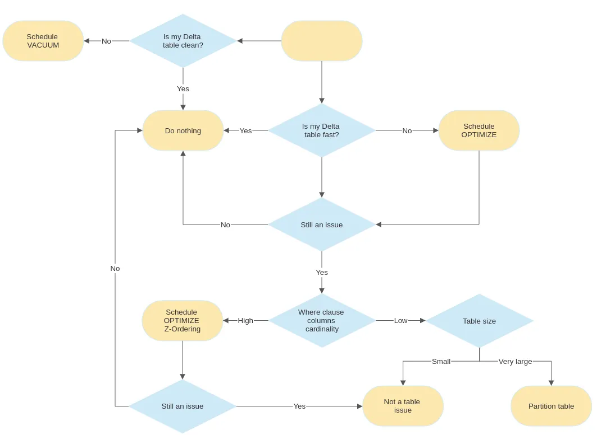
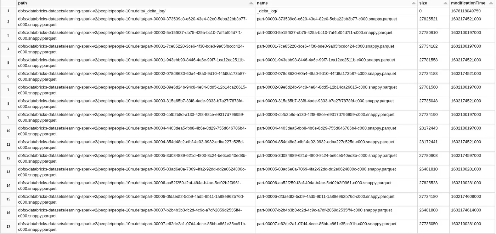
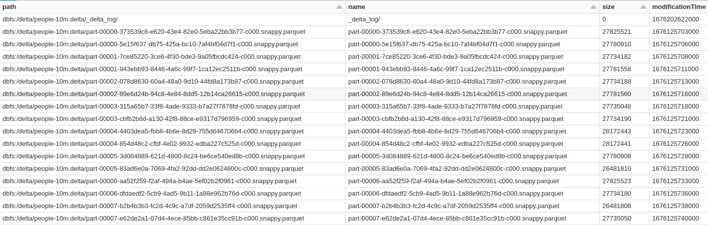
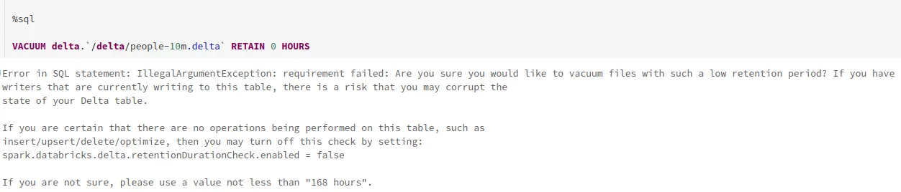
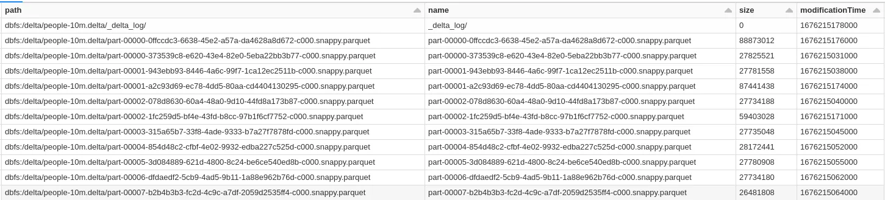
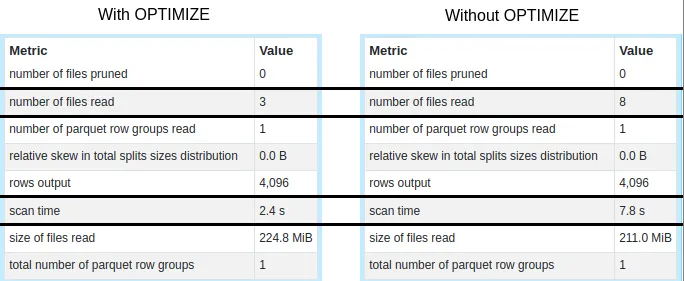
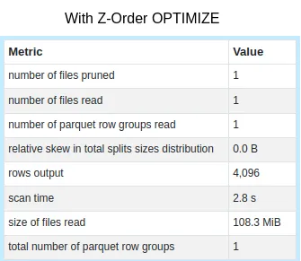
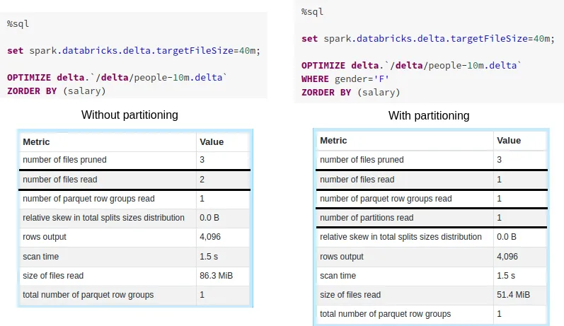

# Pyspark Delta lake keeping it Fast and Clean

**Update**: `2023-04-27` |
**Tag**: `Python` `Spark` `Delta Lake` `Optimization`

Keeping Delta tables fast and clean is important for maintaining the efficiency
of data pipelines. Delta tables can grow very large over time, leading to slow query
performance and increased storage costs. However, there are several operations and
trade-offs that can positively influence the speed of the tables.

In this content, we’ll use the
[people10m public dataset](https://learn.microsoft.com/en-us/azure/databricks/dbfs/databricks-datasets#create-a-table-based-on-a-databricks-dataset)
that is available on Databricks Community Edition, to showcase the best practices
on how to keep the tables fast and clean using Delta operations while explaining
what is happening behind the scenes.



Table of Contents:

- [Analyzing the delta log]()

## Analyzing the delta log



If we check the contents of the log we can see a JSON file that describes the first
transaction that was written when Databricks created this Delta table.

```text
%fs
head dbfs:/databricks-datasets/learning-spark-v2/people/people-10m.delta/_delta_log/00000000000000000000.json
```

From analysis, we can see that this transaction includes several actions:

- **Commit info**:

  ```json
  {
    "commitInfo": {
      "timestamp": 1602173340340,
      "userId": "360903564160648",
      "userName": "stephanie.bodoff@databricks.com",
      "operation": "WRITE",
      "operationParameters": {
        "mode": "ErrorIfExists",
        "partitionBy": "[]"
      },
      "notebook": {
        "notebookId": "1607762315395537"
      },
      "clusterId": "1008-160338-oil232",
      "isolationLevel": "WriteSerializable",
      "isBlindAppend": true,
      "operationMetrics": {
        "numFiles": "8",
        "numOutputBytes": "221245652",
        "numOutputRows": "10000000"
      }
    }
  }
  ```

  `commitInfo` contains all the information regarding the commit: which operation
  was made, by whom, where, and at what time. The `perationMetrics` field shows
  that 8 files were written with a total of 1000000 records.

- **Protocol**:

  ```json
  {
    "protocol": {
      "minReaderVersion": 1,
      "minWriterVersion": 2
    }
  }
  ```

  The `protocol` action is used to increase the version of the Delta protocol that
  is required to read or write a given table. This allows excluding readers/writers
  that are on an old protocol and would miss the necessary features to correctly
  interpret the transaction log.

- **Metadata**:

  ```json
  {
    "metaData": {
      "id": "ee2db204-0e38-4962-92b0-83e5570d7cd5",
      "format": {
        "provider": "parquet",
        "options": {}
      },
      "schemaString": "{\"type\":\"struct\",\"fields\":[{\"name\":\"id\",\"type\":\"integer\",\"nullable\":true,\"metadata\":{}},{\"name\":\"firstName\",\"type\":\"string\",\"nullable\":true,\"metadata\":{}},{\"name\":\"middleName\",\"type\":\"string\",\"nullable\":true,\"metadata\":{}},{\"name\":\"lastName\",\"type\":\"string\",\"nullable\":true,\"metadata\":{}},{\"name\":\"gender\",\"type\":\"string\",\"nullable\":true,\"metadata\":{}},{\"name\":\"birthDate\",\"type\":\"timestamp\",\"nullable\":true,\"metadata\":{}},{\"name\":\"ssn\",\"type\":\"string\",\"nullable\":true,\"metadata\":{}},{\"name\":\"salary\",\"type\":\"integer\",\"nullable\":true,\"metadata\":{}}]}",
      "partitionColumns": [],
      "configuration": {},
      "createdTime": 1602173313568
    }
  }
  ```

  The `metadata` action contains all the table metadata. It is required on the first
  action of a table as it contains its own definition. Subsequent modifications
  to the table metadata will originate a new action.

- **Add**:

  ```json
  {
      "add": {
          "path": "part-00000-373539c8-e620-43e4-82e0-5eba22bb3b77-c000.snappy.parquet",
          "partitionValues": {},
          "size": 27825521,
          "modificationTime": 1602173334000,
          "dataChange": true,
          "stats": "{\"numRecords\":1249744,\"minValues\":{\"id\":3766824,\"firstName\":\"Aaron\",\"middleName\":\"Aaron\",\"lastName\":\"A'Barrow\",\"gender\":\"F\",\"birthDate\":\"1951-12-31T05:00:00.000Z\",\"ssn\":\"666-10-1008\",\"salary\":-20858},\"maxValues\":{\"id\":5016567,\"firstName\":\"Zulma\",\"middleName\":\"Zulma\",\"lastName\":\"Zywicki\",\"gender\":\"M\",\"birthDate\":\"2000-01-30T05:00:00.000Z\",\"ssn\":\"999-98-9985\",\"salary\":180841},\"nullCount\":{\"id\":0,\"firstName\":0,\"middleName\":0,\"lastName\":0,\"gender\":0,\"birthDate\":0,\"ssn\":0,\"salary\":0}}"
      }
  }
  {
      "add": {
          "path": "part-00001-943ebb93-8446-4a6c-99f7-1ca12ec2511b-c000.snappy.parquet",
          "partitionValues": {},
          "size": 27781558,
          "modificationTime": 1602173334000,
          "dataChange": true,
          "stats": "{\"numRecords\":1249537,\"minValues\":{\"id\":1267751,\"firstName\":\"Abbey\",\"middleName\":\"Abbey\",\"lastName\":\"A'Barrow\",\"gender\":\"F\",\"birthDate\":\"1951-12-31T05:00:00.000Z\",\"ssn\":\"666-10-1005\",\"salary\":-20925},\"maxValues\":{\"id\":2517287,\"firstName\":\"Zulma\",\"middleName\":\"Zulma\",\"lastName\":\"Zywicki\",\"gender\":\"F\",\"birthDate\":\"2000-01-30T05:00:00.000Z\",\"ssn\":\"999-98-9981\",\"salary\":165757},\"nullCount\":{\"id\":0,\"firstName\":0,\"middleName\":0,\"lastName\":0,\"gender\":0,\"birthDate\":0,\"ssn\":0,\"salary\":0}}"
      }
  }
  ...
  ```

  The `add` action, as the name suggests, is used to modify the data in a table by
  adding individual _logical files_. It contains the metadata of the respective file
  as well as some data statistics that can be used for optimizations that we’ll
  talk about further down the article.

  The log contains 8 `add` entries, from `part-00000` to `part-00007`, that were
  truncated for simplicity.

## Setup

```text
%fs
cp -r dbfs:/databricks-datasets/learning-spark-v2/people/people-10m.delta dbfs:/delta/people-10m.delta
```

## Keeping it clean

- **Vacuum**:

  The first obvious answer is the `VACUUM` command. What this does are delete the
  files that no longer affect our Delta table, given a configurable
  `delta.deletedFileRetentionDuration` that defaults on 7 days.

  After analyzing the dataset and the delta log, we found that we had 16 files,
  all of them older than the default retention interval, but only 8 of them were
  referenced in the log. This means that in theory if we run the command the other
  8 files would be cleaned.

  ```sql
  VACUUM delta.`/delta/people-10m.delta`
  ```

  Let’s check the result in the underlying filesystem.

  

  Surprisingly, the files were not cleaned up. What happened?

  Something that I found surprising is that the timestamps that are internally
  used by `VACUUM` are not the ones referenced in the transaction log files in the
  `add` action but rather the `modificationTime` of the files. The reason for that is
  to avoid reading a huge number of JSON files to find what files should be selected
  for deletion. With that said, make sure to keep `modificationTime` intact when
  copying/migrating Delta tables.

  Given that we just copied the entire dataset, the `modificationTime` is as of now,
  and it won’t be selected for removal, at least until 7 days have passed. If we
  try to do so we’ll get the following warning:

  

  For testing purposes, we are setting `delta.retentionDurationCheck.enable=false`
  so that we can demonstrate the command in action, but it’s something that should
  be used with caution as it risks corrupting the table if any other active reader
  or writer depends on the data that is being deleted.

  ```sql
  set spark.databricks.delta.retentionDurationCheck.enable=false;
  VACUUM delta.`/delta/people-10m.delta` RETAIN 0 HOURS
  ```

  Everything looks cleaner now. What about the transaction log? There are 4 new
  JSON files, each representing a new transaction.

  Every time a `VACUUM` is requested, two new commits are generated in the transaction
  log, containing `VACUUM START` and `VACUUM END` operations, respectively.

  ```json
  {
    "commitInfo": {
      "timestamp": 1676202617353,
      "userId": "8019820830300763",
      "userName": "vitor",
      "operation": "VACUUM START",
      "operationParameters": {
        "retentionCheckEnabled": true,
        "defaultRetentionMillis": 604800000
      },
      "notebook": {
        "notebookId": "1087108890280137"
      },
      "clusterId": "0102-173902-b3a5lq4t",
      "readVersion": 0,
      "isolationLevel": "SnapshotIsolation",
      "isBlindAppend": true,
      "operationMetrics": {
        "numFilesToDelete": "0"
      },
      "engineInfo": "Databricks-Runtime/11.3.x-scala2.12",
      "txnId": "6b875d5e-4c0e-4724-a87b-a0a6bbfd8419"
    }
  }
  ```

  The first one did not affect any files, hence the `numFilesToDelete` is 0.

  ```json
  {
    "commitInfo": {
      "timestamp": 1676206833338,
      "userId": "8019820830300763",
      "userName": "vitor",
      "operation": "VACUUM START",
      "operationParameters": {
        "retentionCheckEnabled": false,
        "specifiedRetentionMillis": 0,
        "defaultRetentionMillis": 604800000
      },
      "notebook": {
        "notebookId": "1087108890280137"
      },
      "clusterId": "0102-173902-b3a5lq4t",
      "readVersion": 2,
      "isolationLevel": "SnapshotIsolation",
      "isBlindAppend": true,
      "operationMetrics": {
        "numFilesToDelete": "8"
      },
      "engineInfo": "Databricks-Runtime/11.3.x-scala2.12",
      "txnId": "42f93d56-8739-46d5-a8f9-c2c1daffe0ec"
    }
  }
  ```

  The second one marked 8 files for deletion hence `numFilesToDelete` is 8.

  In sum, `VACUUM` jobs are a must for storage cost reduction. However, we need
  to make sure to schedule them regularly (they don’t affect any running jobs),
  as they are not scheduled by default. In addition to this, we need to make sure
  to tweak the retention value for as long as we’d want to time travel and have
  the `modificationTime` in mind when migrating Delta tables.

- **Optimize**:

  The next command we need to be aware of is `OPTIMIZE`. What this does are compact
  small files into larger ones, while keeping all the data intact and delta statistics
  re-calculated. It can greatly improve query performance, especially if the data
  is written using a Streaming job, where, depending on the trigger interval, a
  lot of small files can be generated.

  The target file size can be changed by tweaking `delta.targetFileSize`. Have in
  mind that setting this value does not guarantee that all the files will end up
  with the specified size. The operation will make a best-effort attempt to be
  true to the target size, but it heavily depends on the amount of data we’re
  processing as well as the parallelism.

  In this example, we’ll set it to 80MB, since the dataset is much smaller than
  the default size which is 1GB.

  ```sql
  set spark.databricks.delta.targetFileSize=80m;
  OPTIMIZE delta.`/delta/people-10m.delta`
  ```

  Let’s analyze the transaction log commit after what happened after we run the
  command:

  ```json
  {
    "commitInfo": {
      "timestamp": 1676215176645,
      "userId": "8019820830300763",
      "userName": "vitor",
      "operation": "OPTIMIZE",
      "operationParameters": {
        "predicate": "[]",
        "zOrderBy": "[]",
        "batchId": "0",
        "auto": false
      },
      "notebook": {
        "notebookId": "1087108890280137"
      },
      "clusterId": "0102-173902-b3a5lq4t",
      "readVersion": 2,
      "isolationLevel": "SnapshotIsolation",
      "isBlindAppend": false,
      "operationMetrics": {
        "numRemovedFiles": "8",
        "numRemovedBytes": "221245652",
        "p25FileSize": "59403028",
        "minFileSize": "59403028",
        "numAddedFiles": "3",
        "maxFileSize": "88873012",
        "p75FileSize": "88873012",
        "p50FileSize": "87441438",
        "numAddedBytes": "235717478"
      },
      "engineInfo": "Databricks-Runtime/11.3.x-scala2.12",
      "txnId": "55389d3e-4dd5-43a9-b5e1-de67cde8bb72"
    }
  }
  ```

  A total of 8 files were removed, and 3 were added. Our new target file size is
  80MB so all of our files were compacted into three new ones. As the commit info
  shows, the log also contains 8 `remove` actions and three `add` actions that were
  omitted for simplicity.

  

  You might be wondering if the `OPTIMIZE` command really did something useful in
  this specific dataset so let’s try and run a simple query.

  ```sql
  SELECT * FROM delta.`/delta/people-10m.delta` WHERE salary > 80000
  ```

  

  With `OPTIMIZE` we have improved the scan time since we read fewer files. Nevertheless,
  we are still reading the whole dataset while trying to find salaries that are
  greater than 80000. We will tackle this issue in the next section of the article.

  In sum, one should schedule `OPTIMIZE` jobs regularly since query reads can heavily
  benefit from having fewer files to read. Databricks recommends running it daily,
  but it really depends on the frequency of the updates. Have in mind that OPTIMIZE
  can take some time and will increase processing costs.

- **Z-Order Optimize**:

  Z-Ordering is a technique that is used to collocate related information in the
  same set of files.

  When files are written to a Delta table, min, max, and count statistics are
  automatically added in a `stats` field on the add action as we’ve seen before.
  These statistics are used for data-skipping when querying the table.
  Data-skipping is an optimization that aims to optimize queries containing `WHERE`
  clauses. By default, the first 32 columns of the dataset have their statistics
  collected. It can be changed by tweaking `delta.dataSkippingNumIndexedCols` to
  the desired number. Have in mind that this can affect write performance, especially
  for long strings for which it is advised to move them to the end of the schema
  and set the property to a number lower than its index.

  In the `OPTIMIZE` example, we’ve seen that even though we have these statistics
  collected we can’t really make use of them and still end up reading all the files.
  That’s because we don’t have any explicit ordering and the salaries are basically
  randomized between all files.

  By adding a `ZORDER-BY` column with OPTIMIZE we can easily solve this issue:

  ```sql
  set spark.databricks.delta.targetFileSize=80m;
  OPTIMIZE delta.`/delta/people-10m.delta`
  ZORDER BY (salary)
  ```

  Let’s analyze the transaction log:

  ```json
  {
    "commitInfo": {
      "timestamp": 1676217320722,
      "userId": "8019820830300763",
      "userName": "vitor",
      "operation": "OPTIMIZE",
      "operationParameters": {
        "predicate": "[]",
        "zOrderBy": "[\"salary\"]",
        "batchId": "0",
        "auto": false
      },
      "notebook": {
        "notebookId": "1087108890280137"
      },
      "clusterId": "0102-173902-b3a5lq4t",
      "readVersion": 2,
      "isolationLevel": "SnapshotIsolation",
      "isBlindAppend": false,
      "operationMetrics": {
        "numRemovedFiles": "8",
        "numRemovedBytes": "221245652",
        "p25FileSize": "113573613",
        "minFileSize": "113573613",
        "numAddedFiles": "2",
        "maxFileSize": "123467314",
        "p75FileSize": "123467314",
        "p50FileSize": "123467314",
        "numAddedBytes": "237040927"
      },
      "engineInfo": "Databricks-Runtime/11.3.x-scala2.12",
      "txnId": "0e9b6467-9385-42fa-bc1a-df5486fc997f"
    }
  }
  ```

  There are some differences between both `OPTIMIZE` commands. The first we can notice
  is that, as expected, we now have a `zOrderBy` column in `operationParameters`.
  Moreover, even though we have specified the same target file size, the `OPTIMIZE`
  resulted in 2 files instead of 3, due to the statistics of our column.

  Below is the `add` action for the first file. The stats show that this file contains
  all the records that have salaries between -26884 and 73676. With that said, our
  query should skip this file entirely since the salary value falls out of the range
  of our `WHERE` clause.

  ```json
  {
    "add": {
      "path": "part-00000-edb01f4d-18f1-4c82-ac18-66444343df9b-c000.snappy.parquet",
      "partitionValues": {},
      "size": 123467314,
      "modificationTime": 1676217320000,
      "dataChange": false,
      "stats": "{\"numRecords\":5206176,\"minValues\":{\"id\":1,\"firstName\":\"Aaron\",\"middleName\":\"Aaron\",\"lastName\":\"A'Barrow\",\"gender\":\"F\",\"birthDate\":\"1951-12-31T05:00:00.000Z\",\"ssn\":\"666-10-1010\",\"salary\":-26884},\"maxValues\":{\"id\":9999999,\"firstName\":\"Zulma\",\"middleName\":\"Zulma\",\"lastName\":\"Zywicki\",\"gender\":\"M\",\"birthDate\":\"2000-01-30T05:00:00.000Z\",\"ssn\":\"999-98-9989\",\"salary\":73676},\"nullCount\":{\"id\":0,\"firstName\":0,\"middleName\":0,\"lastName\":0,\"gender\":0,\"birthDate\":0,\"ssn\":0,\"salary\":0}}",
      "tags": {
        "INSERTION_TIME": "1602173334000000",
        "ZCUBE_ZORDER_CURVE": "hilbert",
        "ZCUBE_ZORDER_BY": "[\"salary\"]",
        "ZCUBE_ID": "493cfedf-fdaf-4d34-a911-b4663adefec7",
        "OPTIMIZE_TARGET_SIZE": "83886080"
      }
    }
  }
  ```

  By running the query again after Z-Ordering the files, we can see that only one
  file was read and the other one was pruned.

  

  Even though Z-Ordering for data-skipping looks to be a game changer, it must be
  used correctly in order to be efficient. Below we’ll list some key considerations
  that we must have when using Z-Ordering:

  1. Z-Ordering is only suited for columns with high cardinality, if it has a low
     cardinality we cannot benefit from data-skipping.

  2. We can specify multiple columns on Z-Order but the effectiveness of its
     data-skipping decreases with each extra column.

  3. Make sure to Z-Order only on columns for which statistics are available.
     Have in mind the index of the columns and that only the first 32 columns are
     analyzed.

- **Partitioning**:

  Another technique that can be used is physical partitioning. While Z-ordering
  groups data with similar values under the same file, partitioning groups data
  files under the same folder.

  Contrary to Z-Ordering, partitioning works best with low-cardinality columns.
  If we choose otherwise, we may end up with possibly infinite partitions and end
  up with a lot of small files which in the end results in performance issues.

  We’ll be using gender as our partition column since it is the only one with low
  cardinality present in this dataset.

  ```sql
  REPLACE TABLE delta.`/delta/people-10m.delta`
    USING DELTA
    PARTITIONED BY (gender)
  AS
    SELECT * FROM delta.`/delta/people-10m.delta`
  ```

  By doing this we end up with two folders, one for each gender. This type of
  segregation is rather useful for columns that have low cardinality, and are
  very often used in `WHERE` clauses in large tables.

  Let’s suppose we now want to be able to extract insights based on gender and
  salary.

  ```sql
  SELECT * FROM delta.`/delta/people-10m.delta`
  WHERE gender = 'F' AND salary > 80000
  ```

  `OPTIMIZE` can be paired with a partition column if we only want to optimize a
  subset of the data. Below we’ll analyze data-skipping with and without partitioning
  in Z-Ordered tables to show how can we take advantage of both approaches. We’ve
  decreased the target file size to showcase the differences now that our data is
  split by gender under different files.

  

  As shown above, without partitioning we have to read two files to get our results.
  We were able to skip 3 files by having it Z-Ordered by salary but had to fully
  read them to extract the request gender. With partitioning, we were able to skip
  a full partition, which filtered the gender basically for free, and 3 files due
  to the Z-Ordering.

  As we can see, there are benefits to using both approaches simultaneously, but
  it needs to be thoroughly thought through as it might only make a significant
  difference for very large tables.

## Conclusion

In conclusion, keeping Delta tables clean is crucial for maintaining the performance
and efficiency of data pipelines. Vacuuming and optimizing Delta tables can help
reclaim storage space and improve query execution times. Understanding the small
details of each operation is very important to proper fine-tuning which could
otherwise lead to unnecessary storage and processing costs.

## References

- https://towardsdatascience.com/delta-lake-keeping-it-fast-and-clean-3c9d4f9e2f5e
