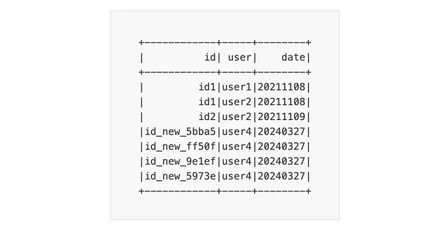

# Concurrent Write

!!! quote

    One of Iceberg’s key features is its support for multiple concurrent writes,
    enabled by its implementation of ^^**“optimistic concurrency”**^^ control.[^1]

## Isolation Levels

Iceberg supports two isolation levels: Serializable and Snapshot.
Both levels provide a consistent view of the table to all operations,
ensuring that readers see only already committed data. However, they differ
in how they handle concurrent transactions.

#### Serializable Isolation

This is the strongest isolation level, guaranteeing that an ongoing UPDATE/DELETE/MERGE
operation fails if a concurrent transaction commits a new file that might contain
rows matching the condition used in the operation.[^2]

**Advantages**:

This level ensures consistent and predictable behavior, avoiding concurrency-related
issues like dirty reads, non-repeatable reads, and phantom reads.

**Disadvantages**:

It can lead to reduced concurrency and increased transaction aborts due to conflicts
with concurrent transactions.

#### Snapshot Isolation

It is beneficial for environments with many concurrent writers.
In this isolation level, concurrent transactions operate on separate consistent
snapshots of the data, reducing contention and allowing for higher concurrency.[^3]

**Advantages**:

Improved performance and scalability, as transactions can proceed without
acquiring exclusive locks on data that is not being modified.

**Disadvantages**:

It may allow for non-serializable anomalies, such as non-repeatable reads and
phantom reads, which may require application-level logic to handle.

---

## :material-arrow-down-right: Getting Started

### Tuning for High Concurrency

When dealing with high concurrency, it’s crucial to tune the properties related
to commit retries and wait times to ensure that transactions can successfully
commit even when conflicts arise. The default configurations may not be sufficient
for retries to succeed during high concurrency, so adjusting properties like
`commit.retry.num-retries`, `commit.retry.min-wait-ms`, and `commit.retry.max-wait-ms`
can help avoid missing rows and improve the overall reliability of concurrent
write

### Hands-on with PySpark and Iceberg

Let’s explore a practical example using PySpark to interact with an Iceberg table.
This example will demonstrate the impact of different isolation levels on concurrent
write operations.

First, create a SparkSession and configure it to work with Iceberg:

```python
from pyspark.sql import SparkSession
from pyspark.sql.types import StructType, StructField, StringType
from pyspark import InheritableThread
from uuid import uuid4

spark = (
    SparkSession.builder.master("local[*]")
    .appName("iceberg-concurrent-write-isolation-test")
    .config(
        "spark.jars.packages",
        "org.apache.iceberg:iceberg-spark-runtime-3.5_2.12:1.5.0,org.apache.iceberg:iceberg-hive-runtime:1.5.0",
    )
        .config(
        "spark.sql.extensions",
        "org.apache.iceberg.spark.extensions.IcebergSparkSessionExtensions",
    )
    .config(
        "spark.sql.catalog.spark_catalog", "org.apache.iceberg.spark.SparkCatalog"
    )
    .config("spark.sql.catalog.spark_catalog.type", "hadoop")
    .config("spark.sql.catalog.spark_catalog.warehouse", "warehouse/iceberg-concurrent-write-isolation-test/")
    .enableHiveSupport()
    .getOrCreate()
)
```

Next, create a DataFrame and write it to an Iceberg table, specifying the isolation
level (a different behavior can be observed the by replacing `snapshot` with
`serializable`):

```python
# Create DataFrame
df = spark.createDataFrame(
    [
        ("id1", "user1", "20211108"),
        ("id1", "user2", "20211108"),
        ("id2", "user2", "20211109")
    ],
    schema=StructType(
    [
        StructField("id", StringType(), True),
        StructField("user", StringType(), True),
        StructField("date", StringType(), True)
    ]
))

# Create database
db_name = "test_db"
table_name = "test_table"
spark.sql(f"DROP TABLE IF EXISTS {db_name}.{table_name}")
spark.sql(f"DROP DATABASE IF EXISTS {db_name} CASCADE")
spark.sql(f"CREATE DATABASE {db_name}")
# Write the DataFrame to an Iceberg table with snapshot isolation
df.writeTo(f"{db_name}.{table_name}").using("iceberg") \\
    .tableProperty("commit.retry.num-retries", "10") \\
    .tableProperty("commit.retry.min-wait-ms", "1000") \\
    .tableProperty("write.merge.isolation-level", "snapshot") \\
.create()
```

Simulate concurrent writes by running 4 threads that simultaneously attempt to merge data into the table:

```python
def run_query(spark, id, table):
    merge_query = f"""MERGE INTO {table} target
                    USING (
                            SELECT
                            'id_new_{id}' AS id,
                            'user4' AS user,
                            '20240327' AS date
                            ) source
                    ON source.id = target.id
                    WHEN MATCHED THEN UPDATE SET *
                    WHEN NOT MATCHED THEN INSERT *
            """
    spark.sql(merge_query)

# Run concurrent merges on the table
threads = []
n_threads = 4
for _ in range(n_threads):
    id = str(uuid4())[:5]
    t = InheritableThread(target=run_query, args=(spark, id, f"{db_name}.{table_name}"))
    threads.append(t)
for t in threads:
    t.start()
for t in threads:
    t.join()
```

### Observations

In this example, I create an Iceberg table and then run four concurrent merge
queries on the table. The key points to note are:

1.  **Retry Mechanism**: I have tuned the `commit.retry.num-retries` and
    `commit.retry.min-wait-ms` properties to handle potential conflicts
    during the commit phase. This ensures that the retries have a better
    chance of succeeding, especially in high-concurrency scenarios.

2.  **Merge Operation**: I used the `MERGE INTO` statement to perform the concurrent
    updates. This is recommended over `INSERT OVERWRITE` because Iceberg can
    replace only the affected data files, and the data overwritten by a dynamic
    overwrite may change if the table's partitioning changes.

3.  **Isolation Level**: I set the `write.merge.isolation-level` property to
    `"snapshot"`. This implies that each thread successfully executes the merge
    query, generating four new rows with unique IDs, as depicted in the figure
    below.



This example emulates a scenario where multiple Spark applications either add a
new row or update a specific row in the same Iceberg table. If they occur simultaneously,
only one commit will immediately succeed. The other three failed commits will
be applied to the updated version of the table metadata. They will then be retried
one at a time, each after a 1-second delay (defined by `min-wait-ms`).
Since the transaction order doesn't matter, and there's no need to ensure the
transactions are executed serially, the appropriate isolation level to use in
this case is `“snapshot”`.
This level prioritizes concurrency and potential performance gains.

With the “serializable” isolation level, the behavior would have been different.
Specifically, the update operation fails under this isolation level if there’s an
ongoing update on a subset of rows and a concurrent transaction adds a new file
with records that could match the update condition.
As a result, only one thread will successfully complete the merge operation,
and the retry mechanism will not be triggered. The figure below illustrates this,
with the other three threads raising the following error:

```text
org.apache.iceberg.exceptions.ValidationException:
    Found conflicting files that can contain records matching true:
        [warehouse/iceberg-concurrent-write-isolation-test/test_db/test_table/data/00000-17-848de3f7-0d53-4d0d-bc1a-0edcb0a5b5a7-0-00001.parquet]
```

**Additional Note: Transaction Type**

It’s crucial to note that in the context of concurrent transactions on Iceberg
tables, the behavior observed with snapshot and serializable isolation levels is
intrinsic to the type of transaction being executed. Specifically, the `MERGE`
operation, which is used in the demonstration, exhibits different outcomes under
these isolation levels due to its nature of potentially modifying existing data.

In contrast, an `INSERT` operation, such as
`INSERT INTO {table} (id, user, date) VALUES ('id_new_{id}', 'user4', '20240327')`,
does not inherently cause a conflict because Iceberg handles `INSERT` operations
by simply adding a new metadata file. This distinction highlights the importance
of understanding the specific characteristics of the operations being performed
when configuring isolation levels in Iceberg, ensuring that the chosen level aligns
with the desired behavior and performance characteristics of the data processing
tasks at hand.

[^1]: [:simple-medium: Concurrent writes on Iceberg Tables using PySpark](https://medium.com/@gmurro/concurrent-writes-on-iceberg-tables-using-pyspark-fd30651b2c97)
[^2]: [:material-newspaper: Iceberg - IsolationLevel](https://iceberg.apache.org/javadoc/0.11.0/org/apache/iceberg/IsolationLevel.html)
[^3]: [:material-stack-overflow: Apache Iceberg - Difference between serializable vs snapshot isolation](https://stackoverflow.com/questions/76176680/apache-iceberg-table-difference-between-serializable-vs-snapshot-isolation)
