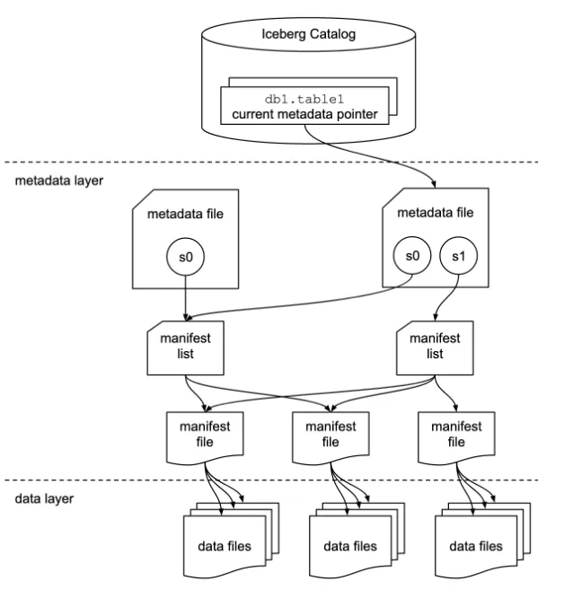

# Apache Iceberg

- [What is Apache Iceberg](https://medium.com/@karim.faiz/what-is-apache-iceberg-184c586ff7f0)

**Apache Iceberg** has carved a niche as a high-performance open-source table format,
enabling ACID transactions on petabyte-scale SQL tables.
It aims to provide a compelling alternative for data lake management solutions.

<figure markdown="span">
  { loading=lazy width="650" }
  <figcaption>Apache Iceberg Architecture</figcaption>
</figure>

Iceberg surpasses traditional formats like _Parquet_ or _ORC_ by offering distinct
advantages:

- **Schema Evolution**: Allows modifications to table schemas without rewriting
  the entire table.
- **Snapshot Isolation**: Ensures data consistency by preventing readers and writers
  from interfering with each other.
- **Efficient Metadata Management**: Utilizes metadata to manage large-scale tables
  efficiently, minimizing overhead associated with vast datasets.
- **Partition Pruning**: Automatically prunes irrelevant partitions during queries,
  optimizing performance.

!!! note

    [PyIceberg](https://py.iceberg.apache.org/) is a Python implementation for
    accessing Iceberg tables, without the need of a JVM.

---

## :material-arrow-down-right: Getting Started

### Basic Architecture

- **Table Format**: Employs a manifest list and manifest files to track metadata,
  facilitating efficient handling of large datasets.
- **Snapshot Management**: Each table maintains a history of snapshots, enabling
  time travel and rollback capabilities.
- **Partitioning**: Leverages hidden partitioning to simplify partition management
  for users, enhancing performance.

### Use Cases

- **Financial Services**: Ideal for handling large-scale transactional data with
  ACID guarantees, making it suitable for financial applications.
- **E-commerce Analytics**: Can effectively manage vast amounts of user data,
  enabling advanced analytics and personalized recommendations.

## Examples

- https://medium.com/@MarinAgli1/learning-apache-iceberg-storing-the-data-to-minio-s3-56670cef199d

## Read Mores

- [:simple-medium: Iceberg in Modern Data Architecture](https://tabular.medium.com/iceberg-in-modern-data-architecture-c647a1f29cb3)
