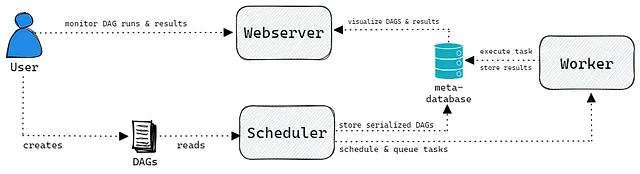
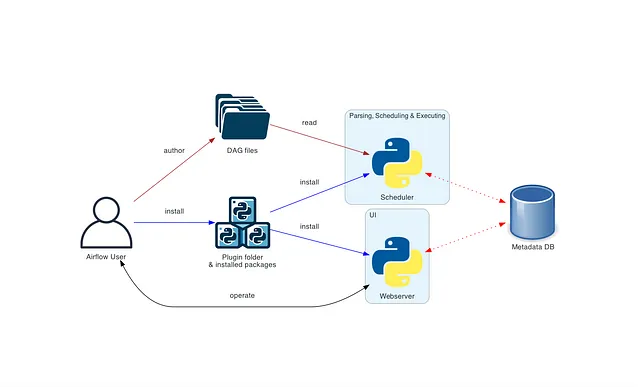

# Apache Airflow

**Airflow** was developed by **Airbnb** in 2014 and later open-sourced.
It joined Apache Software Foundation’s incubation in 2016.

You can think of Airflow as a cook/chef following a recipe where the recipe is
the data pipeline. The chef will follow this recipe by putting the right
ingredients in the right quantity in the right order.

Airflow can be used for a wide variety of workflows:

- ETL pipelines: extract data from a variety of sources, transform data in various ways
- Machine Learning workflows: automate the process of building, training, and deploying machine learning models. This might involve tasks such as data preparation, model training, model evaluation, and model deployment.
- Data Engineering: automate data engineering tasks such as data ingestion, data transformation, and data integration.
- Schedule tasks: schedule tasks to run at regular intervals, such as daily or weekly. This might include tasks such as running backups, sending emails, or updating data.

Airflow is a workflow management tool, an orchestrator, that allows executing
your tasks in the right way, right order, right time.

!!! note

    **Airflow** doesn't expect that you process your data in Airflow, in your
    tasks. Instead, you should use Airflow as a way to trigger the tool
    that will process your data.

**Use Cases of Airflow**:

- AirBNB
- Twitter
- Adobe
- Google - Cloud Composer
- AWS - Amazon Manged Workflows for Apache Airflow (NWAA)

## Components

{ loading=lazy }

- **Airflow Scheduler** — the "heart" of Airflow, that parses the DAGs,
  checks the scheduled intervals, and passes the tasks over to the workers.
- **Airflow Worker** — picks up the tasks and actually performs the work.
- **Airflow Webserver** — provides the main user interface to visualize and
  monitor the DAGs and their results.

## Architecture

{ loading=lazy }

### Operators

https://airflow.apache.org/docs/apache-airflow/stable/_api/airflow/operators/index.html

## How Airflow solves the problems

Airflow is a workflow management tool that essentially helps you manage
and schedule workflows, particularly in situations
where many tasks are running concurrently.

**Here is how Airflow can help you**:

- Complex workflows as code: Many workflows are complex and involve multiple steps that need to be executed in a specific order. Airflow makes it easier to define these workflows as code, which can help you to better understand and maintain your workflows over time.
- Dependencies between tasks: Many workflows have dependencies between tasks, which means that one task must be completed before another can be started. Airflow provides tools to help you manage these dependencies, ensuring that tasks are run in the correct order.
- Scaling: As the number of tasks in a workflow increases, it can become more difficult to manage and monitor the workflow. Airflow is designed to scale to a large number of tasks, and provides features to help you ensure that your workflows are running smoothly, even when you have many tasks running concurrently.
- Visibility: It can be difficult to get a clear picture of what is happening in a workflow, especially when many tasks are running at once. Airflow provides a web-based UI that allows you to view the status of your workflows, as well as the logs for each task in your workflow. This can help you to troubleshoot issues when they arise.

## Bast Practice

- https://medium.com/@datasmiles/over-4-years-with-airflow-our-top-10-make-life-easier-tricks-dc65be6baf66
- https://medium.com/@datasmiles/mastering-apache-airflow-myessential-best-practices-for-robust-data-orchestration-095460505843
- https://towardsdatascience.com/getting-started-with-astronomer-airflow-the-data-engineering-workhorse-d5a5cf543c2c

- [Apache Airflow Cookbook — Part.1](https://medium.com/towardsdev/apache-airflow-cookbook-part-1-1444bb7047b6)

## References

- [Getting Started with Airflow - Why Backend Engineers Should Use It](https://levelup.gitconnected.com/getting-started-with-airflow-why-backend-engineers-should-use-it-731a68e3c05f)
- https://github.com/zkan/data-pipelines-with-airflow
