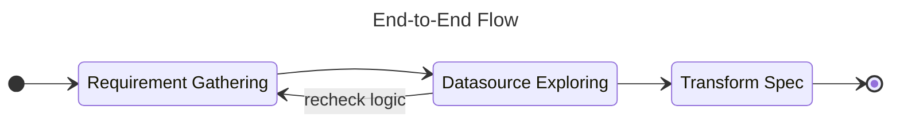

# Transform Spec

When the requirement of data ingestion and transformation was completed by user,
the final product that use to communicate is the transformation spec data.

The flow before implementation data modeling.



## Metadata of Transform Spec

| Component                        | Column Name                      | Description                  | Data Type                                                                 |
|----------------------------------|----------------------------------|------------------------------|---------------------------------------------------------------------------|
| PDM Information (Semantic Layer) | Database                         | Database or schema name      | STRING                                                                    |
|                                  | Table Name / File Name           | Table or file name           | STRING                                                                    |
|                                  | Column Name                      | Column name                  | STRING                                                                    |
|                                  | Data Type                        | Data type                    | STRING                                                                    |
|                                  | Key                              | Flag for primary key marking | BOOLEAN                                                                   |
|                                  | Field Definition                 | Definition of this field     | STRING                                                                    |
| Source Information               | Source System / Database         |                              | STRING                                                                    |
|                                  | Table Name / File Name           |                              | STRING                                                                    |
|                                  | Alias                            |                              | STRING                                                                    |
|                                  | Column                           |                              | STRING                                                                    |
| Transform                        | Business Rule Type               |                              | LITERAL["Not Mapped", "Constant", "Not Mapped", "Move", "Filter", "Join"] |
|                                  | Business Rule / Join / Condition |                              | STRING                                                                    |
|                                  | Remark                           |                              | STRING                                                                    |
| Updating Information             | Updated Date                     |                              | DATETIME                                                                  |
|                                  | Updated By                       |                              | STRING                                                                    |
|                                  | Remark                           |                              | STRING                                                                    |

!!! example

    If the transformation spec fron the user that provide to you be like;

    ```sql
    WITH addr AS (
        SELECT DISTINCT
            cust_address
            , sub_district_code
            , district_code
            , province_code
            , post_code
        FROM `data-prod-mobile.b2c_customer.transaction`
    )
    SELECT
          md5(concat(
            coalesce(cust_address, '')
            , coalesce(sub_district_code, '')
            , coalesce(district_code, '')
            , coalesce(province_code, '')
            , coalesce(post_code, '')
          ))                                                    AS HOUSE_ID
        , 1                                                     AS HOUSE_LVL
        , cust_address                                          AS ADDR
        , null                                                  AS HOUSE_NO
        , null                                                  AS STREET
        , sub_district_code                                     AS SUB_DIST
        , sub_district_name                                     AS SUB_DIST_DESC
        , district_code                                         AS DIST
        , district_name                                         AS DIST_DESC
        , province_code                                         AS PROV
        , province_name                                         AS PROV_NM
        , post_code                                             AS POST_CD
    FROM
        addr                                                    AS addr
    LEFT JOIN `data-prod-mobile.external.outbound_subdistrict`  AS sub
        ON addr.subdistrict_code    = sub.subdistrict_id
    LEFT JOIN `data-prod-mobile.external.outbound_district`     AS dis
        ON addr.district_code       = dis.district_id
    ```

    Assume that this transform spec query use for ingest data to the target table
    on your warehouse name like `DWHMODEL.MODEL_HOUSE`.

    The data on the transform spec table will be like;

    | Database  | Table Name /<br>File Name | Column Name   | Data Type | Key | Field<br>Definition       | Source System /<br>Database | Table Name /<br>File Name                      | Alias | Column                                                                            | Business Rule Type | <div style="width:35em">Business Rule / Join / Condition</div>                                                                                                                        | Remark              | Updated Date  | Updated By  | Remark  |
    |:----------|:--------------------------|:--------------|:---------:|:---:|:--------------------------|:----------------------------|:-----------------------------------------------|:-----:|:----------------------------------------------------------------------------------|:-------------------|:--------------------------------------------------------------------------------------------------------------------------------------------------------------------------------------|:--------------------|:--------------|:------------|:--------|
    | DWHMODEL  | MODEL_HOUSE               | -             |     -     |     | -                         | MOBILE                      | data-prod-mobile.b2c_customer.transaction      | addr  |                                                                                   | Filter             | SELECT DISTINCT<br>cust_address<br>, sub_district_code<br>, district_code<br>, province_code<br>, post_code<br>FROM `data-prod-mobile.b2c_customer.transaction`                       |                     |               |             |         |
    | DWHMODEL  | MODEL_HOUSE               | -             |     -     |     | -                         | MOBILE                      | data-prod-mobile.external.outbound_subdistrict |  sub  |                                                                                   | Join               | LEFT JOIN `data-prod-mobile.external.outbound_subdistrict` AS sub<br>ON addr.subdistrict_code = sub.subdistrict_id                                                                    |                     |               |             |         |
    | DWHMODEL  | MODEL_HOUSE               | -             |     -     |     | -                         | MOBILE                      | data-prod-mobile.external.outbound_district    |  dis  |                                                                                   | Join               | LEFT JOIN `data-prod-mobile.external.outbound_district` AS dis<br>ON addr.district_code = dis.district_id                                                                             |                     |               |             |         |
    | DWHMODEL  | MODEL_HOUSE               | HOUSE_ID      |  STRING   |  Y  | House ident               | MOBILE                      | data-prod-mobile.b2c_customer.transaction      | addr  | cust_address<br>sub_district_code<br>district_code <br>province_code<br>post_code | Business Rule      | md5(concat(<br>  coalesce(cust_address, '')<br>, coalesce(sub_district_code, '')<br>, coalesce(district_code, '')<br>, coalesce(province_code, '')<br>, coalesce(post_code, '')<br>)) | Use `md5` algorithm |               |             |         |
    | DWHMODEL  | MODEL_HOUSE               | HOUSE_LVL     |  INTEGER  |     | House level               | -                           | N/A                                            |  N/A  | N/A                                                                               | Constant           | 1                                                                                                                                                                                     |                     |               |             |         |
    | DWHMODEL  | MODEL_HOUSE               | ADDR          |  STRING   |     | House's address           | MOBILE                      | data-prod-mobile.b2c_customer.transaction      | addr  | cust_address                                                                      | Move               |                                                                                                                                                                                       |                     |               |             |         |
    | DWHMODEL  | MODEL_HOUSE               | HOUSE_NO      |  STRING   |     | House's Number            | -                           | -                                              |   -   | -                                                                                 | Not Mapped         |                                                                                                                                                                                       |                     |               |             |         |
    | DWHMODEL  | MODEL_HOUSE               | STREET        |  STRING   |     | House's street            | -                           | -                                              |   -   | -                                                                                 | Not Mapped         |                                                                                                                                                                                       |                     |               |             |         |
    | DWHMODEL  | MODEL_HOUSE               | SUB_DIST      |  STRING   |     | House's sub-district code | MOBILE                      | data-prod-mobile.b2c_customer.transaction      | addr  | sub_district_code                                                                 | Move               |                                                                                                                                                                                       |                     |               |             |         |
    | DWHMODEL  | MODEL_HOUSE               | SUB_DIST_DESC |  STRING   |     | House's sub-district name | MOBILE                      | data-prod-mobile.external.outbound_subdistrict |  sub  | sub_district_name                                                                 | Move               |                                                                                                                                                                                       |                     |               |             |         |
    | DWHMODEL  | MODEL_HOUSE               | DIST          |  STRING   |     | House's district code     | MOBILE                      | data-prod-mobile.b2c_customer.transaction      | addr  | district_code                                                                     | Move               |                                                                                                                                                                                       |                     |               |             |         |
    | DWHMODEL  | MODEL_HOUSE               | DIST_DESC     |  STRING   |     | House's district name     | MOBILE                      | data-prod-mobile.external.outbound_district    |  dis  | district_name                                                                     | Move               |                                                                                                                                                                                       |                     |               |             |         |
    | DWHMODEL  | MODEL_HOUSE               | PROV          |  STRING   |     | House's province code     | MOBILE                      | data-prod-mobile.b2c_customer.transaction      | addr  | province_code                                                                     | Move               |                                                                                                                                                                                       |                     |               |             |         |
    | DWHMODEL  | MODEL_HOUSE               | PROV_NM       |  STRING   |     | House's province name     | MOBILE                      | data-prod-mobile.b2c_customer.transaction      | addr  | province_name                                                                     | Move               |                                                                                                                                                                                       |                     |               |             |         |
    | DWHMODEL  | MODEL_HOUSE               | POST_CD       |  STRING   |     | House's post code         | MOBILE                      | data-prod-mobile.b2c_customer.transaction      | addr  | post_code                                                                         | Move               |                                                                                                                                                                                       |                     |               |             |         |
